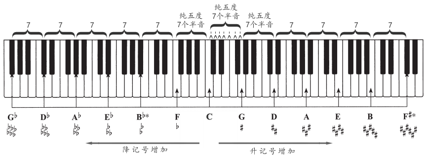
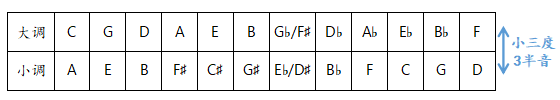
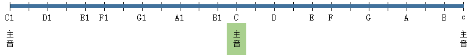

# 调号

调号写在乐谱开头的谱号后面。调号在各种谱号后面的写法是固定的。

各个音加升记号的顺序为FCGDAEB。

# 大调

以C为主音，使用自然音CDEFGAB，在音乐中最为常见，称为大调。

分别以钢琴上每组12个键为主音，则如下循环圈: 其中5度为纯五度7个半音

# 自然小调 & 和声小调 & 旋律小调

以小为主音，使用自然音ABCDEFG，在音乐中比较常见，称为小调。

小调升降记号也遵循五度循环：

A小调与C大调是关系大小调，中间差小三度（4个半音），所有关系大小调：

## 和声小调 & 旋律小调

- 自然小调上行时ABCDEFGA中G到A是全音，将G升高半音为G♯（即第7级升高半音），即为和声小调。
- 和声小调上行时ABCDEFG♯A中F和G♯中相差3个半音，将F升高半音为F♯（即第6级也升高半音），即为旋律小调。
- 下行均无需升高半音。

# 半音阶

半音音阶规则：

- 八度内包含13个音
- 开始音和结束音的音名必须相同
- 每个音级都要出现且最多为2次

半音音阶中如果用升号就全用升号，如果用降号就全用降号，因为升降记号会影响后续相同音高。

# 音级

音级可以用I、II、III、IV、V、VI、VII来表示，每个音级有自己的专有命名。

以乐谱的中心音或结尾音称为主音，其他音根据和主音的关系进行命名。

1. 离主音最远（听感差别最大）的两个音为属音和下属音
2. 离主音最近的两个音为上主音和导音（相差1个半音，小调中相差2个半音则为下主音）
3. 主音与属音中间的音为中音；主音与下属音之间的音为下属音。

