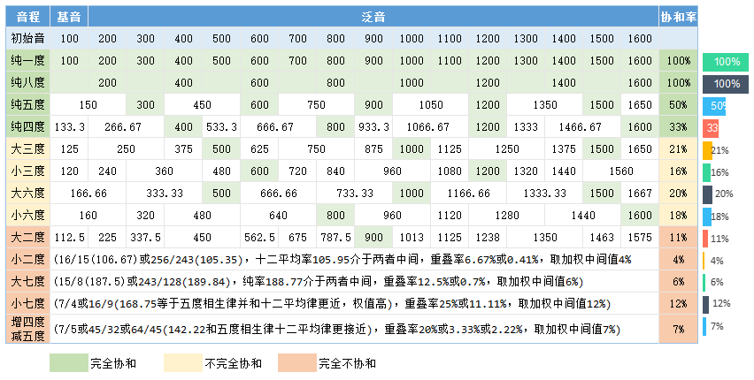

# 音程 & 度

两个音之间音高间隔（路程）关系，称为**音程**。

同时发声称为**和声音程**。先后发声的称为**旋律音程**，旋律音程分为上行和下行。

**音程单位：度**

音程的单位为**度**，表示两个音的音高所包含自然音之间的数量；对应在五线谱上为线和间的数量。

# 音程性质

音程的度数不能精确区分音程的距离。

CDEFGAB是7个音名要最多八度，要兼容每组12个半音，需要区分为纯、小、大、减、增五种：

- 纯： 一、八、五、四
- 小 & 大：二、三、六、七
- 减 & 增：所有音程均有（除了没有减一度）

协和与不协和由两个音的泛音重叠率决定，各音程的协和率如下图：

- 纯为Perfect，意思是协和，纯一度(0个半音)、纯八度(12个半音)、纯五度(7个半音)、纯四度(5个半音)的协和率都高于30%。
- 大小音程表示该度数会出现两种：小二度(1个半音)、大二度（2个半音）、小三度（3个半音）、大三度（4个半音）、小六度（8个半音）、大六度（9个半音）、小七度（10个半音）、大七度（11个半音）
- 还有6个半音的，通过增减命名为增四度、减五度。
- 增音程度数为大音程或纯音程加一个半音，减音程为小音程或纯音程减一个半音。

# 复音程

超过八度的音程称为 复音程，通过度数来命名，分为九度、十度、十一度、十二度、十三度、十四度、十五度：