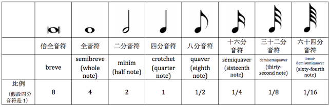
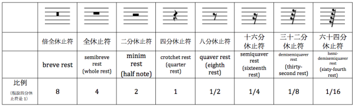
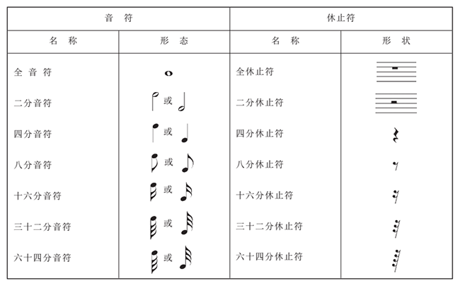

# 五线谱

五线谱是在五条线上用不同时值的音符记录音高的记谱法。从下往上表示音高从低到高。

五条线和四个间只能就九个音符，使用加线和谱号记录超过范围的音。

# 音名 & 唱名

# 音符

# 休止符

休止符命名和音符命名一致。全休止符表示整小节休止（4/2拍除外）。

# 附点音符 & 附点休止符

音符后面的圆点称为**附点**，表示该音符的时值增加一半。也可以在休止符后面，表示该休止符时值增加一半。

# 延音线 & 圆滑线

连音线包括延音线和圆滑线。

**音高相同**且**相邻两音**之间的圆弧线，称为**延音线**。表示这两个音只弹奏一次，时值为两音时值相加。

**音高不同**的两个或多个音上圆弧线，称为**圆滑线**。表示这些音符要连贯圆滑地演奏/演唱出来。