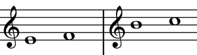
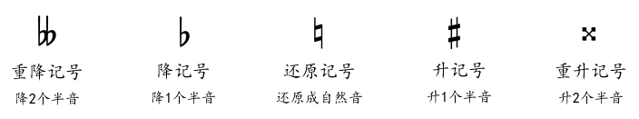

# 谱号

**谱号**是为了避免不同的乐器写很多上下加线。

# 全音半音

钢琴上每组12个音7个白键和5个黑键，不论黑白相邻之间为半音，中间间隔一个音为全音（两个白键之间有黑键视为不相邻）。

对应在五线谱上需要根据谱号来判定相邻的线和间是全音还是半音。高音谱号下如下EF和BC为半音，其他相邻线间为全音。

黑白键不均衡是由音律决定的。

# 变音记号 & 同音异名

变音记号作用范围：

- 变音记号后紧跟的音符
- 同一线或同一间的后续音符
- 直到一个小节线或同音符新的变音记号前都有效

音高相同音名不同的两个音，称为**同音异名**，也叫**等音**。