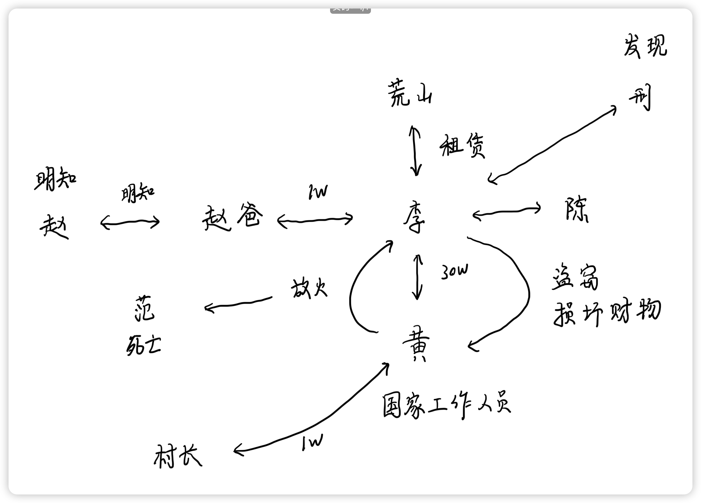
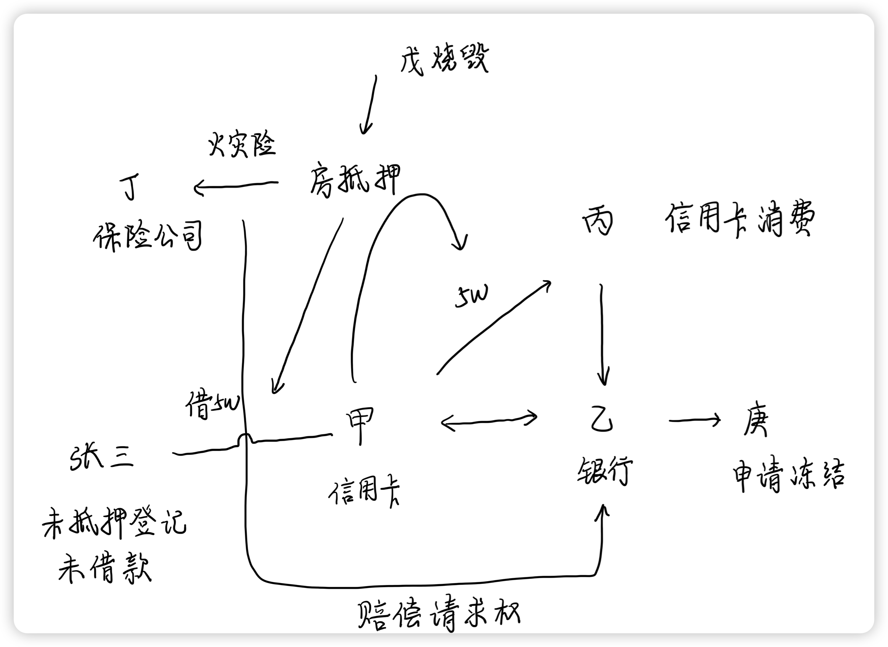
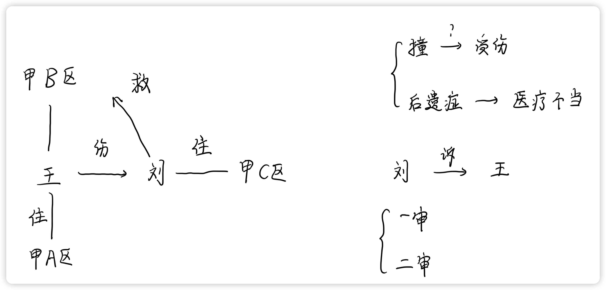
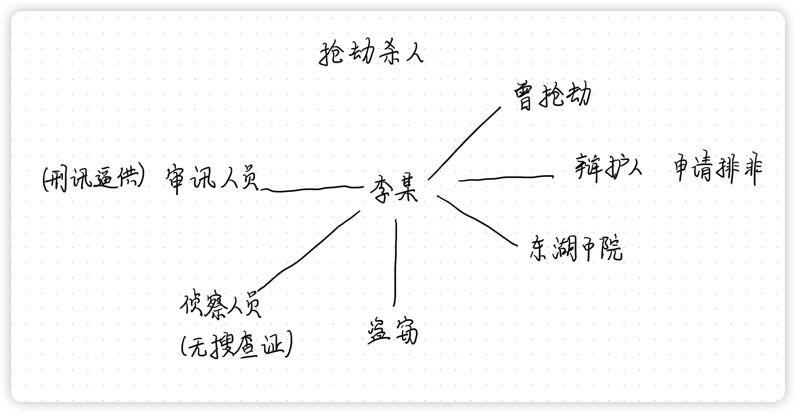
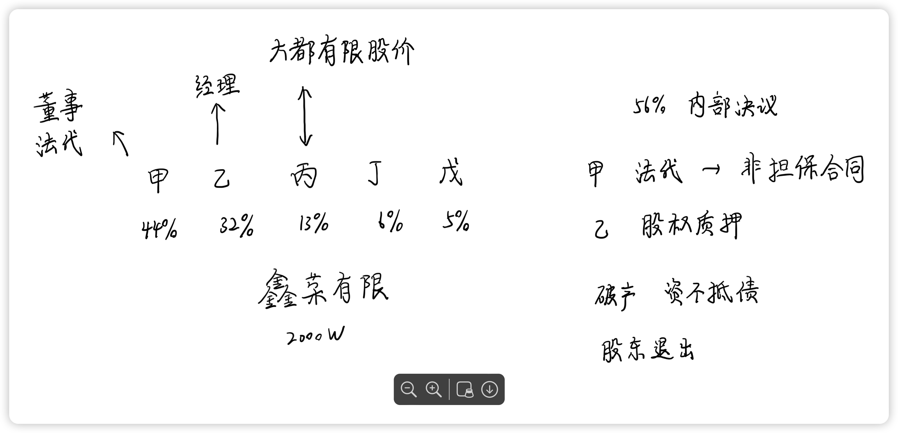

# 刑法学科主观真题（2012）

## 材料
- 镇长黄某负责某重点工程项目占地前期的拆迁和评估工作。黄某和村民李某勾结，由李某出面向某村租赁可能被占用的荒山20亩植树，以骗取补偿款。但村长不同意出租荒山。黄某打电话给村长施压，并安排李某给村长送去1万元现金后，村长才同意签订租赁合同。李某出资1万元购买小树苗5000棵，雇人种在荒山上。
- 副县长赵某带队前来开展拆迁、评估工作的验收。李某给赵某的父亲（原县民政局局长，已退休）送去1万元现金，请其帮忙说话。赵某得知父亲收钱后答应关照李某，令人将邻近山坡的树苗都算到李某名下。
- 后李某获得补偿款50万元，分给黄某30万元。黄某认为自己应分得40万元，二人发生争执，李某无奈又给黄某10万元。
- 李某非常恼火，回家与妻子陈某诉说。陈某说：“这种人太贪心，咱可把钱偷回来。”李某深夜到黄家伺机作案，但未能发现机会，便将黄某的汽车玻璃（价值1万元）砸坏。
- 黄某认定是李某作案，决意报复李某，深夜对其租赁的山坡放火（李某住在山坡上）。
- 树苗刚起火时，被路过的村民邢某发现。邢某明知法律规定发现火情时，任何人都有报警的义务，但因与李某素有矛盾，便悄然离去。
- 大火烧毁山坡上的全部树苗，烧伤了李某，并延烧至村民范某家。范某被火势惊醒逃至屋外，想起卧室有5000元现金，即返身取钱，被烧断的房梁砸死。

## 题目

1. 对村长收受黄某、李某现金1万元一节，应如何定罪？为什么？
2. 对赵某父亲收受1万元一节，对赵某父亲及赵某应如何定罪？为什么？
3. 对黄某、李某取得补偿款的行为，应如何定性？二人的犯罪数额应如何认定？
4. 对陈某让李某盗窃及汽车玻璃被砸坏一节，对二人应如何定罪？为什么？
5. 村民邢某是否构成不作为的放火罪？为什么？
6. 如认定黄某放火与范某被砸死之间存在因果关系，可能有哪些理由？如否定黄某放火与范某被砸死之间存在因果关系，可能有哪些理由？（两问均须作答）

## 关系图

## 作答
1. 答
   1. 村长构成受贿罪，受贿金额为1万元
   2. 黄某、李某构成行贿罪的共同犯罪，行贿金额为1万元
   3. 根据刑法，受贿罪要求国家机关工作人员，利用职权，收受他人贿赂的构成受贿罪。对国家机关工作人员行贿的构成行贿罪。
   4. 本题中，村长作为国家工作人员，收受李某的贿赂1万元，构成受贿罪，黄某指使李某向村长行贿1万元，因此两人构成行贿罪的共同犯罪，其中黄某为行贿罪的教唆犯，李某为行贿罪的实行犯
2. 答
   1. 赵某父亲和赵某构成利用影响力受贿罪的共同犯罪，同时赵某还单独构成受贿罪
   2. 根据刑法，受贿罪是指国家机关工作人员，利用职权收受贿赂，利用影响力受贿罪是指利用对国家机关工作人员对影响力，进行受贿的行为
   3. 本题中，赵某父亲已退休，不是国家机关工作人员，因此仅构成利用影响力受贿罪实行犯，赵某明知其父亲受贿，因而构成利用影响力受贿罪的共同帮助犯，同时赵某身为国家机关工作人员，还单独构成受贿罪
3. 答
   1. 黄某、李某构成诈骗罪的共同犯罪，诈骗金额为50万元
   2. 根据刑法规定，诈骗罪为以非法占有为目的，通过欺骗手段使被害人陷入错误认识，并基于错误认识处分财物，造成财产损失，同时犯罪人获取财物的行为
   3. 本题中，黄某、李某事前串通，以欺骗手段骗取国家补偿款50万元，构成诈骗罪的共同犯罪，并且基于共同犯罪一人犯罪，共同担责的原则，黄某、李某的诈骗金额均为50万元
4. 答
   1. 陈某构成盗窃罪的教唆犯，李某构成盗窃罪的未遂以及故意损害他人财物罪的既遂
   2. 根据刑法，以非法占有为目的，实施将他人所有、他人占有的财物转移为自己占有的行为为盗窃罪，主观明知他人财物并故意损坏的构成故意损害他人财物罪
   3. 本题中，陈某唆使李某去盗窃，李某潜入黄某家即为着手，因此陈某构成盗窃罪的教唆犯，同时李某盗窃罪着手但因为没有盗窃到财物，因此只能认定为盗窃罪的未遂。陈某没有教唆李某故意损害黄某财物，因此李某单独构成故意损害他人财物罪
5. 答
   1. 邢某不构成不作为的放火罪
   2. 根据刑法，不作为的犯罪要求犯罪人对于不作为产生的不利后果，应有避免其发生的义务
   3. 本题中，邢某仅为发现放火的事实，没有放火的行为或者帮助行为，同时任何人都有报警的义务并非刑法上规定的义务，因此邢某没有避免放火及其引发的不利后果的阻止义务，不构成不作为的放火罪
6. 答
   1. 如认定黄某放火与范某被砸死之间存在因果关系，可能有以下理由：
      1. 没有黄某放火行为，就不会导致村民范某家被烧，没有危险发现就不会导致范某被砸死
      2. 黄某放火行为导致村民范某家被烧，范某逃出后反身救钱的行为，该介入因素不异常，属于正常人高概率发生的行为，因此该介入因素不能阻断放火行为和范某被砸死之间的因果关系
   2. 如否定黄某放火与范某被砸死之间存在因果关系
      1. 黄某放火行为导致村民范某家被烧，范某逃出后反身救钱的行为，该介入因素异常，人的生命法益远远高于金钱利益，属于正常人不会发生的行为，因此该介入因素异常，阻断放火行为和范某被砸死之间的因果关系

## 参考答案
1. 村长构成<strong style="color: red;">非国家工作人员受贿罪</strong>，黄某、李某构成<strong style="color: red;">对非国家工作人员行贿罪</strong>，出租荒山是<strong style="color: red;">村民自治组织事务</strong>，不是接受乡镇政府委托从事公共管理活动，村长此时不具有国家工作人员身份，不构成受贿罪
2. 赵某父亲与赵某构成受贿罪共犯，<strong style="color: red;">赵某父亲不成立利用影响力受贿罪</strong>，义务只有在离退休人员<strong style="color: red;">利用过去的职务便利</strong>收受财物，且<strong style="color: red;">与国家工作人员没有共犯关系</strong>的场合，才构成利用影响力受贿罪
3. 黄某、李某取得补偿款的行为构成<strong style="color: red;">贪污罪</strong>，两人是贪污罪共犯，因为两人<strong style="color: red;">共同利用了黄某的职务便利骗取公共财物</strong>，两人要对共同贪污的犯罪数额负责，犯罪数额都是50万元，而不能按照各自最终分得的脏物确定犯罪数额
4. 陈某构成盗窃罪的教唆犯，属于<strong style="color: red;">教唆未遂</strong>，李某构成故意毁坏财物罪，李某虽然接受盗窃教唆，但<strong style="color: red;">并未</strong>按照陈某的教唆<strong style="color: red;">造成危害后果</strong>，对汽车玻璃被砸坏这一结果，属于<strong style="color: red;">超过共同故意</strong>的行为，由李某自己负责
5. 邢某不构成不作为的放火罪，虽然法律明文规定发现火情时，任何人都有报警的义务，但是<strong style="color: red;">报警义务不等于救助义务</strong>，同时<strong style="color: red;">仅在行为人创设了危险或者具有保护、救助法益的义务时以及其他法律、法规规定的义务时</strong>，才能构成刑法上的不作为的义务来源，本案中火情是黄某造成的，邢某仅是偶然路过，其<strong style="color: red;">并未创设火灾的危险</strong>，因此邢某<strong style="color: red;">并无刑法上的作为义务</strong>，不构成不作为的放火罪
6. 黄某放火与范某死亡之间，介入了被害人范某的行为
   1. 肯定因果关系的理由
      1. 根据<strong style="color: red;">条件说</strong>，可以认为放火行为和死亡之间具有“无A就无B”的条件关系
      2. 被害人在当时情况下，来不及精确判断反悔住宅取财的危险性
      3. 被害人在当时情况下，返回住宅取财符合常理
   2. 否定因果关系的理由
      1. 根据<strong style="color: red;">相当因果关系说</strong>，放火和被害人死亡之间不具有相当性
      2. 被告人实施的放火行为并未烧死范某，范某为抢救数额有限的财物返回高度危险的场所，有违常理
      3. 被害人是精神正常的成年人，对自己行为的后果非常清楚，因此要对自己的选择负责
      4. 被害人试图保护的法益价值有限，只有甲对乙的住宅放火，如乙为了抢救婴儿而进入住宅内被烧死的，才能肯定放火行为和死亡后果之间的因果关系

# 民法学科主观真题（2012）

## 材料
- 信用卡在现代社会的运用越来越广泛。设甲为信用卡的持卡人，乙为发出信用卡的银行，丙为接受银行信用卡消费的百货公司。甲可以凭信用卡到丙处持卡消费，但应于下个月的15日前将其消费的款项支付给乙；丙应当接受甲的持卡消费，并于每月的20日请求乙支付甲消费的款项，丙不得请求甲支付其消费的款项。
- 2012年3月，甲消费了5万元，无力向乙还款。甲与乙达成协议，约定3个月内还款，甲将其1间铺面房抵押给乙，并作了抵押登记。应乙的要求，甲为抵押的铺面房向丁保险公司投了火灾险，并将其对保险公司的保险赔偿请求权转让给了乙。
- 2012年4月，甲与张某签订借款意向书，约定甲以铺面房再作抵押向张某借款5万元，用于向乙还款。后因甲未办理抵押登记，张某拒绝提供借款。
- 2012年7月，因甲与邻居戊有矛盾，戊放火烧毁了甲的铺面房。在保险公司理赔期间，乙的债权人庚向法院申请冻结了保险赔偿请求权。

## 题目
1. 2012年3月之前，甲与乙之间存在什么法律关系？乙与丙之间存在什么法律关系？甲与丙之间存在什么法律关系？
2. 丙有权请求乙支付甲消费的款项但不得请求甲支付其消费的款项，其法律含义是什么？乙可否以甲不支付其消费的款项为理由，拒绝向丙付款？为什么？
3. 如甲不向乙支付其消费的款项，乙可以主张什么权利？如乙不向丙支付甲消费的款项，丙可以主张什么权利？
4. 如丙拒绝接受甲持卡消费，应由谁主张权利？可以主张什么权利？为什么？
5. 张某拒绝向甲提供借款是否构成违约？为什么？
6. 甲的抵押铺面房被烧毁之后，届期无力还款，乙可以主张什么权利？
7. 甲将保险赔偿请求权转让给乙，乙的债权人庚向法院申请冻结该保险赔偿请求权，对乙的抵押权有什么影响？为什么？

## 关系图

## 作答
1. 答
   1. 甲乙之间为借贷合同关系，甲丙之间为买卖合同关系，乙丙之间为第三人纯受益的买卖合同关系
2. 答
   1. 乙丙之间的买卖合同，甲为纯受益的第三人，仅享有权利，不需要履行义务；乙不可以仅以甲不支付其消费的款项为理由，拒绝向丙付款，基于合同的相对性原理，丙的请求权可以对乙行使从而请求乙履行付款义务，甲不支付其消费的款项的理由不能向丙进行抗辩
3. 答
   1. 如甲不向乙支付其消费的款项，乙可以向甲主张付款请求权，同时乙可以向丙请求，暂停产生新的甲丙之间的买卖关系
   2. 如乙不向丙支付甲消费的款项，丙可以向乙主张付款请求权，也可以向甲主张代位权，请求甲直接向自己履行付款义务
4. 答
   1. 甲、乙均可以主张权利
   2. 甲可以向丙主张继续履行请求权，甲为乙丙买卖合同的纯受益第三人，享有继续履行请求权，但不享有合同解除权
   3. 乙可以向丙主张继续履行请求权，也可以向丙主张合同解除权，乙为乙丙买卖合同的当事人，基于合同的相对性原理，乙既享有对丙的继续履行请求权，也享有合同的解除权
5. 答
   1. 张某拒绝向甲提供借款不构成违约，因为自然人之间的借贷合同为实践性合同，张某拒绝向甲提供借款，因此张某与甲之间的借贷合同不成立，自然也不构成违约
6. 答
   1. 乙可以主张对保险赔偿金在抵押担保5万元范围内，优先受偿
7. 答
   1. 在乙与庚的债务范围内，乙丧失对甲的抵押权，因为庚有权基于其对乙的债权，对乙的债务人（庚的次债务人）甲行使代为请求权，请求甲直接向自己履行债务

## 参考答案
1. 甲乙之间存在<strong style="color: red;">无名合同关系</strong>，参照适用<strong style="color: red;">委托合同</strong>，在乙银行替甲还款之后，甲应向乙还款，构成<strong style="color: red;">借款合同关系</strong>；乙丙之间存在<strong style="color: red;">无名合同关系</strong>，参照适用<strong style="color: red;">委托合同</strong>；甲丙之间存在<strong style="color: red;">买卖关系</strong>
2. 法律含义为<strong style="color: red;">免责的债务承担</strong>，基于<strong style="color: red;">债的相对性和独立性</strong>，乙不可以甲不支付其消费的款项为由，拒绝向丙付款
3. 拒绝支付
   1. 如果甲不向乙支付其消费的款项，乙可依甲乙之间的还款关系要求<strong style="color: red;">甲支付其所消费的款项及利息（违约责任）</strong>
   2. 如果乙不向丙支付甲所消费的款项，丙可依乙丙之间的还款关系要求<strong style="color: red;">乙支付甲所消费的款项及利息（违约责任）</strong>
4. <strong style="color: red;">应由乙主张权利，由乙向丙主张违约责任</strong>，因为在乙丙之间存在着委托关系，只要持卡人符合条件，丙即应接受其消费并向其为相应给付
5. 不构成违约，因为借款合同尚未生效
6. 乙可以就<strong style="color: red;">甲对乙的保险赔偿金和甲对戊的损害赔偿金主张优先受偿权</strong>（乙可以行使甲对乙的保险赔偿请求权、甲对戊的损害赔偿请求权），乙可以对戊行使<strong style="color: red;">基于抵押权的损害赔偿请求权</strong>
7. 没有影响，<strong style="color: red;">抵押权具有优先效力，应获得优先受偿</strong>

# 民事诉讼法学科主观真题（2012）

## 材料
- 居住在甲市A区的王某驾车以60公里时速在甲市B区行驶，突遇居住在甲市C区的刘某骑自行车横穿马路，王某紧急刹车，刘某在车前倒地受伤。刘某被送往甲市B区医院治疗，疗效一般，留有一定后遗症。之后，双方就王某开车是否撞倒刘某，以及相关赔偿事宜发生争执，无法达成协议。
- 刘某诉至法院，主张自己被王某开车撞伤，要求赔偿。刘某提交的证据包括：甲市B区交警大队的交通事故处理认定书（该认定书没有对刘某倒地受伤是否为王某开车所致作出认定）、医院的诊断书（复印件）、处方（复印件）、药费和住院费的发票等。王某提交了自己在事故现场用数码摄像机拍摄的车与刘某倒地后状态的视频资料。图像显示，刘某倒地位置与王某车距离1米左右。王某以该证据证明其车没有撞倒刘某。
- 一审中，双方争执焦点为：刘某倒地受伤是否为王某驾车撞倒所致；刘某所留后遗症是否因医疗措施不当所致。
- 法院审理后，无法确定王某的车是否撞倒刘某。一审法院认为，王某的车是否撞倒刘某无法确定，但即使王某的车没有撞倒刘某，由于王某车型较大、车速较快、刹车突然、刹车声音刺耳等原因，足以使刘某受到惊吓而从自行车上摔倒受伤。因此，王某应当对刘某受伤承担相应责任。同时，刘某因违反交通规则，对其受伤也应当承担相应责任。据此，法院判决：王某对刘某的经济损失承担50%的赔偿责任。关于刘某受伤后留下后遗症问题，一审法院没有作出说明。
- 王某不服一审判决，提起上诉。二审法院审理后认为，综合各种证据，认定王某的车撞倒刘某，致其受伤。同时，二审法院认为，一审法院关于双方当事人就事故的经济责任分担符合法律原则和规定。故此，二审法院驳回王某上诉，维持原判。

## 题目
1. 对刘某提起的损害赔偿诉讼，哪个（些）法院有管辖权？为什么？
2. 本案所列当事人提供的证据，属于法律规定中的哪种证据？属于理论上的哪类证据？
3. 根据民事诉讼法学（包括证据法学）相关原理，一审法院判决是否存在问题？为什么？
4. 根据《民事诉讼法》有关规定，二审法院判决是否存在问题？为什么？

## 关系图

## 作答
1. 答
   1. 根据民事诉讼法规定，侵权法律关系案件由被告人所在地与侵权行为地人民法院管辖，其中侵权行为地包括侵权行为发生地以及侵权行为结果地
   2. 本题中甲市A区为被告人王某居住地，甲市B区为侵权行为发生地及结果地
   3. 因此本题中甲市A区及甲市B区人民法院有管辖权
2. 答
   1. 刘某提交的证据系书证
   2. 王某提供的证据系电子数据
3. 答
   1. 一审法院认定的证据范围超出当原告主张的证据范围，违反了辩论原则
   2. 一审法院遗漏原告关于后遗症赔偿的诉讼请求
   3. 民事案件中法院的审理范围受原告的诉讼请求范围限制，应当就原告的诉讼请求范围进行审理、判决，不应该超出原告的诉讼请求也不应该遗漏原告的诉讼请求
4. 答
   1. 二审法院认定原审事实不清，证据不足的案件，应当发回重审或者查清事实后依法改判

## 参考答案
1. 对本案享有管辖权的有甲市A区人民法院和甲市B区人民法院。本案属于<strong style="color: red;">侵权纠纷</strong>，侵权行为地与被告所在地法院享有管辖权；本案的侵权行为发生在甲市B区，被告王某居住在甲市A区
2. 根据《民法诉讼法》关于证据的分类：本案中，交通事故处理认定书、医院的诊断书（复印件）、处方（复印件）、药费和住院费的发票属于书证，王某在事故现场用数码摄像机拍摄的车与刘某倒地后状态的视频资料属于视听资料。根据理论上对证据的分类
   1. 上述证据都属于间接证据
   2. 交通事故处理认定书、药费和住院费的发票、王某在事故现场用数码摄像机拍摄的车与刘某倒地后状态的视频资料属于原始证据，医院的诊断书（复印件）、处方（复印件）属于传来证据
   3. 就证明王某的车撞到刘某并导致刘某受伤的事实而言，刘某提供的证据均为本证，王某提供的证据均为反证
3. 一审法院判决存在如下问题
   1. <strong style="color: red;">判决没有对案件的争议焦点作出事实认定，违反了辩论原则</strong>
   2. 在案件争执的法律要件事实真伪不明的情况下，法院没有根据<strong style="color: red;">证明责任原理</strong>来作出判决
   3. 法院未对第二个争议焦点作出事实认定
4. 二审法院维持原判，驳回上诉不符合《民事诉讼法》规定。依据法律规定，只有在一审法院认定事实清楚，适用法律正确的情况下，二审法院才可以维持原判，驳回上诉。本案中，二审法院的判决认定了王某开车撞到了刘某，该<strong style="color: red;">事实认定与一审法院对案件事实的认定有根本性的差别</strong>，说明<strong style="color: red;">一审法院认定案件事实不清或存在错误</strong>，在此情况下，二审法院既可以选择裁定撤销原判决、发回重审，也可以选择依法改判，而不应当维持原判

# 刑事诉讼法学科主观真题（2012）

## 材料
- 花园小区发生一起入室抢劫杀人案，犯罪现场破坏严重，未发现有价值的痕迹物证。经查，李某有重大犯罪嫌疑，其曾因抢劫被判有期徒刑12年，刚刚刑满释放，案发时小区保安见李某出入小区。李某被东湖市公安局立案侦查并被逮捕羁押。审讯期间，在保安的指认下，李某不得不承认其在小区他处入室盗窃3000元，后经查证属实。但李某拒不承认抢劫杀人行为。审讯人员将李某提到公安局办案基地对其实施了捆绑、吊打、电击等行为，3天3夜不许吃饭，不许睡觉，只给少许水喝，并威胁不坦白交代抢劫杀人罪行、认罪态度不好法院会判死刑。最终，李某按审讯人员的意思交代了抢劫杀人的事实。在此期间，侦查人员还对李某的住处进行了搜查，提取扣押了李某鞋子等物品，当场未出示搜查证。
- 案件经东湖市检察院审查起诉后，向东湖市中级法院提起公诉。庭审中，应李某辩护人的申请，法庭启动了排除非法证据程序。

## 题目
1. 本案哪些行为收集的证据属于非法证据？哪些非法证据应当予以排除？
2. 本案负有排除非法证据义务的机关有哪些？
3. 针对检察院的指控，东湖市中级法院应当如何判决本案？
4. 结合本案，简要说明刑事诉讼法对保障刑法实施的价值。
5. 结合本案，简述非法证据排除规则的完善过程，阐明非法证据排除规则的诉讼价值。

## 关系图

## 作答
1. 答
   1. 李某关于抢劫杀人的犯罪嫌疑人供述以及搜查人员非法扣押的物品属于非法证据
   2. 李某关于抢劫杀人的犯罪嫌疑人供述，因为是采用刑讯逼供的非法暴力手段获取的非法证据，应当予以排除
   3. 搜查人员非法扣押的物品，因为搜查时未当场出示搜查证，系程序违法，若无法作出合理补正，应当予以排除
2. 答
   1. 公安机关
   2. 公安机关作为搜集证据的负责机关，应当依法进行证据收集的工作
   3. 检察机关
   4. 检察机关作为监督机关，负有对公安人员办案程序合法性的监督职责
   5. 东湖市中级法院
   6. 东湖市中级法院作为审判机关，负有审查公诉人提供的证据合法性的审查职责
3. 答
   1. 若检察院指控盗窃罪
   2. 应当根据刑诉法规定，不得单独根据被告人供述认定犯罪事实，应当判决盗窃罪的犯罪事实不清、证据不足，被告人不犯盗窃罪
   3. 若检察院指控抢劫罪致人死亡
   4. 应当根据刑诉法规定，首先要求检察院对于非法程序搜查的证据进行补正，若无法补正应当根据非法证据排除规则，对于排除关于抢劫杀人的被告人供述证据并一并排除扣押的证据，应当判决抢劫罪的犯罪事实不清、证据不足，被告人不犯抢劫罪
   5. 综上应当判决被告人无罪
4. 答
   1. 太有价值辣
5. 答
   1. 太有价值辣

## 参考答案
1. 本案非法的证据有
   1. 审讯人员通过捆绑、吊打、电击等行为，3天3夜不许吃饭，不许睡觉，只给少许水喝，并威胁不坦白交代抢劫杀人罪行、认罪态度不好法院会判死刑的方式获取的供述属于非法证据
   2. 侦查人员还对李某的住处进行了搜查，提取扣押了李某鞋子等物品，当场未出示搜查证也属于非法证据
   3. 上述非法的证据应当排除的是通过刑讯手段获得的李某的供述，没有出示搜查证的情形下搜查到的物品虽然违法，但是通过补正解释可以作为证据使用
2. 本案负有排除非法证据义务的机关包括公安机关、人民检察院、人民法院
   1. 公安机关在侦查阶段发现了非法证据，该证据不能作为起诉意见的依据
   2. 人民检察院在审查起诉中发现了非法证据，该证据不能作为起诉决定的依据
   3. 人民法院在审判中发现了非法证据，该证据不能作为法院裁判的依据
3. 答
   1. 本案人民法院应当判决李某构成盗窃罪，对于入室抢劫杀人部分宣告无罪。理由是盗窃部分事实清楚证据充分，入室抢劫杀人部分证据不足，法院应当作出证据不足的无罪判决

# 商经法学科主观真题（2012）

## 材料
- 2009年1月，甲、乙、丙、丁、戊共同投资设立鑫荣新材料有限公司（以下简称鑫荣公司），从事保温隔热高新建材的研发与生产。该公司注册资本2000万元，各股东认缴的出资比例分别为44%、32%、13%、6%、5%。其中，丙将其对大都房地产开发有限公司所持股权折价成260万元作为出资方式，经验资后办理了股权转让手续。甲任鑫荣公司董事长与法定代表人，乙任公司总经理。
- 鑫荣公司成立后业绩不佳，股东之间的分歧日益加剧。当年12月18日，该公司召开股东会，在乙的策动下，乙、丙、丁、戊一致同意，限制甲对外签约合同金额在100万元以下，如超出100万元，甲须事先取得股东会同意。甲拒绝在决议上签字。此后公司再也没有召开股东会。
- 2010年12月，甲认为产品研发要想取得实质进展，必须引进隆泰公司的一项新技术。甲未与其他股东商量，即以鑫荣公司法定代表人的身份，与隆泰公司签订了金额为200万元的技术转让合同。
- 2011年5月，乙为资助其女赴美留学，向朋友张三借款50万元，以其对鑫荣公司的股权作为担保，并办理了股权质权登记手续。
- 2011年9月，大都房地产公司资金链断裂，难以继续支撑，不得不向法院提出破产申请。经审查，该公司尚有资产3000万元，但负债已高达3亿元，各股东包括丙的股权价值几乎为零。
- 2012年1月，鉴于鑫荣公司经营状况不佳及大股东与管理层间的矛盾，小股东丁与戊欲退出公司，以避免更大损失。

## 题目
1. 2009年12月18日股东大会决议的效力如何？为什么？
2. 甲以鑫荣公司名义与隆泰公司签订的技术转让合同效力如何？为什么？
3. 乙为张三设定的股权质押效力如何？为什么？
4. 大都房地产公司陷入破产，丙是否仍然对鑫荣公司享有股权？为什么？
5. 丁与戊可以通过何种途径保护自己的权益？

## 关系图

## 作答
1. 答
    1. 股东大会决议合法有效
    2. 根据公司法规定，有限公司股东会决议，如无章程特别规定，一般事项经有表决权股东表决，表决权过半数同意则决议通过
    3. 本题中，鑫荣公司召开了股东会进行决议，乙、丙、丁、戊持有56%表决权且乙、丙、丁、戊一致同意，因此该决议合法有效
 2. 答
    1. 技术转让合同合法有效
    2. 根据民法典143条及公司法相关规定，本合同并非担保合同，法定代表人有权代表公司签订合同，同时该合同内容合法有效
    3. 鑫荣公司股东会决议对法定代表人甲的权利限制，仅在鑫荣公司内部具有效力，不得对抗善意第三人
    4. 本题中法定代表人有权代表公司与隆泰公司签订合同，合同内容合法有效
 3. 答
    1. 股权质押合法有效
    2. 根据民法典及公司法相关规定，股权质押自登记之日起生效
    3. 本题中，双方关于股权质押的意思表示真实且达成意思合意，同时办理了股权质权登记，因此股权质押合法有效，张三自登记之日起取得股权质权
 4. 答
    1. 丙仍享有股权
    2. 根据公司法规定，股权可以转让也具有确定价值，因此股权出资可以作为股权出资的方式
    3. 本题中丙对大都房地产开发有限公司所持股权，经验资，因此出资真实，同时办理了股权转让手续，履行了出资义务，因此丙取得股权；股权出资的股权价值取决于出资时股权的作价价值，不因之后股权价值的变动而受到影响，因此破产时股权价值并不影响丙的股权
 5. 答
    1. 丁和戊可以请求向其他股东转让股权
    2. 丁和戊可以请求其他股东放弃优先购买权的情况下，对外转让股权
    3. 因为鑫荣公司两年未召开股东会，公司经营严重困难，丁和戊可以请求解散公司

## 参考答案
1. 股东会决议<strong style="color: red;">有效</strong>，<strong style="color: red;">股东会有权</strong>就董事长的职权行使作出限制，且<strong style="color: red;">表决权过半数的股东</strong>已在决议上签字
2. <strong style="color: red;">合同有效</strong>，根据<strong style="color: red;">《民法典》504条</strong>规定，<strong style="color: red;">越权行为有效规则</strong>，公司对外签订的合同依然是有效的
3. <strong style="color: red;">股权质押有效</strong>，张三享有质权，因为已经按照规定<strong style="color: red;">办理了股权质押登记</strong>
4. <strong style="color: red;">丙仍然享有股权</strong>，义务丙已经<strong style="color: red;">办理了股权转让手续</strong>，且丙以股权出资时，大都房地产公司并未陷入破产，<strong style="color: red;">不存在虚假出资</strong>
5. 丁、戊可以通过<strong style="color: red;">向其他股东或第三人转让股权</strong>的途径退出公司，或<strong style="color: red;">联合提起诉讼，请求法院强制解散公司</strong>的途径保护自己的权益