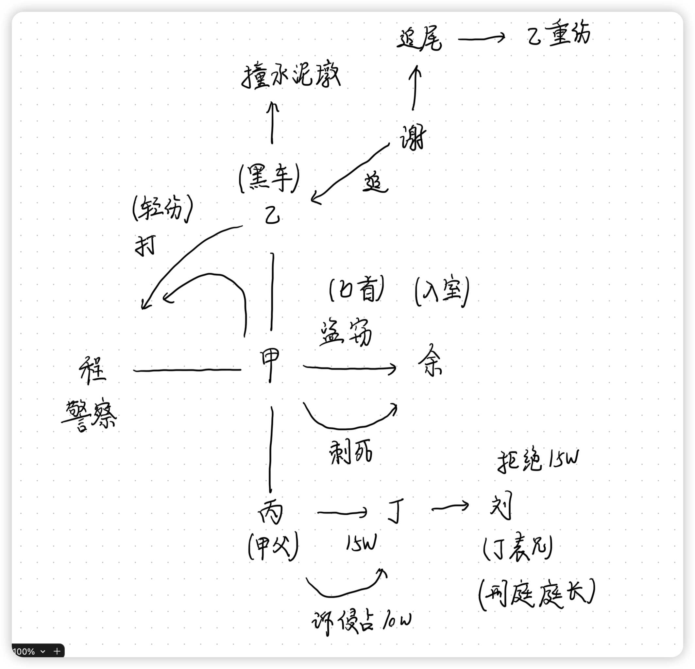
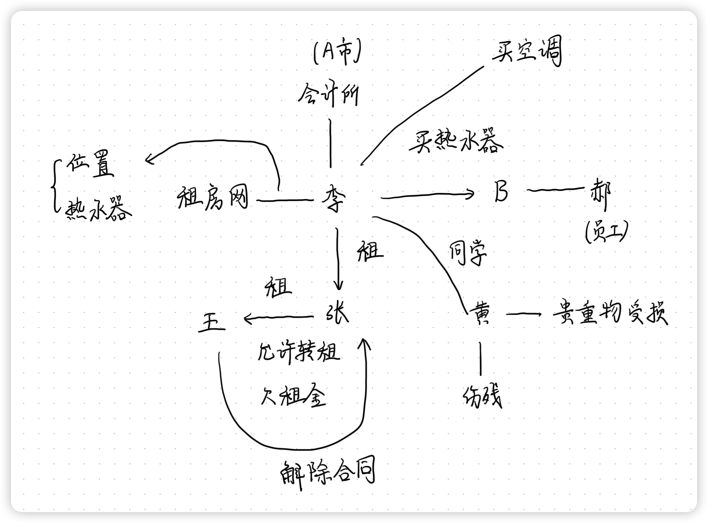
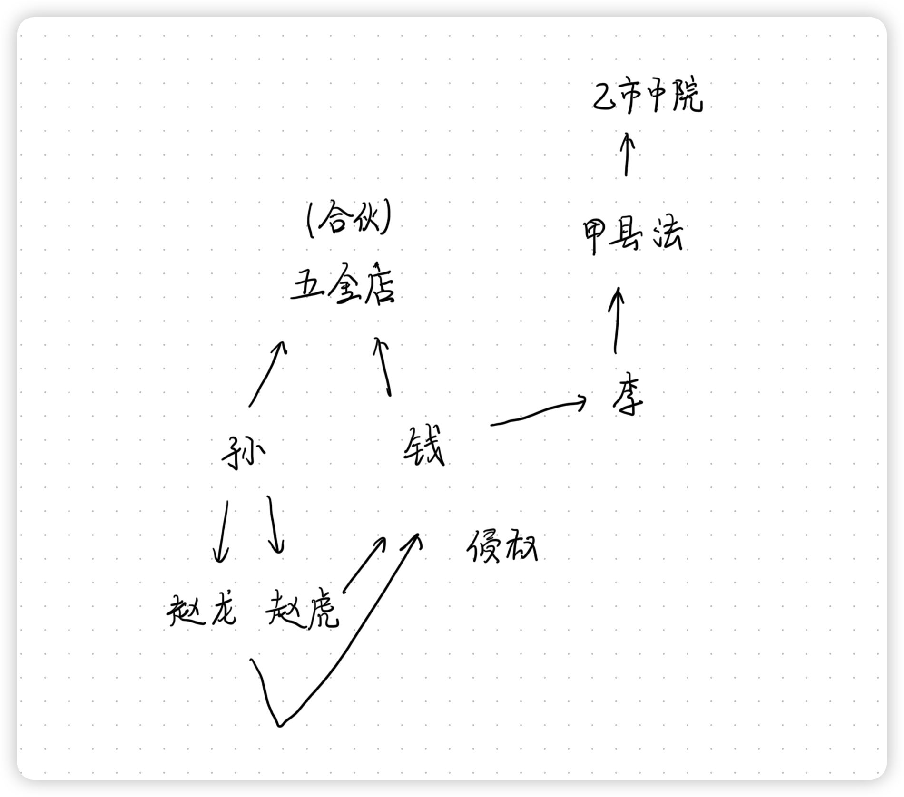
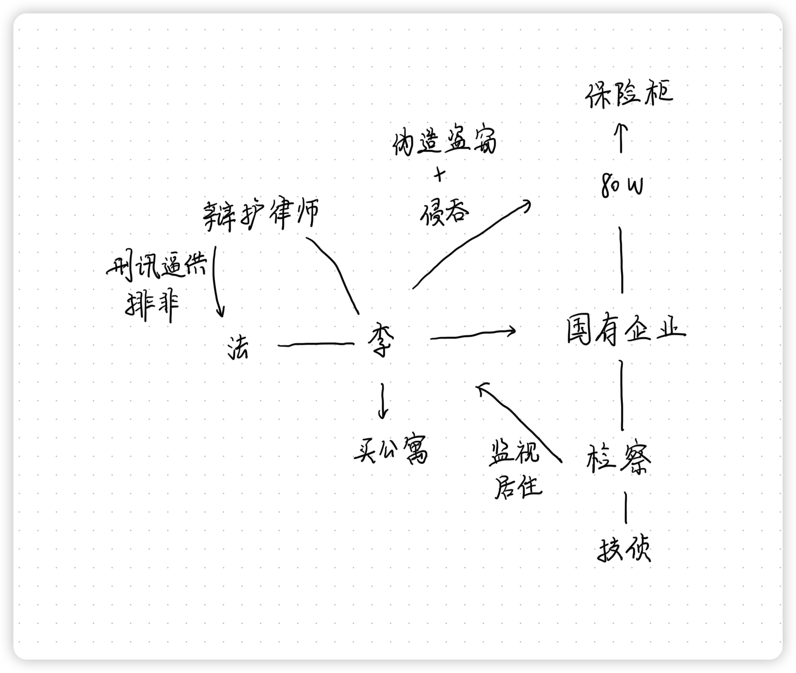

# 刑法学科主观真题（2013）

## 材料
- 甲与余某有一面之交，知其孤身一人。某日凌晨，甲携匕首到余家盗窃，物色一段时间后，未发现可盗财物。此时，熟睡中的余某偶然大动作翻身，且口中念念有词。甲怕被余某认出，用匕首刺死余某，仓皇逃离。（事实一）
- 逃跑中，因身上有血迹，甲被便衣警察程某盘查。程某上前拽住甲的衣领，试图将其带走。甲怀疑遇上劫匪，与程某扭打。甲的朋友乙开黑车经过此地，见状停车，和甲一起殴打程某。程某边退边说：“你们不要乱来，我是警察。”甲对乙说：“别听他的，假警察该打。”程某被打倒摔成轻伤。（事实二）
- 司机谢某见甲、乙打人后驾车逃离，对乙车紧追。甲让乙提高车速并走“蛇形”，以防谢某超车。汽车开出2公里后，乙慌乱中操作不当，车辆失控撞向路中间的水泥隔离墩。谢某刹车不及撞上乙车受重伤。赶来的警察将甲、乙抓获。（事实三）
- 在甲、乙被起诉后，甲父丙为使甲获得轻判，四处托人，得知丁的表兄刘某是法院刑庭庭长，遂托丁将15万元转交刘某。丁给刘某送15万元时，遭到刘某坚决拒绝。（事实四）
- 丁告知丙事情办不成，但仅退还丙5万元，其余10万元用于自己炒股。在甲被定罪判刑后，无论丙如何要求，丁均拒绝退还余款10万元。丙向法院自诉丁犯有侵占罪。（事实五）

## 题目
1. 就事实一，对甲的行为应当如何定性？理由是什么？
2. 就事实二，对甲、乙的行为应当如何定性？理由是什么？
3. 就事实三，甲、乙是否应当对谢某重伤的结果负责？理由是什么？
4. 就事实四，丁是否构成介绍贿赂罪？是否构成行贿罪（共犯）？是否构成利用影响力受贿罪？理由分别是什么？
5. 就事实五，有人认为丁构成侵占罪，有人认为丁不构成侵占罪。你赞成哪一观点？具体理由是什么？

## 关系图

## 作答
1. 答
   1. 甲犯盗窃罪未遂与故意杀人罪既遂
   2. 甲主观上意图盗窃，到达余某家中时视为盗窃罪着手，后因非自身原因的客观原因导致盗窃罪不能既遂，因此应视为盗窃罪未遂，其中入室情节为加重情节
   3. 甲杀害余某的行为主观上明知自己的行为，客观上实施杀人行为并导致余某死亡结果，构成故意杀人罪既遂
2. 答
   1. 甲主观上认为自己是正当防卫，客观上是抗拒抓捕行为，主客观相统一构成故意伤害罪
   2. 乙主观上认为自己是在帮助甲正当防卫，客观上妨害警察工作，若有过失则构成过失类犯罪，本案中警察受轻伤，因此乙不构成犯罪
3. 答
   1. 甲、乙应当负责
   2. 乙操作不当系介入因素，本案情形中，该介入因素系高概率事件，介入因素不异常，不能切断前后事件的因果关系，因此甲、乙的行为与谢某受伤之间存在因果关系，因此甲、乙应当对谢某受重伤负责
4. 答
   1. 丁构成行贿罪的共犯，不构成介绍贿赂罪也不构成利用影响力受贿罪
   2. 根据刑法规定，丁将15万元贿赂款交给刘某时即行贿罪以着手，刘某拒绝接受因此丁构成行贿罪的未遂，丁没有介绍贿赂的行为不构成介绍贿赂罪
   3. 利用影响力受贿罪中影响力指的是国家机关工作人员利用其职权获得的影响力进行行贿受贿行为，本案中丁利用的自己与刘某的亲属关系，不属于利用影响力受贿罪中的影响力，因此丁不构成利用影响力受贿罪
5. 答
   1. 赞同丁构成侵占罪
      1. 甲父丙的将15万元贿赂款交给丁目的是希望丁将钱转交给刘某，因此不能视为丙有转移财产占有给丁的意图，因此丁拒绝归回钱的行为系将他人所有自己占有的财物转移为自己所有自己占有，构成侵占罪
   2. 不赞同丁构成侵占罪
      1. 甲父丙的15万元贿赂款系货币，应为国家所有，根据货币占有即所有的原则，丙将15万元交给丁时，丁不能获得15万元的所有权，不构成侵占罪

## 参考答案
1. 甲携带凶器盗窃、入户盗窃，<strong style="color: red;">应当成立盗窃罪</strong>。如暴力行为<strong style="color: red;">不是作为压制财物占有人反抗的手段</strong>而使用的，只能视情况单独定罪。在盗窃过程中，为窝藏赃物、抗拒抓捕、毁灭罪证而使用暴力的，才能定抢劫罪。甲并非出于上述目的，因而不应认定为抢劫罪。在本案中，被害人并未发现罪犯的盗窃行为，并未反抗，甲也未在杀害被害人后再取得财物，故对甲的行为应以盗窃罪和故意杀人罪并罚，不能对甲定抢劫罪
2. 甲、乙的行为系假想防卫。假想防卫视情况<strong style="color: red;">成立过失犯罪或意外事件</strong>。在本案中，甲、乙在程某明确告知是警察的情况下，仍然对被害人使用暴力，主观上有过失，但是过失行为只有在造成<strong style="color: red;">重伤</strong>结果的场合，才构成犯罪，因此，对于事实二，甲、乙均无罪
3. 在被告人高速驾车走蛇形和被害人重伤之间，介入<strong style="color: red;">被害人的过失行为</strong>。谢某的重伤与甲、乙的行为之间，仅有条件关系，从规范判断的角度看，是谢某自己驾驶的汽车对乙车追尾所造成，该结果不应当由甲、乙负责
4. 1. 丁没有在丙和法官刘某之间牵线搭桥，<strong style="color: red;">没有促成行贿受贿事实的介绍行为</strong>，不构成介绍受贿罪。
   2. 丁接受丙的委托，帮助丙实施行贿行为，构成行贿罪（未遂）共犯
   3. 丁客观上并未索取或者收受他人财物，主观上并无收取财物的意思，不构成利用影响力受贿罪
5. 1. 构成
      1. 丁将<strong style="color: red;">代为保管的他人财物非法占为己有</strong>，数额较大，拒不退还，完全符合侵占罪的犯罪构成
      2. 无论丙对10万元是否具有<strong style="color: red;">返还请求权</strong>，10万元都<strong style="color: red;">不属于</strong>丁的财物，因此该财物属于“他人财物”
      3. 虽然民法不保护非法的委托关系，但刑法的目的不是确认财产的所有权，而是打击侵犯财产的犯罪行为，如果不处罚侵占代为保管的非法财物的行为，将可能使大批侵占赃款、赃物的行为无罪化，这并不合适
   2. 不构成
      1. 10万元为贿赂款，丙<strong style="color: red;">没有返还请求权</strong>，该财物已经不属于丙，因此丁没有侵占“他人的财物”
      2. 该财产在丁的实际控制下，不能认为其已经属于国家财产，故该财产不属于代为保管的“他人财物”。据此，不能认为丁虽未侵占丙的财物但侵占了国家财产
      3. 故认定为侵占罪，会得出民法上丙没有返还请求权，但刑法上认为其有返还请求权的结论，刑法和民法对相同问题会得出不同结论，法秩序的统一性会受到破坏

# 民法学科主观真题（2013）

## 材料
- 大学生李某要去A市某会计师事务所实习。此前，李某通过某租房网站租房，明确租房位置和有淋浴热水器两个条件。张某承租了王某一套二居室，租赁合同中有允许张某转租的条款。张某与李某联系，说明该房屋的位置及房屋里配有高端热水器。李某同意承租张某的房屋，并通过网上银行预付了租金。
- 李某入住后发现，房屋的位置不错，卫生间也较大，但热水器老旧不堪，不能正常使用，屋内也没有空调。另外，李某了解到张某已拖欠王某1个月的租金，王某已表示，依租赁合同的约定要解除与张某的租赁合同。
- 李某要求张某修理热水器，修了几次都无法使用。再找张某，张某避而不见。李某只能用冷水洗澡并因此感冒，花了一笔医疗费。无奈之下，李某去B公司购买了全新电热水器，B公司派其员工郝某去安装。在安装过程中，找不到登高用的梯子，李某将张某存放在储藏室的一只木箱搬进卫生间，供郝某安装时使用。安装后郝某因有急事未按要求试用便离开，走前向李某保证该热水器可以正常使用。李某仅将该木箱挪至墙边而未搬出卫生间。李某电话告知张某，热水器已买来装好，张某未置可否。
- 另外，因暑热难当，李某经张某同意，买了一部空调安装在卧室。
- 当晚，同学黄某来A市探访李某。黄某去卫生间洗澡，按新装的热水器上的提示刚打开热水器，该热水器的接口处迸裂，热水喷溅不止，黄某受到惊吓，摔倒在地受伤，经鉴定为一级伤残。另外，木箱内装的贵重衣物，也被热水器喷出的水流浸泡毁损。

## 题目
1. 由于张某拖欠租金，王某要解除与张某的租赁合同，李某想继续租用该房屋，可以采取什么措施以抗辩王某的合同解除权？
2. 李某的医疗费应当由谁承担？为什么？
3. 李某是否可以更换热水器？李某更换热水器的费用应当由谁承担？为什么？
4. 某购买空调的费用应当由谁承担？为什么？
5. 对于黄某的损失，李某、张某是否应当承担赔偿责任？为什么？
6. 对于黄某的损失，郝某、B公司是否应当承担赔偿责任？为什么？
7. 对于张某木箱内衣物浸泡受损，李某、B公司是否应当承担赔偿责任？为什么？

## 关系图

## 作答
1. 答
   1. 李某可以请求代张某向王某支付租金，并在相应范围内免除对张某履行租金的支付义务
2. 答
   1. 王某与张某共同承担
   2. 王某作为房屋的所有人及出租人，若合同未约定的情况下，负有保证房屋设施正常使用及修缮房屋设施的义务，李某可以基于侵权关系请求王某承担侵权责任
   3. 张某作为承租人，与次承租人李某之间，基于合同的相对性原理，张某亦负有保证合同正常履行的义务，李某可以基于合同请求张某承担违约责任
3. 答
   1. 李某不可以更换热水器，李某为租赁合同的当事人，并非房屋的所有权人，因此李某不享有热水器的所有权，不应当处分热水器
   2. 李某更换热水器的费用应当由王某与张某共同承担，张某可以向王某追偿
   3. 王某作为房屋的出租人，具有保障房屋设备正常的义务，张某作为承租人与李某，基于租赁合同有义务保障次承租人李某正常租赁使用房屋，代为承担费用后有权向最终承担责任的设备所有人王某追偿费用
4. 答
   1. 购买空调的费用应当由林某承担
   2. 空调并非租赁合同约定的内容，因此林某应当承担空调的相关费用
5. 答
   1. 李某、张某不应当承担赔偿责任
   2. 黄某事件中，李某、张某不存在侵权行为，与黄某之间也不存在合同关系，因此不应当承担赔偿责任
6. 答
   1. B公司是否应当承担赔偿责任，郝某不应当承担赔偿责任
   2. 郝某为B公司职工，职务行为对第三人侵权，由接受劳务一方承担赔偿责任，因此B公司承担对黄某侵权的赔偿责任，郝某不承担赔偿责任，B公司仅可根据郝某是否存在过错对其追偿
7. 答
   1. 李某应当承担赔偿责任、B公司不应当承担赔偿责任
   2. 张某的贵重物品受到损害，张某可以基于侵权关系，向有过错行为的李某请求赔偿责任，而B公司没有过错，侵权责任是一个过错责任，因此B公司不承担赔偿责任

## 参考答案
1. 李某（次承租人）可以请求代张某（承租人）支付其欠付王某（出租人）的<strong style="color: red;">租金和违约金</strong>，以抗辩王某的合同解除权
2. 由张某（出租人）承担。因为张某（出租人）有提供热水（热水器）的义务，张某<strong style="color: red;">违反该义务</strong>，致李某损失，应由张某承担赔偿责任
3. 可以。张某承担。因为张某（出租人）作为出租人应当按照约定将租赁物交付承租人、<strong style="color: red;">应当履行租赁物的维修义务</strong>，张某有<strong style="color: red;">保持租赁物符合约定用途的义务</strong>
4. 由李某承担。因为李某（承租人）经张某（出租人）同意装饰装修，但<strong style="color: red;">未就费用负担作特别约定</strong>，故<strong style="color: red;">承租人不得请求出租人补偿费用</strong>
5. 李某或张某均不应当承担赔偿责任。因为李某与黄某之间并无合同，李某不需要承担违约损害赔偿责任；对于黄某的损失，李某亦无过错，不需承担侵权责任。故李某不应承担赔偿责任。张某与黄某之间并无合同，张某不需要承担违约损害赔偿责任；对于黄某的损失，张某并无过错，不需承担侵权责任。故张某不应承担赔偿责任
6. 郝某不应当承担赔偿责任。B公司应承担赔偿责任。因为郝某是B公司的工作人员，执行B公司的工作任务，故不需承担侵权责任。因热水器是缺陷产品，缺陷产品造成损害，被侵权人（黄某）既可向产品的生产者请求赔偿，也可向产品的销售者请求赔偿。故B公司需承担侵权责任
7. 李某不应承担赔偿责任，B公司应承担赔偿责任。因为李某对衣物受损并无过错。缺陷产品的侵权责任。由生产者或销售者承担，故B公司应对张某衣物受损承担侵权责任

# 民事诉讼法主观真题（2013）

## 材料
- 孙某与钱某合伙经营一家五金店，后因经营理念不合，孙某唆使赵龙、赵虎兄弟寻衅将钱某打伤，钱某花费医疗费2万元，营养费3000元，交通费2000元。钱某委托李律师向甲县法院起诉赵家兄弟，要求其赔偿经济损失2.5万元，精神损失5000元，并提供了医院诊断书、处方、出租车票、发票、目击者周某的书面证言等证据。甲县法院适用简易程序审理本案。二被告没有提供证据，庭审中承认将钱某打伤，但对赔偿金额提出异议。甲县法院最终支持了钱某的所有主张。
- 二被告不服，向乙市中院提起上诉，并向该法院承认，二人是受孙某唆使。钱某要求追加孙某为共同被告，赔偿损失，并要求退伙析产。乙市中院经过审查，认定孙某是必须参加诉讼的当事人，遂通知孙某参加调解。后各方达成调解协议，钱某放弃精神损害赔偿，孙某即时向钱某支付赔偿金1.5万元，赵家兄弟在7日内向钱某支付赔偿金1万元，孙某和钱某同意继续合伙经营。乙市中院制作调解书送达各方后结案。

## 题目
1. 请结合本案，简要概括钱某的起诉状或法院的一审判决书的结构和内容。（起诉状或一审判决书择一作答；二者均答时，评判排列在先者）
2. 如果乙市中院调解无效，应当如何处理？
3. 如果甲县法院重审本案，应当在程序上注意哪些特殊事项？
4. 近年来，随着社会转型的深入，社会管理领域面临许多挑战，通过人民调解、行政调解、司法调解和民事诉讼等多种渠道化解社会矛盾纠纷成为社会治理的必然选择；同时，司法改革以满足人民群众的司法需求为根本出发点，让有理有据的人打得赢官司，让公平正义通过司法渠道得到彰显。请结合本案和社会发展情况，试述调解和审判在转型时期的关系。

## 关系图

## 作答
1. 答
   1. 起诉状：
      1. 原告
      2. 被告
      3. 诉讼请求
      4. 证据
   2. 一审判决书：
      1. 原告、被告
      2. 法律事实
      3. 法律适用
      4. 判决结果
2. 答
   1. 乙市中院调解无效，应当依法裁定撤销原判，发回重审
   2. 原告二审中申请追加孙某为共同被告，且共同侵权中孙某是必须参加诉讼的当事人，因此为保障孙某的上诉权，二审法院应当裁定撤销原判，发回重审
3. 答
   1. 应当重组合议庭，原合议庭成员回避

## 参考答案
2. 如果乙市中院调解无效，应裁定将该案发回一审法院重审，因为一审法院遗漏了应该参加诉讼的当事人，且该当事人为<strong style="color: red;">必要共同被告</strong>
3. 1. 甲县人民法院重审本案时，应当另行组成合议庭。必须参加诉讼的当事人在一审中未参加诉讼，第二审人民法院可以根据当事人自愿的原则予以调解，调解不成的，发回重审。发回重审的裁定书不列应当追加的当事人。因此，二审法院发回重审的裁定书上不能列孙某的名字。
   2. 原审人民法院对发回重审的案件作出判决后，当事人提起上诉的，第二审人民法院不得再次发回重审。发回重审以一次为限

# 刑事诉讼法主观真题（2013）

## 材料
- 李某于2012年7月毕业后到某国有企业从事财务工作。因无钱买房，单位又不分房，在同学、朋友及亲戚家里四处借住，如何弄钱买一套住房成为他的心结。
- 2013年4月，单位有一笔80万元现金未来得及送银行，存放于单位保险柜，李某借职务之便侵吞了全部现金并伪造外人盗窃现场。李某用该款购买了一套公寓。
- 李某的反常行为被单位举报到检察机关，检察机关反贪技术侦查部门当即实施技术侦查措施，查明系李某作案并予以立案。在刑事拘留期间，李某供认了全部犯罪事实。鉴于本人最终认罪并将赃物全部追回，根据本案特殊情况和办案需要，检察机关决定对其采取指定居所监视居住。
- 2013年7月该案提起公诉。李某及其辩护律师向法院提出李某在拘留期间遭受了严重的刑讯逼供，要求排除非法证据。

## 题目
1. 检察机关对李某贪污行为采取技术侦查措施，是否正确？为什么？
2. 根据修改后的《刑事诉讼法》，技术侦查措施在使用主体、案件范围和适用程序上有哪些特殊要求？
3. 检察机关对李某采取指定居所监视居住措施是否正确？为什么？
4. 法院处理李某及其辩护人申请排除非法证据的程序步骤是什么？

## 关系图

## 作答
1. 答
   1. 不正确
   2. 根据刑法规定，只有涉及危害国家安全、恐怖组织、黑社会、毒品类犯罪，才可以使用技术侦查手段，本案中的贪腐类犯罪不能适用技术侦查手段
   3. 根据刑法规定，如果需要使用技术侦查手段，应当有市级以上公安机关进行实施，本案中检察机关实施技术侦查措施不符合规定
2. 答
   1. 使用主体：只能是市级以上公安机关，不能是检察机关
   2. 案件范围：只能是涉及危害国家安全、恐怖组织、黑社会、毒品类犯罪
   3. 适用程序：必须由市级以上公安机关决定
3. 答
   1. 正确
   2. 因为犯罪嫌疑人没有固定住所，因此若决定采取非逮捕类强制措施，应当采用指定居所监视居住而不应当采用取保候审措施
4. 答
   1. 要求李某及其辩护人提供一定的线索
   2. 根据线索，要求检察机关提供证据证明公安机关、检察机关在侦查阶段及审查起诉阶段没有遭遇刑讯逼供
   3. 若检察机关不能提供相应证据的，应当依据非法证据排除规则进行排非

## 参考答案
1. 不正确
   1. 技术侦查手段<strong style="color: red;">只能在立案后采取</strong>
   2. 采取技术侦查措施必须履行严格的批准手续
   3. <strong style="color: red;">检察机关不能实施技术侦查措施</strong>，必须交有关机关执行
2. 1. 技术侦查措施的实施主体只能是<strong style="color: red;">公安机关和国家安全机关</strong>
   2. 适用范围为<strong style="color: red;">公安机关在立案后</strong>，对于<strong style="color: red;">危害国家安全犯罪、恐怖活动犯罪、黑社会性质的组织犯罪、重大毒品犯罪或者其他严重危害社会的犯罪案件</strong>可以采取技术侦查措施；<strong style="color: red;">检察机关在立案后</strong>，对于重大的<strong style="color: red;">贪污、贿赂犯罪案件以及利用职权实施的严重侵犯公民人身权利的重大犯罪案件</strong>，可以采取技术侦查措施；<strong style="color: red;">追捕被通缉或者批准、决定逮捕的在逃的犯罪嫌疑人、被告人</strong>，可以采取必要的技术侦查措施
   3. 适用程序上，技术侦查措施由公安机关、国家安全机关、人民检察院决定，由公安机关、国家安全机关执行；采取技术侦查措施，必须经过严格的批准手续；有关机关必须严格按照批准的措施种类、适用对象和期限执行
3. 正确。符合逮捕条件，因为案件的特殊情况或者办理案件的需要，办案机关可以采取监视居住措施。指定居所监视居住适用于<strong style="color: red;">无固定住处</strong>的，以及<strong style="color: red;">涉及危害国家安全罪</strong>等三类案件，本案李某虽然不符合三类案件，但他没有固定住处，符合指定居所监视居住规定
4. 1. 人民法院应当在开庭前及时将申请书及相关线索、材料等复制件送交人民检察院
   2. 人民法院经审查，对证据收集的合法性有疑问的，应当召开庭前会议就非法证据排除等问题了解情况，听取意见。人民检察院可以通过出示有关证据材料等方式，对证据收集的合法性加以说明
   3. 庭审对非法证据的调查，可以在当事人及辩护人提出排除非法证据的申请后进行，也可以在法庭调查结束前一并进行
   4. 调查程序主要是由公诉人出示、宣读、播放有关证据材料，提请法庭通知有关侦查人员或者其他有关人员出庭说明情况，证明证据收集的合法性
   5. 人民法院对证据收集的合法性进行调查后，应当将调查结论告知公诉人、当事人和辩护人、诉讼代理人

# 商经法主观真题（2013）

## 材料
- 2012年5月，兴平家装有限公司（下称兴平公司）与甲、乙、丙、丁四个自然人，共同出资设立大昌建材加工有限公司（下称大昌公司）。在大昌公司筹建阶段，兴平公司董事长马玮被指定为设立负责人，全面负责设立事务，马玮又委托甲协助处理公司设立事务。
- 2012年5月25日，甲以设立中公司的名义与戊签订房屋租赁合同，以戊的房屋作为大昌公司将来的登记住所。
- 2012年6月5日，大昌公司登记成立，马玮为公司董事长，甲任公司总经理。公司注册资本1000万元，其中，兴平公司以一栋厂房出资；甲的出资是一套设备（未经评估验资，甲申报其价值为150万元）与现金100万元。
- 2013年2月，在马玮知情的情况下，甲伪造丙、丁的签名，将丙、丁的全部股权转让至乙的名下，并办理了登记变更手续。乙随后于2013年5月，在马玮、甲均无异议的情况下，将登记在其名下的全部股权作价300万元，转让给不知情的吴耕，也办理了登记变更等手续。
- 现查明：第一，兴平公司所出资的厂房，其所有权原属于马玮父亲；2011年5月,马玮在其父去世后，以伪造遗嘱的方式取得所有权，并于同年8月，以该厂房投资设立兴平公司，马玮占股80%。而马父遗产的真正继承人，是马玮的弟弟马祎。第二，甲的100万元现金出资，系由其朋友满钺代垫，且在2012年6月10日，甲将该100万元自公司账户转到自己账户，随即按约还给满钺。第三，甲出资的设备，在2012年6月初，时值130万元；在2013年1月，时值80万元。

## 题目
1. 甲以设立中公司的名义与戊签订的房屋租赁合同，其效力如何？为什么？
2. 在2013年1月，丙、丁能否主张甲设备出资的实际出资额仅为80万元，进而要求甲承担相应的补足出资责任？为什么？
3. 在甲不能补足其100万元现金出资时，满钺是否要承担相应的责任？为什么？
4. 马祎能否要求大昌公司返还厂房？为什么？
5. 乙能否取得丙、丁的股权？为什么？
6. 吴耕能否取得乙转让的全部股权？为什么？

## 关系图

## 作答

## 参考答案