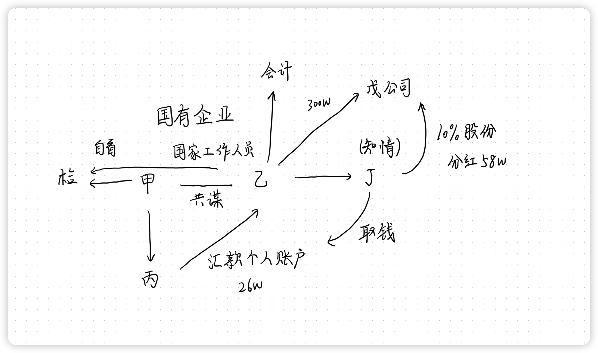
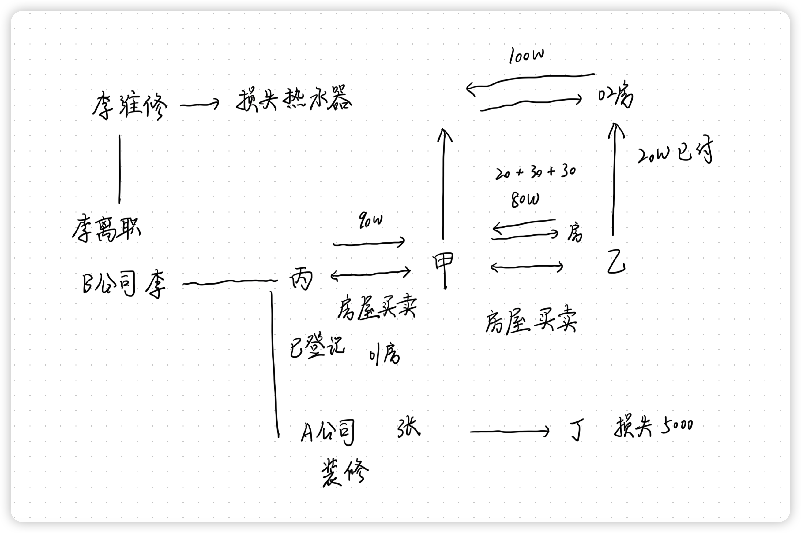
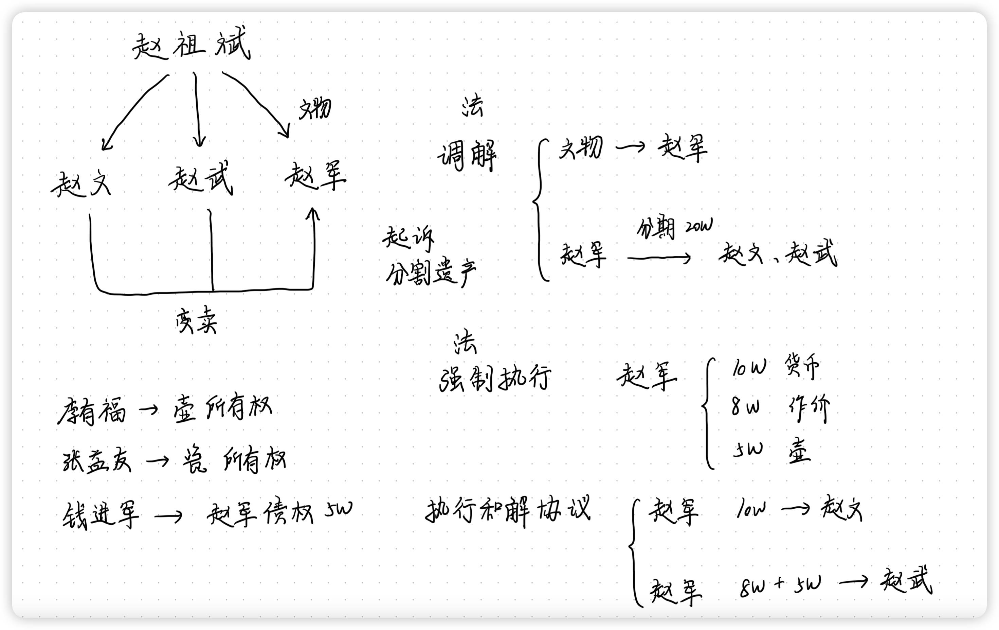

# 刑法学科主观真题（2014）

## 材料
- 国有化工厂车间主任甲与副厂长乙(均为国家工作人员)共谋，在车间的某贵重零件仍能使用时，利用职务之便，制造该零件报废、需向五金厂(非国有企业)购买的假象(该零件价格26万元)，以便非法占有货款。甲将实情告知五金厂负责人丙，嘱丙接到订单后，只向化工厂寄出供货单、发票而不需要实际供货，等五金厂收到化工厂的货款后，丙再将26万元货款汇至乙的个人账户。
- 丙为使五金厂能长期向化工厂供货，便提前将五金厂的26万元现金汇至乙的个人账户。乙随即让事后知情的妻子丁去银行取出26万元现金，并让丁将其中的13万元送给甲。3天后，化工厂会计准备按照乙的指示将26万元汇给五金厂时，因有人举报而未汇出。甲、乙见事情败露，主动向检察院投案，如实交待了上述罪行，并将26万元上交检察院。
- 此外，甲还向检察院揭发乙的其他犯罪事实：乙利用职务之便，长期以明显高于市场的价格向其远房亲戚戊经营的原料公司采购商品，使化工厂损失近300万元;戊为了使乙长期关照原料公司，让乙的妻子丁未出资却享有原料公司10%的股份(乙、丁均知情)，虽未进行股权转让登记，但已分给红利58万元，每次分红都是丁去原料公司领取现金。

## 题目
1. 请分析甲、乙、丙、丁、戊的刑事责任(包括犯罪性质、犯罪形态、共同犯罪、数罪并罚与法定量刑情节)，须答出相应理由。

## 关系图

## 作答
1. 答
   1. 甲
      1. 甲、乙共谋非法占有国有企业财产，行为已着手但因非自己原因未遂，构成共同犯罪、贪污罪未遂，金额为26万元，主动向检察院投案，如实交待了上述罪行，并将26万元上交构成自首
      2. 甲向检察院揭发乙的其他犯罪事实，该犯罪事实与甲、乙贪污无关，构成立功
   2. 乙
      1. 贪污同甲，构成共同犯罪，金额为26万元
      2. 乙利用职务之便，长期以明显高于市场的价格向其远房亲戚戊经营的原料公司采购商品，单独构成贪污罪，金额为300万元
   3. 丙
      1. 丙明知甲、乙贪污的意图，仍然帮助甲、乙，构成贪污罪的共同犯罪帮助犯
   4. 丁
      1. 丙明知甲、乙贪污的意图，仍然帮助甲、乙，构成贪污罪的共同犯罪帮助犯
      2. 丁享有原料公司10%的股份，获取分红，构成受贿罪
   5. 戊
      1. 戊为了使乙长期关照原料公司，构成行贿罪

## 参考答案
1. 甲、乙<strong style="color: red;">利用职务上便利实施了贪污行为</strong>，虽然<strong style="color: red;">客观上</strong>获得了26万元，构成贪污罪，但该26万元不是化工厂的财产，<strong style="color: red;">没有给化工厂造成实际损失</strong>；甲、乙也不可能贪污五金厂的财物，所以，对甲、乙的贪污行为只能认定为贪污未遂。<strong style="color: red;">甲乙犯贪污罪后自首</strong>，可以从轻或者减轻处罚。<strong style="color: red;">甲揭发了乙为亲友非法牟利罪与受贿罪的犯罪事实</strong>，构成立功，可以从轻或者减轻处罚。
2. 乙长期以明显高于市场的价格向其远房亲戚戊经营的原料公司采购商品，使化工厂损失近300万元的行为<strong style="color: red;">构成为亲友非法牟利罪</strong>。<strong style="color: red;">乙以妻子丁的名义</strong>在原料公司享有10%的股份分得红利58万元的行为，符合受贿罪的构成要件，成立<strong style="color: red;">受贿罪</strong>。对于为亲友非法牟利罪与受贿罪以及上述贪污罪，应当实行数罪并罚。
3. 丙将五金厂的26万元挪用出来汇给乙的个人账户。不是为了<strong style="color: red;">个人使用</strong>，也不是为了<strong style="color: red;">谋取个人利益</strong>，<strong style="color: red;">不能认定为挪用资金罪</strong>。但是，丙明知甲、乙两人实施贪污行为，客观上也帮助甲、乙实施了贪污行为，所以<strong style="color: red;">丙构成贪污罪的共犯</strong>（从犯）。
4. 丁将26万元取出的行为，<strong style="color: red;">不构成掩饰、隐瞒犯罪所得罪</strong>，因为该26万元不是<strong style="color: red;">贪污犯罪所得</strong>，也不是其他<strong style="color: red;">犯罪所得</strong>。丁也<strong style="color: red;">不成立贪污罪的共犯</strong>，因为丁取出26万元时该26万元不是<strong style="color: red;">贪污犯罪所得</strong>。丁将其中的13万元送给甲，既<strong style="color: red;">不是帮助分赃</strong>，也<strong style="color: red;">不是行贿</strong>，因为<strong style="color: red;">不成立犯罪</strong>。丁对自己名义对干股<strong style="color: red;">知情</strong>，并<strong style="color: red;">领取贿赂款</strong>，<strong style="color: red;">构成受贿罪的共犯</strong>（从犯）。
5. 戊作为回报让乙的妻子丁未出资却享有原料公司10%丁股份，虽未进行股权转让登记，但让丁分得红利58万元的行为，是为了<strong style="color: red;">谋取不正当利益</strong>，<strong style="color: red;">构成行贿罪</strong>。

# 民法学科主观真题（2014）

## 材料
- 2月5日，甲与乙订立一份房屋买卖合同，约定乙购买甲的房屋一套(以下称01号房)，价格80万元。并约定，合同签订后一周内乙先付20万元，交付房屋后付30万元，办理过户登记后付30万元。
- 2月8日，丙得知甲欲将该房屋出卖，表示愿意购买。甲告其已与乙签订合同的事实，丙说愿出90万元。于是，甲与丙签订了房屋买卖合同，约定合同签订后3日内丙付清全部房款，同时办理过户登记。2月11日，丙付清了全部房款，并办理了过户登记。
- 2月12日，当乙支付第一笔房款时，甲说：房屋已卖掉，但同小区还有一套房屋(以下称02号房)，可作价100万元出卖。乙看后当即表示同意，但提出只能首付20万元，其余80万元向银行申请贷款。甲、乙在原合同文本上将房屋相关信息、价款和付款方式作了修改，其余条款未修改。
- 乙支付首付20万元后，恰逢国家出台房地产贷款调控政策，乙不再具备贷款资格。故乙表示仍然要买01号房，要求甲按原合同履行。甲表示01号房无法交付，并表示第二份合同已经生效，如乙不履行将要承担违约责任。乙认为甲违约在先。3月中旬，乙诉请法院确认甲丙之间的房屋买卖合同无效，甲应履行2月5日双方签订的合同，交付01号房，并承担迟延交付的违约责任。甲则要求乙继续履行购买02号房的义务。
- 3月20日，丙聘请不具备装修资质的A公司装修01号房。装修期间，A公司装修工张某因操作失误将水管砸坏，漏水导致邻居丁的家具等物件损坏，损失约5000元。
- 5月20日，丙花3000元从商场购买B公司生产的热水器，B公司派员工李某上门安装。5月30日，李某从B公司离职，但经常到B公司派驻丙所住小区的维修处门前承揽维修业务。7月24日，丙因热水器故障到该维修处要求B公司维修，碰到李某。丙对李某说：热水器是你装的，出了问题你得去修。维修处负责人因人手不够，便对李某说：那你就去帮忙修一下吧。李某便随丙去维修。李某维修过程中操作失误致热水器毁损。

## 题目
1. 01号房屋的物权归属应当如何确定?为什么?
2. 甲、丙之间的房屋买卖合同效力如何?考察甲、丙之间合同效力时应当考虑本案中的哪些因素?
3. 2月12日，甲、乙之间对原合同修改的行为的效力应当如何认定?为什么?
4. 乙的诉讼请求是否应当得到支持?为什么?
5. 针对甲要求乙履行购买02号房的义务，乙可主张什么权利?为什么?
6. 邻居丁所遭受的损失应当由谁赔偿?为什么?
7. 丙热水器的毁损，应由谁承担赔偿责任?为什么?

## 关系图

## 作答
1. 答
   1. 01号房屋的物权归属为丙
   2. 不动产以登记作为物权变动，合同、付钱等行为均只产生债权效力，不发生物权变动
2. 答
   1. 甲、丙之间的房屋买卖合同合法有效
   2. 根据《民法典》143条关于合同效力的规定，甲、丙之间合同只要不违反法律法规的强制性规定，不违背公序良俗，当事人具有民事行为能力，意思表示真实，即可认定合同效力
   3. 因此本案中，只需审查甲、丙之间的合同内容合法，甲、丙均为完全民事行为能力人，房屋买卖意思表示真实即可
3. 答
   1. 甲、乙之间对原合同修改的行为的效力合法有效
   2. 根据《民法典》143条关于合同效力的规定
   3. 甲、乙之间对原合同修改的行为，是双方真实意思表示，达成合意，可以认定
4. 答
   1. 乙的诉讼请求不应当得到支持
   2. 甲、丙之间的房屋买卖合同合法有效
   3. 甲、乙重新签订合同的行为，应该认定为当事人对于合同内容的修改合意，01房屋不是甲、乙合同的买卖标的，没有发生违约
5. 答
   1. 乙可主张解除权
   2. 合同双方无过错当事人享有任意解除权
   3. 乙不能继续履行合同的原因是因为国家政策变动，属于解除权的免责事由，可以行使解除权
6. 答
   1. 邻居丁所遭受的损失应当由A公司承担赔偿责任
   2. A公司装修工张某因操作失误将水管砸坏，漏水导致邻居丁的家具等物件损坏，张某系A公司职工，提供劳务过程中因职务行为造成损失的，应当由雇佣单位A公司承担赔偿责任
7. 答
   1. 丙热水器的毁损，应由B公司承担赔偿责任
   2. 李某虽然从B公司离职，但B公司未尽到通知义务，因此李某行为构成表见代理
   3. 对于丙，李某是B公司的职工，李某维修过程中操作失误致热水器毁损系职务行为导致侵权，应当由B公司承担赔偿责任

## 参考答案
1. 甲、丙基于<strong style="color: red;">合法有效的买卖合同</strong>于2月11日<strong style="color: red;">办理了过户登记手续</strong>，即完成了<strong style="color: red;">不动产物权的公示行为</strong>。不动产物权发生变动，即由原所有权人甲变更为丙。
2. 甲、丙之间与2月8日形成的房屋买卖合同，该合同为<strong style="color: red;">有效合同</strong>。尽管甲已就该房与乙签订了合同，但甲丙的行为<strong style="color: red;">不属于违背公序良俗的行为</strong>，也<strong style="color: red;">不违反法律、行政法规的强制性规定</strong>，不存在无效的因素。丙的行为仅为<strong style="color: red;">单纯的知情</strong>，甲、丙之间的合同<strong style="color: red;">不属于恶意串通行为</strong>，因其<strong style="color: red;">不以损害乙的权利为目的</strong>。
3. 2月12日，甲、乙之间修改合同的行为，该<strong style="color: red;">行为有效</strong>，其性质属于<strong style="color: red;">双方变更合同</strong>。双方受变更后的合同的约束。
4. 乙与甲通过协商变更了合同，且<strong style="color: red;">甲、丙之间的合同有效且已经办理了物权变动的手续</strong>，故乙关于<strong style="color: red;">确认甲、丙之间合同无效、由甲交付01号房的请求不能得到支持</strong>。但是，乙<strong style="color: red;">可以请求甲承担违约责任</strong>，乙<strong style="color: red;">同意变更合同不等于放弃追索甲在01号房屋买卖合同项下的违约责任</strong>。
5. 乙可请求解除合同，甲应将收受的<strong style="color: red;">购房款本金及其利息</strong>返还给乙。因<strong style="color: red;">政策限购属于当事人无法预见的情形</strong>，且合同出现了<strong style="color: red;">履行不能</strong>的情形，乙有权解除合同，且无须承担责任。
6. 应当由<strong style="color: red;">丙和A公司</strong>承担。张某是受雇人，其执行<strong style="color: red;">职务的行为</strong>，由A公司承担侵权赔偿责任。丙聘请没有装修资质的A公司进屋装修，<strong style="color: red;">具有过错</strong>，也应对丁的损失承担赔偿责任。
7. 1. B公司承担。李某维修行为，构成<strong style="color: red;">表见代理</strong>，其行为后果由B公司承担（<strong style="color: red;">合同上的赔偿责任</strong>）。
   2. 李某虽然离职，但经维修处负责人指派，仍为<strong style="color: red;">执行工作任务</strong>，应由B公司承担（<strong style="color: red;">侵权责任</strong>）。

# 民诉学科主观真题（2014）

## 材料
- 赵文、赵武、赵军系亲兄弟，其父赵祖斌于2013年1月去世，除了留有一个元代青花瓷盘外，没有其他遗产。该青花瓷盘在赵军手中，赵文、赵武要求将该瓷盘变卖，变卖款由兄弟三人平均分配。赵军不同意。2013年3月，赵文、赵武到某省甲县法院(赵军居住地和该瓷盘所在地)起诉赵军，要求分割父亲赵祖斌的遗产。经甲县法院调解，赵文、赵武与赵军达成调解协议：赵祖斌留下的青花瓷盘归赵军所有，赵军分别向赵文、赵武支付人民币20万元。该款项分2期支付：2013年6月各支付5万元、2013年9月各支付15万元。
- 但至2013年10月，赵军未向赵文、赵武支付上述款项。赵文、赵武于2013年10月向甲县法院申请强制执行。经法院调查，赵军可供执行的款项有其在银行的存款10万元，可供执行的其他财产折价为8万元，另外赵军手中还有一把名家制作的紫砂壶，市场价值大约5万元。赵军声称其父亲留下的那个元代青花瓷盘被卖了，所得款项50万元做生意亏掉了。法院全力调查也未发现赵军还有其他的款项和财产。法院将赵军的上述款项冻结，扣押了赵军可供执行的财产和赵军手中的那把紫砂壶。
- 2013年11月，赵文、赵武与赵军拟达成执行和解协议：2013年12月30日之前，赵军将其在银行的存款10万元支付给赵文，将可供执行财产折价8万元与价值5万元的紫砂壶交付给赵武。赵军欠赵文、赵武的剩余债务予以免除。
- 此时，出现了以下情况：①赵军的朋友李有福向甲县法院报告，声称赵军手中的那把紫砂壶是自己借给赵军的，紫砂壶的所有权是自己的。②赵祖斌的朋友张益友向甲县法院声称，赵祖斌留下的那个元代青花瓷盘是他让赵祖斌保存的，所有权是自己的。自己是在一周之前(2013年11月1日)才知道赵祖斌已经去世以及赵文、赵武与赵军进行诉讼的事。③赵军的同事钱进军向甲县法院声称，赵军欠其5万元。同时，钱进军还向法院出示了公证机构制作的债权文书执行证书，该债权文书所记载的钱进军对赵军享有的债权是5万元，债权到期日是2013年9月30日。

## 题目
1. 在不考虑李有福、张益友、钱进军提出的问题的情况下，如果赵文、赵武与赵军达成了执行和解协议，将产生什么法律后果?(考生可以就和解协议履行的情况作出假设)
2. 根据案情，李有福如果要对案中所提到的紫砂壶主张权利，在民事诉讼制度的框架下，其可以采取什么方式?采取相关方式时，应当符合什么条件?(考生可以就李有福采取的方式可能出现的后果作出假设)
3. 根据案情，张益友如果要对那个元代青花瓷盘所涉及的权益主张权利，在民事诉讼制度的框架下，其可以采取什么方式?采取该方式时，应当符合什么条件?
4. 根据案情，钱进军如果要对赵军主张5万元债权，在民事诉讼制度的框架下，其可以采取什么方式?为什么?

## 关系图
