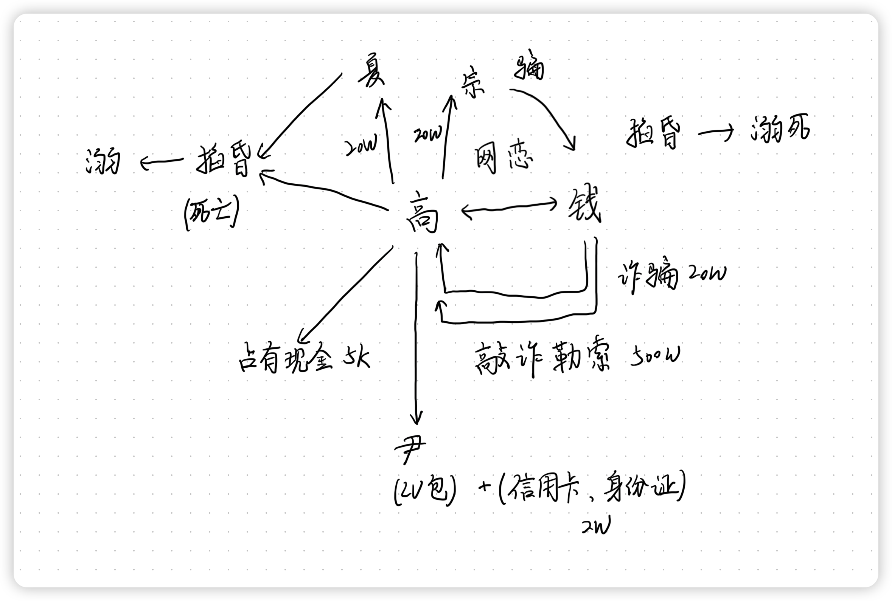

# 刑法学科主观真题（2015）

## 材料
- 高某(男)与钱某(女)在网上相识，后发展为网恋关系，其间，钱某知晓了高某一些隐情，并以开店缺钱为由，骗取了高某20万元现金。
- 见面后，高某对钱某相貌大失所望，相处不久更感到她性格古怪，便决定断绝关系。但钱某百般纠缠，最后竟以公开隐情相要挟，要求高某给予500万元补偿费。高某假意筹钱，实际打算除掉钱某。
- 随后，高某找到密友夏某和认识钱某的宗某，共谋将钱某诱骗至湖边小屋，先将其掐昏，然后扔入湖中溺死。事后，高某给夏某、宗某各20万元作为酬劳。
- 按照事前分工，宗某发微信将钱某诱骗到湖边小屋。但宗某得知钱某到达后害怕出事后被抓，给高某打电话说：“我不想继续参与了。一日网恋十日恩，你也别杀她了。”高某大怒说：“你太不义气啦，算了，别管我了!”宗某又随即打钱某电话，打算让其离开小屋，但钱某手机关机未通。
- 高某、夏某到达小屋后，高某寻机抱住钱某，夏某掐钱某脖子。待钱某不能挣扎后，二人均误以为钱某已昏迷(实际上已经死亡)，便准备给钱某身上绑上石块将其扔入湖中溺死。此时，夏某也突然反悔，对高某说：“算了吧，教训她一下就行了。”高某说：“好吧，没你事了，你走吧!”夏某离开后，高某在钱某身上绑石块时，发现钱某已死亡。为了湮灭证据，高某将钱某尸体扔入湖中。
- 高某回到小屋时，发现了钱某的LV手提包(价值5万元)，包内有5000元现金、身份证和一张储蓄卡，高某将现金据为己有。
- 三天后，高某将LV提包送给前女友尹某，尹某发现提包不是新的，也没有包装，问：“是偷来的还是骗来的”，高某说：“不要问包从哪里来。我这里还有一张储蓄卡和身份证，身份证上的人很像你，你拿着卡和身份证到银行柜台取钱后，钱全部归你。”尹某虽然不知道全部真相，但能猜到包与卡都可能是高某犯罪所得，但由于爱财还是收下了手提包，并冒充钱某从银行柜台取出了该储蓄卡中的2万元。

## 题目
1. 请根据《刑法》相关规定与刑法原理分析高某、夏某、宗某和尹某的刑事责任(要求注重说明理由，并可以同时答出不同观点和理由)。

## 关系图

## 作答
1. 答
   1. 高某
      1. 高某抱住钱某、夏某掐钱某脖子，致钱某死亡构成故意杀人罪既遂，共同犯罪。为了湮灭证据，高某将钱某尸体扔入湖中行为系不可罚之事后行为，不具有期待可能性
      2. 高某将现金据为己有的行为
         1. 若认为死者死亡时立即丧失对财物的占有，则高某构成侵占罪
         2. 若认为死者死亡后短暂继续占有财物，则高某构成盗窃罪
      3. 若认为高某是盗窃信用卡后交由尹某使用，则是盗窃信用卡后使用信用卡，构成对信用卡的盗窃罪；若认为高某是侵占信用卡后交由尹某使用，则是侵占信用卡后使用信用卡，过程信用卡诈骗罪
   2. 夏某
      1. 夏某掐钱某脖子，致其死亡构成故意杀人罪既遂，共同犯罪
      2. 夏某的故意杀人罪已经既遂，因此其反悔行为不构成犯罪中止也不构成犯罪未遂
   3. 宗某
      1. 高某、夏某、宗某，共谋杀害钱某，且宗某的行为没有消除其谋划行为对钱某死亡结果的影响，因此其仍然与高某、夏某构成共同犯罪，构成故意杀人罪既遂
   4. 尹某
      1. 尹某明知信用卡可能是犯罪所得，仍然继续使用信用卡，构成信用卡诈骗罪；同时尹某收下了手提包与使用信用卡的行为还构成掩饰、隐瞒犯罪所得罪

## 参考答案
1. 答
   1. 高某的刑事责任
      1. 高某对钱某成立<strong style="color: red;">故意杀人罪</strong>。是成立<strong style="color: red;">故意杀人罪既遂</strong>还是<strong style="color: red;">故意杀人罪未遂与过失致人死亡罪的想象竞合</strong>，关键在于如何处理<strong style="color: red;">构成要件的提前实现</strong>
         1. 答案一：虽然构成要件结果提前发生，但掐脖子本身有致人死亡的紧迫威胁，能够认定掐脖子时就已经实施杀人行为，<strong style="color: red;">故意存在于着手实行时即可</strong>，故高某应对钱某的死亡承担故意杀人既遂的刑事责任
         2. 答案二：高某、夏某掐钱某的脖子时只是想致钱某昏迷，没有认识到掐脖子的行为会导致钱某死亡，亦即<strong style="color: red;">缺乏既遂的故意</strong>，因而不能对故意杀人既遂负责，只能认定高某的行为是故意杀人未遂与过失致人死亡的想象竞合
      2. 关于拿走钱某的手提包和5000元现金的行为性质，关键在于如何认定死者的占有
         1. 答案一：高某对钱某的手提包和5000元现金成立<strong style="color: red;">侵占罪</strong>，理由是<strong style="color: red;">死者并不占有自己生前的财物</strong>，故手提包和5000元现金属于<strong style="color: red;">遗忘物</strong>
         2. 答案二：高某对钱某的手提包和5000元现金成立<strong style="color: red;">盗窃罪</strong>，理由是<strong style="color: red;">死者继续占有生前的财物</strong>，高某的行为属于<strong style="color: red;">将他人占有财产转移给自己占有的盗窃行为</strong>，成立盗窃罪
      3. 讲钱某的储蓄卡与身份证交给尹某取款2万元的行为性质
         1. 答案一：构成<strong style="color: red;">信用卡诈骗罪的教唆犯</strong>。因为高某不是盗窃信用卡，而是<strong style="color: red;">侵占信用卡</strong>，利用拾得的他人信用卡取款的，属于<strong style="color: red;">冒用他人信用卡</strong>，高某唆使尹某冒用，故属于信用卡诈骗罪的教唆犯
         2. 答案二：构成<strong style="color: red;">盗窃罪</strong>。因为高某是盗窃信用卡，<strong style="color: red;">盗窃信用卡并使用</strong>的，不管是自己直接使用还是让第三人使用，均应认定为盗窃罪
   2. 夏某的刑事责任
      1. 夏某参与杀人共谋，掐钱某的脖子，构成故意杀人既遂。或夏某构成故意杀人未遂与过失致人死亡的想象竞合。理由与高某相同
      2. 由于发生了钱某死亡结果，<strong style="color: red;">夏某的行为是钱某死亡的原因</strong>，夏某<strong style="color: red;">不可能成立犯罪中止</strong>
   3. 宗某的刑事责任
      1. 宗某参与共谋，并将钱某诱骗到湖边小屋，成立故意杀人既遂。宗某虽然后来没有实行行为，但其前行行为与钱某死亡之间具有因果性，<strong style="color: red;">没有脱离共犯关系</strong>；宗某虽然给钱某打过电话，但该中止行为<strong style="color: red;">未能有效防止结果发生</strong>，<strong style="color: red;">不能成立犯罪中止</strong>
   4. 尹某的刑事责任
      1. 尹某构成<strong style="color: red;">掩饰、隐瞒犯罪所得罪</strong>。因为从客观上说，该包属于高某犯罪所得，而且尹某的行为属于掩饰、隐瞒犯罪所得的行为；尹某<strong style="color: red;">认识到可能是高某犯罪所得</strong>，因而具备明知的条件
      2. 尹某冒充钱某取出2万元的行为性质
         1. 答案一：构成<strong style="color: red;">信用卡诈骗罪</strong>。因为尹某属于<strong style="color: red;">冒用他人信用卡</strong>，完全符合信用卡诈骗罪的构成要件
         2. 答案二：构成<strong style="color: red;">盗窃罪</strong>。尹某虽然没有盗窃储蓄卡，但<strong style="color: red;">认识到储蓄卡可能是高某盗窃所得</strong>，并且实施使用行为，属于<strong style="color: red;">承继的共犯</strong>，故应以盗窃罪论处

# 民法学科主观真题（2015）

## 材料
- 甲欲出卖自家的房屋，但其房屋现已出租给张某，租赁期还剩余1年。甲将此事告知张某，张某明确表示，以目前的房价自己无力购买。
- 甲的同事乙听说后，提出购买。甲表示愿意但需再考虑细节。乙担心甲将房屋卖与他人，提出草签书面合同，保证甲将房屋卖与自己，甲同意。甲、乙一起到房屋登记机关验证房屋确实登记在甲的名下，且所有权人一栏中只有甲的名字，双方草签了房屋预购合同。
- 后双方签订正式房屋买卖合同约定：乙在合同签订后的5日内将购房款的三分之二通过银行转账给甲，但甲须提供保证人和他人房屋作为担保;双方还应就房屋买卖合同到登记机关办理预告登记。
- 甲找到丙作为保证人，并用丁的房屋抵押。丁与乙签订了抵押合同并办理了抵押登记，但并没有约定担保范围。甲乙双方办理了房屋买卖合同预告登记，但甲忘记告诉乙房屋出租情况。
- 此外，甲的房屋实际上为夫妻共同财产，甲自信妻子李某不会反对其将旧房出卖换大房，事先未将出卖房屋的事情告诉李某。李某知道后表示不同意。但甲还是瞒着李某与乙办理了房屋所有权转移登记。
- 2年后，甲与李某离婚，李某认为当年甲擅自处分夫妻共有房屋造成了自己的损失，要求赔偿。甲抗辩说，赔偿请求权已过诉讼时效。

## 题目
1. 在本案中，如甲不履行房屋预购合同，乙能否请求法院强制其履行?为什么?
2. 甲未告知乙有租赁的事实，应对乙承担什么责任?
3. 如甲不按合同交付房屋并转移房屋所有权，预告登记将对乙产生何种保护效果?
4. 如甲在预告登记后又与第三人签订房屋买卖合同，该合同是否有效?为什么?
5. 如甲不履行合同义务，在担保权的实现上乙可以行使什么样的权利?担保权实现后，甲、丙、丁的关系如何?
6. 甲擅自处分共有财产，其妻李某能否主张买卖合同无效?是否可以主张房屋过户登记为无效或者撤销登记?为什么?
7. 甲对其妻李某的请求所提出的时效抗辩是否成立?为什么?

## 关系图
