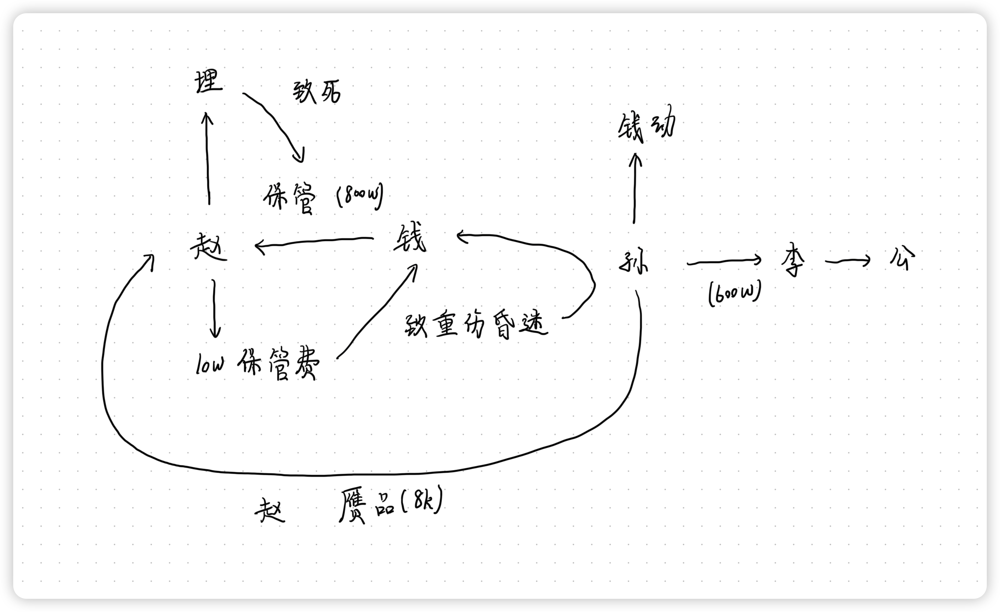
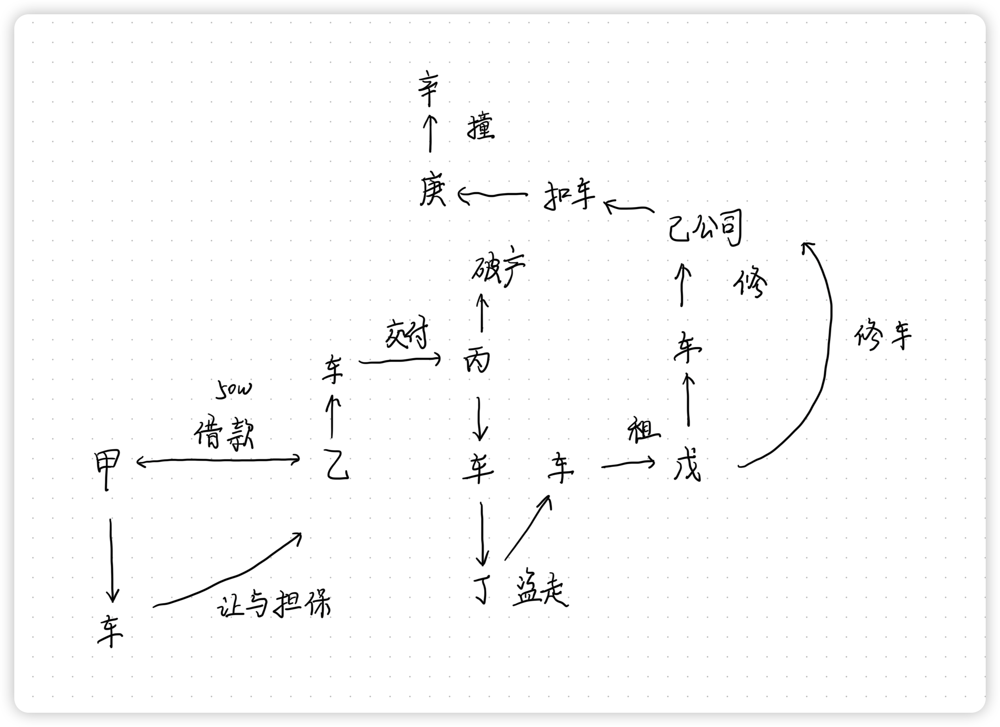
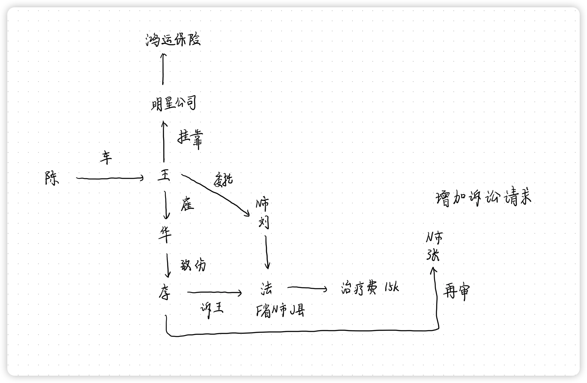

# 刑法学科主观真题（2016）

## 材料
- 赵某与钱某原本是好友，赵某受钱某之托，为钱某保管一幅名画(价值800万元)达三年之久。某日，钱某来赵某家取画时，赵某要求钱某支付10万元保管费，钱某不同意。赵某突然起了杀意，为使名画不被钱某取回进而据为己有，用花瓶猛砸钱某的头部，钱某头部受重伤后昏倒，不省人事，赵某以为钱某已经死亡。刚好此时，赵某的朋友孙某来访。赵某向孙某说“我摊上大事了”，要求孙某和自己一起将钱某的尸体埋在野外，孙某同意。
- 二人一起将钱某抬至汽车的后座，由赵某开车，孙某坐在钱某身边。开车期间，赵某不断地说“真不该一时冲动”，“悔之晚矣”。其间，孙某感觉钱某身体动了一下，仔细察看，发现钱某并没有死。但是，孙某未将此事告诉赵某。到野外后，赵某一人挖坑并将钱某埋入地下(致钱某窒息身亡)，孙某一直站在旁边没做什么，只是反复催促赵某动作快一点。
- 一个月后，孙某对赵某说：“你做了一件对不起朋友的事，我也做一件对不起朋友的事。你将那幅名画给我，否则向公安机关揭发你的杀人罪行。”三日后，赵某将一幅赝品(价值8000元)交给孙某。孙某误以为是真品，以600万元的价格卖给李某。李某发现自己购买了赝品，向公安机关告发孙某，导致案发。

## 题目
1. 关于赵某杀害钱某以便将名画据为己有这一事实，可能存在哪几种处理意见?各自的理由是什么?
2. 关于赵某以为钱某已经死亡，为毁灭罪证而将钱某活埋导致其窒息死亡这一事实，可能存在哪几种主要处理意见?各自的理由是什么?
3. 孙某对钱某的死亡构成何罪(说明理由)?是成立间接正犯还是成立帮助犯(从犯)?
4. 孙某向赵某索要名画的行为构成何罪(说明理由)?关于法定刑的适用与犯罪形态的认定，可能存在哪几种观点?
5. 孙某将赝品出卖给李某的行为是否构成犯罪?为什么?

## 关系图

## 作答
1. 答
   1. 赵某杀害钱某该犯罪事实系刑法理论中的结果的推迟发生
   2. 若认为赵某的犯罪行为应当作为一个整体的犯罪事实看待，则赵某实施了杀人的危害行为，造成了钱某死亡的实害结果，该行为、结果直接具有因果关系，因此应当认定赵某犯故意杀人罪既遂
   3. 若认为赵某实施了两个犯罪行为，其杀人行为与钱某死亡的结果之间存在异常的介入因素，切断了行为、结果之间的因果关系，则应当认定赵某前行为犯故意杀人罪未遂
2. 答
   1. 赵某以为钱某已经死亡，为毁灭罪证而将钱某活埋导致其窒息死亡该犯罪事实系刑法理论中的结果的推迟发生
   2. 若认为赵某的犯罪行为应当作为一个整体的犯罪事实看待，则赵某实施了杀人的危害行为，造成了钱某死亡的实害结果，该行为、结果直接具有因果关系，因此应当认定赵某犯故意杀人罪既遂
   3. 若认为赵某实施了两个犯罪行为，其杀人行为与钱某死亡的结果之间存在异常的介入因素，切断了行为、结果之间的因果关系，则应当认定赵某后行为犯过失致人死亡罪
3. 答
   1. 若认定赵某构成故意杀人罪既遂，赵某杀害行为以及掩埋行为视为故意杀人罪的犯罪继续行为，孙某的行为是构成赵某故意杀人罪的承继共犯，则孙某构成故意杀人罪的帮助犯
   2. 若认定赵某构成故意杀人罪未遂、过失致人死亡罪，则孙某的行为只及于赵某掩埋行为过失致人死亡罪，因此孙某的行为系利用赵某实施杀人行为，则孙某构成故意杀人罪的间接正犯
4. 答
   1. 孙某向赵某索要名画的行为构成敲诈勒索罪
   2. 孙某索要名画的行为，其本质是通过威胁、恐吓赵某，使其陷入恐慌状态，并给予恐慌状态转移自己占有的财物给孙某占有，符合敲诈勒索罪的构成要件
   3. 若认为只要实施了敲诈勒索的行为即触犯敲诈勒索罪，则孙某的行为构成敲诈勒索罪的既遂，若认为敲诈勒索行为需要确实转移占有了相应的财物，则孙某的行为构成敲诈勒索罪的未遂
5. 答
   1. 孙某将赝品出卖给李某的行为不构成犯罪
   2. 孙某出卖的行为虽然在客观上构成了诈骗罪，是的李某陷入错误认识，并基于错误认识处分财物，造成了财产损失，并且孙某获取了相关利益，符合诈骗罪的构成要件，但是主观上孙某没有意识到自己出卖的是赝品，没有诈骗的犯罪主观意识，因此不能认定孙某构成诈骗罪，孙某的行为不构成犯罪

## 参考答案
1. 关于赵某杀害钱某以便将名画据为己有这一事实，可能存在两种处理意见。
   1. 认定为<strong style="color: red;">侵占罪与故意杀人罪</strong>，实行<strong style="color: red;">数罪并罚</strong>。理由是，赵某<strong style="color: red;">已经占有</strong>了名画，不可能对名画实施抢劫行为，杀人行为同时使得赵某将名画据为己有，所以，赵某对名画成立（委托物）侵占罪
   2. 认定成立<strong style="color: red;">抢劫罪</strong>一罪。理由是，赵某杀害钱某是为了使名画不被返还，钱某对名画的<strong style="color: red;">返还请求权</strong>是一种财产性利益，财产性利益可以成为抢劫罪的对象，所以赵某属于<strong style="color: red;">抢劫财产性利益</strong>
2. 赵某以为钱某已经死亡，为毁灭罪证而将钱某活埋导致其窒息死亡，属于<strong style="color: red;">事前的故意或概括的故意</strong>。对此现象的处理，主要有两种观点
   1. 将赵某的前行为认定为<strong style="color: red;">故意杀人罪未遂</strong>（或普通<strong style="color: red;">抢劫</strong>），将后行为认定为<strong style="color: red;">过失致人死亡</strong>，对两者实行<strong style="color: red;">数罪并罚或者按想象竞合处理</strong>。理由是毕竟是因为后行为导致死亡，但行为人对后行为只有过失
   2. 应认定为<strong style="color: red;">故意杀人既遂</strong>一罪（或故意的<strong style="color: red;">抢劫致人死亡</strong>即对死亡持故意一罪），前行为与死亡结果之间的<strong style="color: red;">因果关系并未中断</strong>，前行为与后行为具有一体性，故意不需要存在于实行行为的全过程
3. 孙某对钱某的死亡构成故意杀人罪。孙某明知钱某没有死亡，却催促赵某动作快一点，显然具有杀人故意，客观上对钱某的死亡也起到了作用。及时认为赵某对钱某成立抢劫致人死亡，但由于钱某不对抢劫负责，也只能认定为故意杀人罪。倘若在前一问题上认为赵某成立故意杀人未遂（或普通抢劫）与过失致人死亡罪，那么，孙某就是利用过失行为实施杀人的间接正犯；倘若在前一问题上认为赵某成立故意杀人既遂（或故意的抢劫致人死亡即对死亡持故意），则孙某成立故意杀人罪的帮助犯（从犯）
4. 孙某索要名画的行为构成<strong style="color: red;">敲诈勒索罪</strong>。理由：孙某的行为完成符合本罪的构成要件，因为利用合法行为使他人产生恐惧心理的也属于敲诈勒索。一种观点是，对孙某应当按800万元<strong style="color: red;">适用数额特别巨大的法定刑</strong>，同时<strong style="color: red;">适用未遂犯</strong>的规定，并将<strong style="color: red;">取得价值8000元的赝品的事实作为量刑情节</strong>，这种观点将数额巨大与特别巨大作为加重构成要件；另一种观点是，对孙某应当按8000元<strong style="color: red;">适用数额较大的法定刑</strong>，认定为<strong style="color: red;">犯罪既遂</strong>，<strong style="color: red;">不适用未遂犯的规定</strong>，这种观点将<strong style="color: red;">数额较大视为单纯的量刑因素或量刑规则</strong>
5. 孙某出卖赝品的行为不构成诈骗罪，因为孙某以为出卖的是名画，不具有诈骗故意

# 民法学科主观真题（2016）

## 材料
- 自然人甲与乙订立借款合同，其中约定甲将自己的一辆汽车作为担保物让与给乙。借款合同订立后，甲向乙交付了汽车并办理了车辆的登记过户手续。乙向甲提供了约定的50万元借款。
- 一个月后，乙与丙公司签订买卖合同，将该汽车卖给对前述事实不知情的丙公司并实际交付给了丙公司，但未办理登记过户手续，丙公司仅支付了一半购车款。某天，丙公司将该汽车停放在停车场时，该车被丁盗走。丁很快就将汽车出租给不知该车来历的自然人戊，戊在使用过程中因汽车故障送到己公司修理。己公司以戊上次来修另一辆汽车时未付修理费为由扣留该汽车。汽车扣留期间，己公司的修理人员庚偷开上路，违章驾驶撞伤行人辛，辛为此花去医药费2000元。现丙公司不能清偿到期债务，法院已受理其破产申请。

## 题目
1. 甲与乙关于将汽车让与给债权人乙作为债务履行担保的约定效力如何?为什么?乙对汽车享有什么权利?
2. 甲主张乙将汽车出卖给丙公司的合同无效，该主张是否成立?为什么?
3. 丙公司请求乙将汽车登记在自己名下是否具有法律依据?为什么?
4. 丁与戊的租赁合同是否有效?为什么?丁获得的租金属于什么性质?
5. 己公司是否有权扣留汽车并享有留置权?为什么?
6. 如不考虑交强险责任，辛的2000元损失有权向谁请求损害赔偿?为什么?
7. 丙公司与乙之间的财产诉讼管辖应如何确定?法院受理丙公司破产申请后，乙能否就其债权对丙公司另行起诉并按照民事诉讼程序申请执行?

## 关系图

## 作答
1. 答
   1. 甲与乙关于将汽车让与给债权人乙作为债务履行担保的约定合法有效
   2. 根据《民法典》规定，让与担保合法有效，名为让与实为担保，让与合同是双方同谋的虚假意思表示，真实意思表示担保合同
   3. 乙对汽车享有担保物权
2. 答
   1. 甲主张乙将汽车出卖给丙公司的合同无效，主张不成立
   2. 根据《民法典》规定，无权处分行为不影响合同效力，合同不违背法律法规的强制性规定、不违背公序良俗、当事人具有完全民事行为能力、双飞意思表示真实的合同即合法有效
3. 答
   1. 丙公司请求乙将汽车登记在自己名下的法律依据是双方之间签订的买卖合同
   2. 乙将汽车交付给丙即完成了汽车的物权变动，但是登记是对抗要件，因此乙可以依据合法有效的买卖合同请求丙协助乙将汽车登记至丙名下
4. 答
   1. 丁与戊的租赁合同合法有效
   2. 根据《民法典》无权处分行为不影响合同效力，丁出租盗赃物的行为不导致发生物权变动，因此不影响丁与戊的租赁合同的合同效力
   3. 丁获得的租金属于不当得利
5. 答
   1. 己公司无权扣留汽车
   2. 只有基于同一法律关系的物才能行使留置权
   3. 己公司对戊的债权请求权是基于另一辆汽车，非同一法律关系，因此己公司不享有对该辆汽车的留置权
6. 答
   1. 辛的损失有权向庚和己公司请求损害赔偿
   2. 庚偷开上路不属于职务行为，因此庚承担相应的侵权责任
   3. 己公司扣留汽车，庚偷开上路，己公司对于汽车管理有过错，应当在其过错范围内承担赔偿责任
7. 答
   1. 丙公司申请破产后，丙公司与乙之间的财产诉讼由受理丙公司破产案件的法院（丙公司所在地法院）集中管辖
   2. 乙不能就其债权对丙公司另行起诉并按照民事诉讼程序申请执行，乙只能向受理丙公司破产案件的法院申报债权

## 参考答案
1. 有效。因为我国相关法律虽然没有规定这种<strong style="color: red;">让与担保</strong>方式，但并<strong style="color: red;">无禁止性规定</strong>。通过合同约定，再转移所有权的方式达到担保目的，是不违反法律的，也符合合同自由、鼓励交易的立法目的
   1. 乙享有的不是所有权，而是<strong style="color: red;">以所有权人的名义享有担保权</strong>
   2. 由于办理了<strong style="color: red;">过户登记手续</strong>，乙<strong style="color: red;">享有所有权</strong>
2. 不能成立。
   1. 乙对汽车享有所有权，其有权处分该汽车。没有导致合同无效的其他因素
   2. 虽然乙将汽车出卖给丙公司的行为属于无权处分，对甲也是违约行为，但无权处分不影响合同效力，法律并不要求出卖人在订立买卖合同时对标的物享有所有权或者处分权
3. 有法律依据。因根据《民法典》第224条规定，动产物权的设立和转让，自交付时发生效力，但是法律另有规定的除外。第225条规定，船舶、航空器和机动车等的物权的设立、变更、转让和消灭，未经登记，不得对抗善意第三人。汽车属于特殊动产，交付即转移所有权，登记只是产生对外的效力，不登记不具有对抗第三人的效力。本案中因为汽车已经交付，丙公司已取得汽车所有权
4. 有效，因为尽管丁不享有所有权或处分权，但是并不影响租赁合同效力。其所得的租金属于不当得利
5. 己公司无权扣留汽车并享有留置权。《民法典》第448条规定，债权人留置的动产，应当与债权属于同一法律关系，但是企业之间留置的除外。而在本案中，债权与汽车无牵连关系
6. 辛有权向戊、己公司、庚请求赔偿，因为戊系承租人，系汽车的使用权人；庚是己公司的雇员，庚的行为属于职务行为，己应当承担雇用人（或雇主）责任；庚系肇事人（直接侵权行为人）
7. 丙公司与乙之间的财产诉讼应该由破产案件受理的人民法院管辖。法院受理丙公司破产申请后，乙应当申报债权，如果对于债权有争议，可以向受理破产申请的人民法院提起诉讼，但不能按照民事诉讼程序申请执行

# 民诉学科主观真题（2016）

## 材料
- 陈某转让一辆中巴车给王某但未办过户。王某为了运营，与明星汽运公司签订合同，明确挂靠该公司，王某每月向该公司交纳500元，该公司为王某代交规费、代办各种运营手续、保险等。明星汽运公司依约代王某向鸿运保险公司支付了该车的交强险费用。
- 2015年5月，王某所雇司机华某驾驶该中巴车致行人李某受伤，交警大队认定中巴车一方负全责，并出具事故认定书。但华某认为该事故认定书有问题，提出虽肇事车辆车速过快，但李某横穿马路没有走人行横道，对事故发生也负有责任。因赔偿问题协商无果，李某将王某和其他相关利害关系人诉至F省N市J县法院，要求王某、相关利害关系人向其赔付治疗费、误工费、交通费、护理费等费用。被告王某委托N市甲律师事务所刘律师担任诉讼代理人。
- 案件审理中，王某提出其与明星汽运公司存在挂靠关系、明星汽运公司代王某向保险公司交纳了该车的交强险费用、交通事故发生时李某横穿马路没走人行横道等事实;李某陈述了自己受伤、治疗、误工、请他人护理等事实。诉讼中，各利害关系人对上述事实看法不一。李某为支持自己的主张，向法院提交了因误工被扣误工费、为就医而支付交通费、请他人护理而支付护理费的书面证据。但李某声称治疗的相关诊断书、处方、药费和治疗费的发票等不慎丢失，其向医院收集这些证据遭拒绝。李某向法院提出书面申请，请求法院调查收集该证据，J县法院拒绝。
- 在诉讼中，李某向J县法院主张自己共花治疗费36650元，误工费、交通费、护理费共计12000元。被告方仅认可治疗费用15000元。J县法院对案件作出判决，在治疗费方面支持了15000元。双方当事人都未上诉。
- 一审判决生效一个月后，李某聘请N市甲律师事务所张律师收集证据、代理本案的再审，并商定实行风险代理收费，约定按协议标的额的35%收取律师费。经律师说服，医院就李某治伤的相关诊断书、处方、药费和治疗费的支付情况出具了证明，李某据此向法院申请再审，法院受理了李某的再审申请并裁定再审。
- 再审中，李某提出增加赔付精神损失费的诉讼请求，并要求张律师一定坚持该意见，律师将其写入诉状。

## 题目
1. 本案的被告是谁?简要说明理由
2. 就本案相关事实，由谁承担证明责任?简要说明理由
3. 交警大队出具的事故认定书，是否当然就具有证明力?简要说明理由
4. 李某可以向哪个(些)法院申请再审?其申请再审所依据的理由应当是什么
5. 再审法院应当按照什么程序对案件进行再审?再审法院对李某增加的再审请求，应当如何处理?简要说明理由
6. 根据律师执业规范，评价甲律师事务所及律师的执业行为，并简要说明理由

## 关系图

## 作答
1. 答
   1. 被告是王某、鸿运保险公司，李某可以增加明星公司为被告
   2. 本案中，直接侵权人是华某，王某雇佣华某驾驶汽车，华某是在执行职务行为过程中侵权李某，根据《民法典》规定由劳务接受方承担侵占责任，因此王某是适格被告；明星汽运公司代王某向保险公司交纳了该车的交强险费用，因此鸿运保险公司是适格被告；王某是车所有权人，车挂靠明星公司，根据《民法典》规定挂靠方与被挂靠方承担连带责任，因此李某可以选择增加明星公司为被告，也可以选择放弃增加明星公司为被告
   3. 车虽然登记在陈某名下，但是陈某不是车实际所有权人，也不是侵权行为发生时的车辆驾驶人，在本次案件中，没有过错，因此陈某不是适合被告
2. 答
   1. 交通事故责任是无过错责任
   2. 王某提出其与明星汽运公司存在挂靠关系系自认，王某提出明星汽运公司代王某向保险公司交纳了该车的交强险费用的事实，由王某承担证明责任，王某提出交通事故发生时李某横穿马路没走人行横道的事实系免责事由，由王某承担证明责任
   3. 李某请求要求王某、相关利害关系人向其赔付治疗费、误工费、交通费、护理费，由李某承担证明责任
3. 答
   1. 交警大队出具的事故认定书，系国家机关出具的公文书，当然具有证明力，推定其内容具有正确性
   2. 本案中王某等被告若主张事故认定书有问题，可以举证予以推翻
4. 答
   1. 李某可以向作出原审生效判决的F省N市J县基层人民法院申请再审，也可以向作出原审生效判决法院的上一级法院即F省N市中级人民法院申请再审
   2. 申请再审所依据的理由应当是有新发现的关键证据，可以证明案件有新的事实
5. 答
   1. 若再审法院为F省N市J县基层人民法院，应当按照一审程序对案件进行再审，若再审法院为F省N市中级人民法院，应当按照二审程序提审，对案件进行再审
   2. 若再审法院为F省N市J县基层人民法院，再审法院对李某增加的再审请求，可以调解，调解不成按照原告新增诉讼请求处理，因为再审按照一审程序处理，对于新增的诉讼请求可以继续审理，若再审法院为F省N市中级人民法院，再审法院对李某，增加的再审请求，调解，调解不成，应当裁定撤销原判，发回重审，若双方同意由二审法院直接判决的二审法院可以直接判决，因为再审按照二审程序处理，为保证诉讼当事人的上诉权，原则上不应当由二审法院直接判决，但是当事人双方同意由二审法院判决的除外
6. 答
   1. 刘律证据收集能力有问题
   2. 张律正常

## 参考答案
1. 本案被告得以原告的主张来加以确定
   1. 原告主张<strong style="color: red;">挂靠单位和被挂靠单位承担责任的</strong>，<strong style="color: red;">王某、明星汽运公司、鸿运保险公司为共同被告</strong>
      1. 因为明星汽运公司为王某从事中巴车运营的被挂靠单位，根据民诉司法解释第54条规定，以挂靠形式从事民事活动，当事人请求由挂靠人和被挂靠人依法承担民事责任的，该<strong style="color: red;">挂靠人和被挂靠人为共同诉讼人</strong><strong style="color: red;"></strong>
   2. 原告不主张挂靠单位承担责任的，<strong style="color: red;">王某、鸿运保险公司为共同被告</strong>
2. 王某与明星汽运公司存在挂靠关系的事实，由王某承担证明责任；明星汽运公司依约代王某向鸿运保险公司交纳了该车的强制保险费用的事实，由王某承担证明责任；交通事故发生时，李某横穿马路没走人行通道的事实，由王某承担证明责任；李某受伤状况、治疗状况、误工状况、请他人护理状况等事实，由李某承担证明责任
   1. 诉讼中，在通常情况下，<strong style="color: red;">谁主张事实支持自己的权利主张</strong>，由<strong style="color: red;">谁来承担自己所主张的事实的证明责任</strong>。本案上述事实，不存在特殊情况的情形，因此由相对应的事实主张者承担证明责任
3. 交警大队出具的事故认定书，<strong style="color: red;">不当然具有证明力</strong>
   1. 在诉讼中，交警大队出具的事故认定书只是证据的一种，其所证明的事实与案件其他证据所证明的事实是否一致，以及法院是否确信该事故认定书所确认的事实，法院有权根据案件的综合情况予以判断，即该事故认定书的证明力由法院判断后确定
4. 李某可以向F省N市中级人民法院申请再审。因为，根据民诉司法解释，<strong style="color: red;">再审案件原则上向原审法院的上级人民法院提出</strong>。本案不存在向原审法院申请再审的法定事由。再审的理由为：对审理案件需要的主要证据，当事人因客观原因不能自行收集，书面申请人民法院调查收集，人民法院未调查收集；<strong style="color: red;">有新的证据</strong>，<strong style="color: red;">足以推翻原判决</strong>
5. 1. 原审法院应当按照第二审程序对案件进行再审。因为受理丙裁定对案件进行再审的，是原审法院的上级人民法院，应当适用第二审程序对案件进行再审
   2. <strong style="color: red;">再审法院对李某增加的要求被告支付精神损失费的再审请求不予受理</strong>；且该请求也不属于可以另行起诉的情形，再审法院也不可告知另行起诉。因为，根据《最高人民法院关于确定民事侵权精神损害赔偿责任若干问题的解释》第六条的规定，当事人在侵权诉讼中没有提出赔偿精神损害的诉讼请求，诉讼终结后，又基于同一侵权事实另行起诉请求赔偿精神损害赔偿的，人民法院不予受理
6. 1. 可以适用风险代理，但风险代理收费按规定不得高于30%
   2. 甲律所张律师担任李某申诉代理人，违反《律师执业行为规范》50条第（七）项规定
   3. 李某增加诉讼请求不符合有关规定，律师应指出未能指出，有违“以事实为根据、以法律为准绳”的执业原则及勤勉尽责的要求