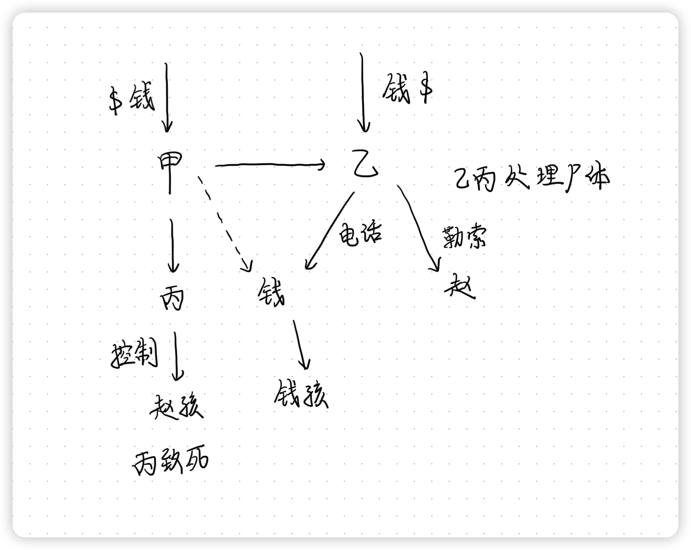
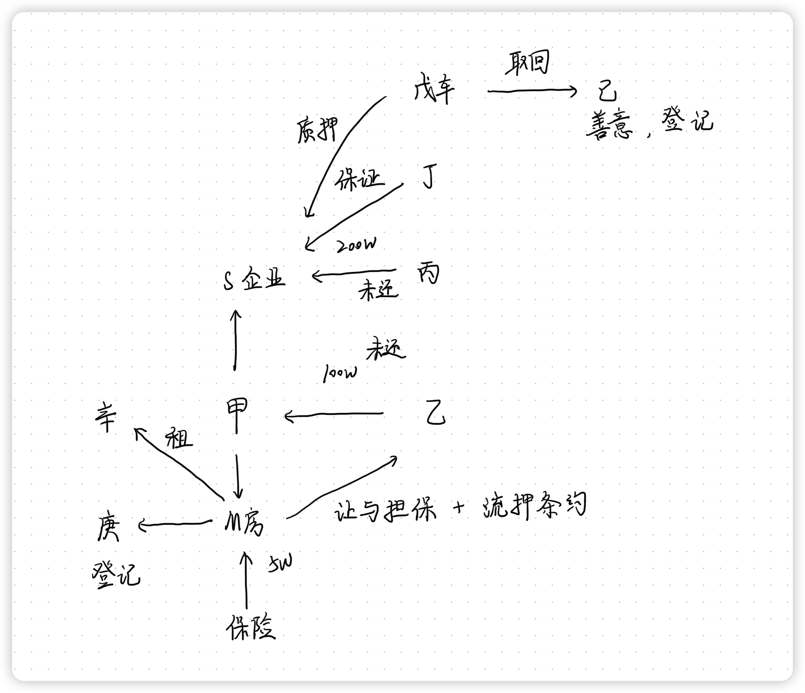

# 刑法学科主观真题（2017）

## 材料
- 甲生意上亏钱，乙欠下赌债，二人合谋干一件“靠谱”的事情以摆脱困境。甲按分工找到丙，骗丙使其相信钱某欠债不还，丙答应控制钱某的小孩以逼钱某还债，否则不放人
- 丙按照甲所给线索将钱某的小孩骗到自己的住处看管起来，电告甲控制了钱某的小孩，甲通知乙行动。乙给钱某打电话：“你的儿子在我们手上，赶快交50万元赎人，否则撕票!”钱某看了一眼身旁的儿子，回了句：“骗子!”便挂断电话，不再理睬。乙感觉异常，将情况告诉甲。甲来到丙处发现这个孩子不是钱某的小孩而是赵某的小孩，但没有告诉丙，只是嘱咐丙看好小孩，并从小孩口中套出其父赵某的电话号码
- 甲与乙商定转而勒索赵某的钱财。第二天，小孩哭闹不止要离开，丙恐被人发觉，用手捂住小孩口、鼻，然后用胶带捆绑其双手并将嘴缠住，致其机械性窒息死亡。甲得知后与乙商定放弃勒索赵某财物，由乙和丙处理尸体。乙、丙二人将尸体连夜运至城外掩埋。第三天，乙打电话给赵某，威胁赵某赶快向指定账号打款30万元，不许报警，否则撕票。赵某当即报案，甲、乙、丙三人很快归案

## 题目
1. 请分析甲、乙、丙的刑事责任(包括犯罪性质即罪名、犯罪形态、共同犯罪、数罪并罚等)，须简述相应理由

## 关系图

## 作答
1. 答
    1. 甲
       1. 甲、乙、丙共谋绑架孩子勒索财物，共同犯罪，实施绑架行为时着手，对于犯罪形态有两种观点
          1. 若认为只有主观认识的绑架对象与客观实际绑架的人完全一致时，才能认定绑架罪既遂，则甲、乙、丙为绑架未遂与非法拘禁罪既遂，想象竞合，择一重罪
          2. 若认为只要实施了绑架行为，就可以认定绑架罪既遂，则甲、乙、丙为绑架既遂
    2. 乙
       1. 乙绑架罪同
       2. 乙明知赵某孩子死亡的事实，电话赵某威胁要钱，构成诈骗罪未遂，与前绑架罪一类数罪并罚
       3. 乙、丙掩埋尸体的行为，系不可罚之事后行为，不具有期待可能性
    3. 丙
       1. 丙绑架罪同
       2. 丙在非法拘禁赵某孩子过程中，过失致孩子死亡，构成绑架致人死亡的加重情节
       3. 处理尸体行为同

## 参考答案
1. 甲、乙构成共同绑架罪
   1. 甲与乙预谋绑架，并<strong style="color: red;">利用丙的不知情行为</strong>，尽管丙误将赵某的小孩作为钱某的小孩<strong style="color: red;">非法拘禁</strong>，但是甲、乙借此<strong style="color: red;">实施索要钱某财物的行为</strong>，是<strong style="color: red;">绑架他人为人质</strong>，进行<strong style="color: red;">勒索第三人的财物</strong>，符合绑架罪犯罪构成，构成共同绑架罪
   2. 甲、乙所犯绑架罪属于<strong style="color: red;">未遂</strong>，可以从轻或者减轻处罚
      1. 虽然侵犯了赵某小孩的人身权利，但是没有造成钱某的担忧，没有侵犯也不可能侵犯到钱某的人身自由与权利，当然也<strong style="color: red;">不可能勒索到钱某的财物</strong>，所以是绑架罪未遂
2. 在甲与乙商定放弃犯罪时，乙假意答应甲放弃犯罪，实际上借助于原来的犯罪，对赵某谎称绑架了其小孩，继续实施勒索赵某财物的行为，构成了<strong style="color: red;">敲诈勒索罪与诈骗罪的想象竞合犯</strong>，应当从一重罪论处
   1. 因为人质已经不复存在，其行为不仅构成敲诈勒索罪，同时构成诈骗罪。因为乙向赵某发出的是虚假的能够<strong style="color: red;">引起赵某恐慌、担忧</strong>的信息，<strong style="color: red;">同时具有虚假性质和要挟性质</strong>，因而构成敲诈勒索罪与诈骗罪的想象竞合犯，应当从一重罪论处，并与之前所犯绑架罪（未遂），数罪并罚
3. 丙构成<strong style="color: red;">非法拘禁罪和故意杀人罪</strong>，应当分别定罪量刑，然后数罪并罚
   1. 丙哄骗小孩离开父母，并施力控制，是出于非法剥夺他人人身自由目的而实行的行为，所以构成非法拘禁罪
   2. 因为丙没有参加甲、乙绑架预谋，对于甲、乙实施<strong style="color: red;">绑架犯罪不知情</strong>，所以不能与甲、乙构成共同绑架罪，而是单独构成非法拘禁罪。丙犯非法拘禁罪，是甲、乙共同实施绑架罪的一部分——绑架他人作为人质，甲、乙对于丙的非法拘禁行为负责。甲、乙、丙在<strong style="color: red;">非法拘禁罪范围内构成共同犯罪</strong>；甲、乙既构成绑架罪，由构成非法拘禁罪，是想象竞合犯，从一重罪论处；丙则因为没有绑架犯罪故意，仅有非法拘禁罪故意，所以只成立非法拘禁罪
   3. 1. 丙为控制小孩采取捆绑行为致其死亡，构成<strong style="color: red;">故意杀人罪</strong>
         1. 这是一种具有高度危险的侵犯人身权利的行为，可能造成死亡的结果，可以评价为杀人行为，丙主观上对此有明知并持放任的态度，是间接故意杀人，因而构成故意杀人罪
         2. 甲、乙对于人质的死亡没有故意、过失，没有罪责。具体来说，丙的杀人故意行为超出了非法拘禁之共同犯罪故意范围，应当由丙单独负责，甲乙没有罪过、罪责
      2. 1. 丙构成<strong style="color: red;">过失致人死亡罪</strong>。丙应当预见到自己的行为可能造成小孩死亡，但是丙不希望，也不容忍小孩死亡，主观上是疏忽大意过失，构成过失致人死亡罪
         2. 按照事前分工，看护小孩属于丙的责任，小孩的安全由丙负责，甲乙两人均不在现场，没有可能保证防止、避免小孩死亡，所以，甲、乙不构成过失致人死亡罪

# 民法学科主观真题（2017）

## 材料
- 2016年1月10日，自然人甲为创业需要，与自然人乙订立借款合同，约定甲向乙借款100万元，借款期限1年，借款当日交付。2016年1月12日，双方就甲自有的M商品房又订立了一份商品房买卖合同，其中约定：如甲按期偿还对乙的100万元借款，则本合同不履行;如甲到期未能偿还对乙的借款，则该借款变成购房款，甲应向乙转移该房屋所有权;合同订立后，该房屋仍由甲占有使用
- 2016年1月15日，甲用该笔借款设立了S个人独资企业。为扩大经营规模，S企业向丙借款200万元，借款期限1年，丁为此提供保证担保，未约定保证方式;戊以一辆高级轿车为质押并交付，但后经戊要求，丙让戊取回使用，戊又私自将该车以市价卖给不知情的己，并办理了过户登记
- 2016年2月10日，甲因资金需求，瞒着乙将M房屋出卖给了庚，并告知庚其已与乙订立房屋买卖合同一事。2016年3月10日，庚支付了全部房款并办理完变更登记，但因庚自3月12日出国访学，为期4个月，双方约定庚回国后交付房屋
- 2016年3月15日，甲未经庚同意将M房屋出租给知悉其卖房给庚一事的辛，租期2个月，月租金5000元。2016年5月16日，甲从辛处收回房屋的当日，因雷电引发火灾，房屋严重毁损。根据甲卖房前与某保险公司订立的保险合同(甲为被保险人)，某保险公司应支付房屋火灾保险金5万元。2016年7月13日，庚回国，甲将房屋交付给了庚
- 2017年1月16日，甲未能按期偿还对乙的100万元借款，S企业也未能按期偿还对丙的200万元借款，现乙和丙均向甲催要

## 题目
1. 就甲对乙的100万元借款，如乙未起诉甲履行借款合同，而是起诉甲履行买卖合同，应如何处理?请给出理由
2. 就S企业对丙的200万元借款，甲、丁、戊各应承担何种责任?为什么
3. 甲、庚的房屋买卖合同是否有效?庚是否已取得房屋所有权?为什么
4. 谁有权收取M房屋2个月的租金?为什么
5. 谁应承担M房屋火灾损失?为什么
6. 谁有权享有M房屋火灾损失的保险金请求权?为什么

## 关系图

## 作答
1. 答
   1. 甲、乙之间的买卖合同，名为让与实为担保，实质系非典型担保合同，合同中关于买卖的规定本质是流押条款，依法无效，因此如乙起诉甲履行买卖合同，应当驳回其诉讼请求
   2. 乙享有的担保权合法有效，乙可以请求拍卖甲M房，在借款及利息范围内主张有效受偿
2. 答
   1. S企业系甲的个人独资企业，因此甲在S企业不能归还借款范围内承担连带责任，丁的保证责任为约定保证类型，丁承担一般保证责任，丙归还戊车视为放弃对戊的质押权，戊不承担担保责任
3. 答
   1. 甲、庚的房屋买卖合同合法有效，甲是M房所有权人，甲出卖房屋行为系有权处分，合法有效
   2. 庚已取得房屋所有权，房屋系不动产，不动产以登记发生物权变动，庚自登记时起取得房屋所有权
4. 答
   1. 甲有权收取M房屋2个月的租金
   2. 租赁合同当事人是甲和庚，根据合同相对性原理，甲有权收取租金
5. 答
   1. 甲应承担M房屋火灾损失
   2. 因为此时房屋尚未交付，风险尚未转移
6. 答
   1. 甲有权享有M房屋火灾损失的保险金请求权
   2. 甲是保险合同中的被保险人，根据合同相对性原理

## 参考答案
1. 1. 本案应按照<strong style="color: red;">民间借贷法律关系</strong>作出认定和处理。
      1. 根据民间借贷司法解释第24条第1款，当事人以签订买卖合同作为民间借贷合同的担保，借款到期后借款人不能还款，出借人<strong style="color: red;">请求履行买卖合同</strong>的，<strong style="color: red;">人民法院应当按照民间借贷法律关系审理</strong>。当事人根据法庭审理情况变更诉讼请求的，人民法院应当准许。民间借贷司法解释第24条第2款，根据按照民间借贷法律关系审理作出的判决生效后，借款人不履行生效判决确定的金钱债务，出借人可以申请拍卖买卖合同标的物，以偿还债务；就拍卖所得的借款与应偿还借款本息之间的差额，借款人或者出借人有权主张返还或者补偿
   2. 应当按照<strong style="color: red;">抵押合同</strong>处理。根据民法典第146条第1款“行为人与相对人以虚假的意思表示实施的民事法律行为无效”，<strong style="color: red;">认定买卖合同无效</strong>；进而，又根据民法典第146条第2款“以虚假的意思表示隐藏的民事法律行为的效力，依照有关法律规定处理”，认定<strong style="color: red;">隐藏的行为为抵押合同</strong>，应当按照抵押合同处理
2. 甲仅<strong style="color: red;">于S企业财产不足以清偿债务时以个人其他财产予以清偿</strong>；根据个人独资企业法第31条的规定，“个人独资企业财产不足以清偿债务的，投资人应当以其个人的其他财产予以清偿”。丁应<strong style="color: red;">承担连带保证责任</strong>；根据《民法典》第686条的规定，当事人在保证合同中对保证方式没有约定或者约定不明确的，<strong style="color: red;">按照一般保证承担保证责任</strong>。戊不承担责任，其<strong style="color: red;">质权因丧失占有而消灭</strong>
3. 合同有效，庚<strong style="color: red;">知情并不影响合同效力</strong>。庚已取得所有权，甲系<strong style="color: red;">有权处分</strong>，庚因<strong style="color: red;">登记取得所有权</strong>
4. 甲有权收取。甲为<strong style="color: red;">有权占有</strong>，租赁合同有效，甲可<strong style="color: red;">收取房屋法定孳息</strong>
5. 应由甲承担。根据合同法第142条的规定，除非当事人另有约定，<strong style="color: red;">标的物风险自交付起转移</strong>
6. 庚享有请求权。根据保险法第49条第1款的规定，保险标的转让的，保险标的的受让人承继被保险人的权利和义务

# 民诉学科主观真题（2017）

## 材料
- 2013年5月，居住在S市二河县的郝志强、迟丽华夫妻将二人共有的位于S市三江区的三层楼房出租给包童新居住，协议是以郝志强的名义签订的。2015年3月，住所地在S市四海区的温茂昌从该楼房底下路过，被三层掉下的窗户玻璃砸伤，花费医疗费8500元
- 就温茂昌受伤赔偿问题，利害关系人有关说法是：包童新承认当时自己开了窗户，但没想到玻璃会掉下，应属窗户质量问题，自己不应承担责任;郝志强认为窗户质量没有问题，如果不是包童新使用不当，窗户玻璃不会掉下;此外，温茂昌受伤是在该楼房院子内，作为路人的温茂昌不应未经楼房主人或使用权人同意擅自进入院子里，也有责任;温茂昌认为自己是为了躲避路上的车辆而走到该楼房旁边的，不知道这个区域已属个人私宅的范围。为此，温茂昌将郝志强和包童新诉至法院，要求他们赔偿医疗费用
- 法院受理案件后，向被告郝志强、包童新送达了起诉状副本等文件。在起诉状、答辩状中，原告和被告都坚持协商过程中自己的理由。开庭审理5天前，法院送达人员将郝志强和包童新的传票都交给包童新，告其将传票转交给郝志强。开庭时，温茂昌、包童新按时到庭，郝志强迟迟未到庭。法庭询问包童新是否将出庭传票交给了郝志强，包童新表示4天之前就交了。法院据此在郝志强没有出庭的情况下对案件进行审理并作出了判决，判决郝志强与包童新共同承担赔偿责任：郝志强赔偿4000元，包童新赔偿4500元，两人相互承担连带责任
- 一审判决送达后，郝志强不服，在上诉期内提起上诉，认为一审审理程序上存在瑕疵，要求二审法院将案件发回重审。包童新、温茂昌没有提起上诉

## 题目
1. 哪些(个)法院对本案享有管辖权?为什么
2. 本案的当事人确定是否正确?为什么
3. 本案涉及的相关案件事实应由谁承担证明责任
4. 一审案件的审理在程序上有哪些瑕疵?二审法院对此应当如何处理