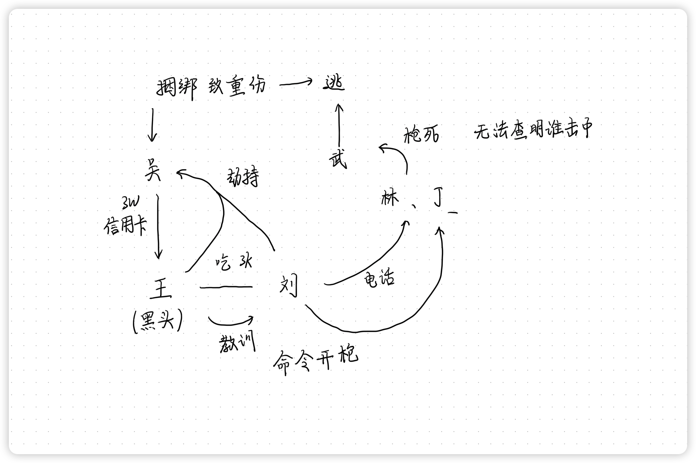
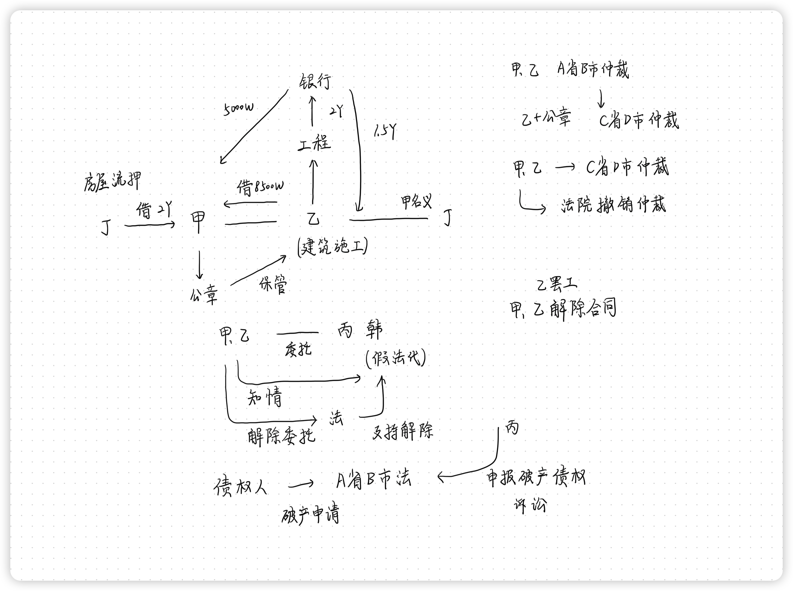
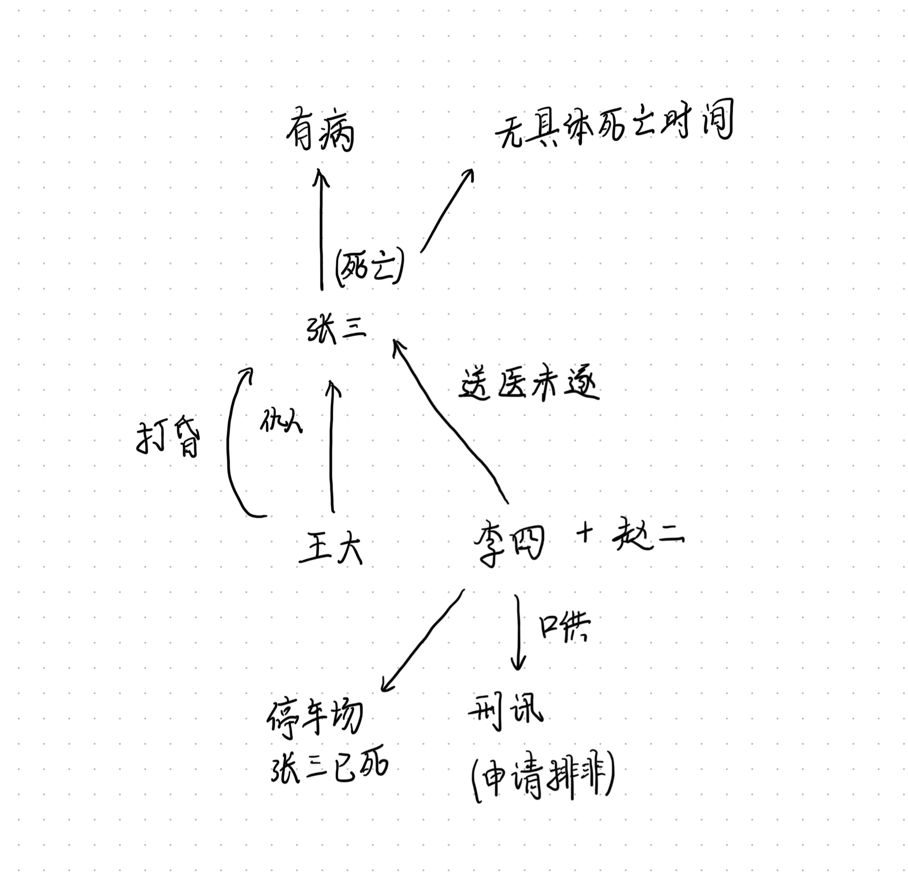

# 刑法学科主观真题（2018）

## 材料
- 王某是黑社会性质组织的领导者，某日和刘某一起到餐厅吃饭时，消费3000元，刷卡付款时，服务员吴某故意将金额输入为30000元，王某果然没有注意到，遂刷卡付款
- 王某发现多付了钱以后，与刘某去找吴某还钱，吴某拒不返还。王某、刘某恼羞成怒，准备劫持吴某让其还钱。在捆绑吴某过程中，不慎将吴某摔成重伤，因为担心酒店其他人员报警，故放弃挟持，离开酒店
- 在王某和刘某走出酒店时，在门口被武某等四名保安拦截。王某遂让刘某打电话叫人过来帮忙，刘某给林某、丁某打电话，并私下叫二人带枪过来，林某二人将枪支藏在衣服里，护送王某上了私家车
- 新厂武某等人见状遂让四人离开。王某上车以后气不过，让刘某“好好教训这个保安”，随即开车离开。刘某随即让林某、丁某二人开枪。林某与丁某同时分别朝武某腿部和腹部开枪。只有一枪击中武某腹部，导致其死亡，现无法查明是谁击中

## 题目
1. 关于吴某的行为定性，有几种处理意见？须说明理由
2. 对于王某劫持吴某的行为应如何定性，为什么
3. 对于武某的死亡，王某、刘某、林某、丁某如何定性？为什么（其中对王某行为性质的认定有不同见解，分别写出）

## 关系图

## 作答
1. 答
   1. 服务员吴某故意将金额输入为30000元的行为
      1. 若认为吴某的行为是使用平和手段将他人所有的货币转移为自己所有，则吴某的行为触犯了盗窃罪
      2. 若认定吴某的行为是使得王某基于错误认识，处分财物，吴某获取相应的财物，则吴某的行为触犯了诈骗罪与信用卡诈骗罪，想象竞合
2. 答
   1. 吴某占有的30000元货币中，3000元是王某等人消费金额，属于合法占有，27000元是非法占有
   2. 因此王某、刘某劫持吴某还钱的行为，在3000元范围内，属于非法劫持他人，意图占有第三人的财物，触犯了绑架罪，在27000元范围内，属于非法劫持他人索要属于自己的财物，触犯了非法拘禁罪而非绑架罪
3. 答
   1. 林某与丁某同时分别朝武某腿部和腹部开枪。只有一枪击中武某腹部，导致其死亡，现无法查明是谁击中，基于存疑时有利于被告的原则，只能认定击中武某腹部的子弹不是来自林某、也不是来自丁某，因此林某、丁某均触犯故意伤害罪，但不触犯致人死亡的加重情节
   2. 因为刘某让林某、丁某二人开枪，因此刘某对林某、丁某的行为结果概括性承担责任，因此刘某一定对武某死亡结果承担责任，因此刘某触犯故意杀人罪既遂
   3. 对于王某让刘某“好好教训这个保安”的行为
      1. 若认定王某对刘某、林某、丁某的行为在王某的主观故意范围内，则王某对武某的死亡结果概括性承担责任，王某触犯故意杀人罪
      2. 若认定王某不知林某、丁某携枪，其行为结果超出了王某的主观预料范围内，则王某触犯故意伤害罪致人死亡的加重情节

## 参考答案
1. 关于吴某的行为定性，有两种处理意见。没有明确的处分意识，仅有自愿的转移财产行为是否能构成诈骗罪，在理论上有不同观点
   1. 根据处分意识不要说，吴某的行为构成诈骗罪。本案中，王某在支付餐费时，虽然没有意识到自己实际支付的是30000元，而不是3000元，但其确实自愿支付了该笔金额。如果认为构成诈骗罪只需要有自愿的转移财产的行为，而不需要有明确的处分财产的意识，则吴某的行为构成诈骗罪
   2. 根据处分意识必要说，吴某的行为构成盗窃罪。王某在支付餐费时，并没有认识到自己支付的是30000元，他并没有处分30000元给饭店的意识，所以他是在自己不知情的情况下，被吴某盗走了27000元。因此，吴某的行为构成盗窃罪
   如果认为要构成诈骗罪，被害人必须对处分的财物具有完全的意识，在本案中即必须认识到自己支付了30000元，则本案中王某没有处分意识，吴某构成盗窃罪。反之，如果认为被害人只要认识到自己在处分财产，而不要求认识到具体处分了什么，处分了多少，则本案中王某具有处分意识，吴某的行为构成诈骗罪
   3. 信用卡诈骗罪。如果欺骗王某结账时在POS机上刷信用卡，可被认为是利用被害人错误的间接正犯行为，系冒用他人信用卡的间接正犯行为，根据刑法第一把九十六条第一款第三项的规定可知，构成信用卡诈骗罪
2. 1. 王某、刘某对吴某构成非法拘禁罪。王某、刘某劫持吴某，是为了要回王某无意中多付的钱，二人并无非法占有的目的。因此，二人的行为不构成抢劫罪。根据刑法的规定，为索债而非法拘禁他人的，构成非法拘禁罪。因此，二人的行为构成非法拘禁罪
   2. 二人在捆绑吴某时，不慎将吴某摔成重伤，根据刑法规定，这属于“在非法拘禁中致人重伤”的情形，构成非法拘禁罪的结果加重犯
3. 1. 林某构成故意伤害罪、丁某构成故意杀人罪，二人在故意伤害罪的范围内成立共犯，且均需对死亡结果负责。
      1. 刘某下令让二人“开枪”，但并未明确是杀死武某还是伤害武某，所以难以认定林某、丁某具有故意杀人的共同故意。林某向武某的腿部开枪，说明其只具有伤害武某的犯罪故意；丁某向武某的腹部开枪，说明其具有杀害武某的犯罪故意。根据主客观相一致原则，林某构成故意伤害罪，丁某构成故意杀人罪
      2. 由于二人在接到刘某指令后同时向武某开枪，所以二人具有杀害武某的共同故意和共同行为。因此，在故意伤害罪的范围内构成共同犯罪
      3. 虽然无法查明谁的枪打中了武某的腹部，但是由于二人在故意伤害罪的范围内构成共同犯罪，二人均需为对方的伤害行为负责，丁某的杀人行为也可以被评价为伤害行为，所以无论谁打中了武某的腹部，二人均需对死亡结果负责
   2. 刘某对武某的死亡构成故意伤害（致人死亡）罪。刘某和林某、丁某共同构成本罪。刘某指使二人向武某开枪，其行为属于故意伤害罪的教唆犯。根据共犯从属性原理，教唆犯需要为被教唆者的实行行为负责，故刘某也构成故意伤害罪，且其需要对武某的死亡负责
   3. 王某的行为构成何罪，有两种不同的处理意见
      1. 王某的行为构成故意伤害（致人死亡）罪。王某指示刘某“好好教训一下这个保安”，林某、丁某也是私下带枪过来的，王某对此不知情。因此，其在主观上只具有故意伤害武某的犯罪意图，丁某的杀人行为超出其犯意，其无须负责
      2. 王某的行为构成故意杀人罪。王某是黑社会性质组织的首要分子。根据刑法规定，犯罪集团的首要分子对本集团所犯的所有犯罪负责。丁某的杀人行为是受刘某指示后进行的，是为了完成犯罪集团的任务而进行的犯罪，所以王某应当对丁某的杀人行为负责

# 民法民诉学科主观真题（2018）

## 材料
- 甲公司中标了某地块的开发权，与乙公司签订合同，由乙公司负责建筑施工，但甲公司未支付工程款项，于是甲公司和乙公司协商又重新达成协议，将甲公司之前的欠款本金8500万元作为对乙公司的借款，乙公司同意以未完成的工程做抵押向银行贷款2亿元，甲公司偿还借款5000万元后剩余的1.5亿元作为资本继续开发。但甲公司的公章要交由乙公司保管，甲公司对外签订合同要经过乙公司同意。甲乙两公司约定若发生争议，由A省B市仲裁委管辖
- 乙公司拿到甲公司公章后，私自重新做了补充协议，并加盖了甲公司公章，并且将仲裁委改成C省D市仲裁委。后来乙公司以甲公司的名义与丁公司签订购货合同，并加盖了甲公司公章
- 后甲乙公司发生争议，乙公司向C省D市提出仲裁申请，仲裁委受理，甲公司提出管辖异议，认为C省D市仲栽委认为仲载协议有效，继续审理，并作出了裁决。甲公司不服仲裁裁决，向法院中请撤销该仲裁裁决
- 后甲乙公司与丙公司的韩某签订房屋销售委托合同，经乙公司同意，加盖了甲公司公章，由丙公司负责销售甲公司的楼房，丙公司刚换了法定代表人，但未办理变更登记，韩某是被替换的法定代表人，（甲乙公司派律师打听获悉了该消息）。后丙公司销售不力，甲公司向法院起诉以此解除委托合同，一审判决丙公司败诉
- 后来甲公司还是负债很多，于是和丁签订了借款合同，同时签订了房屋买卖合同，约定丁借款2亿元给甲公司，若甲公司到期无法清偿，则房屋归丁所有
- 甲公司没钱给乙公司支付工程款，乙公司遂罢工，导致甲公司想建成房屋出售后营利的计划无法实现，遂提出解除合同
- 后甲公司负债累累，有债权人向A省B市法院提出破产申请，A省B市法院受理了申请。之前与甲公司有购货合同的丙公司向甲公司发货，已经发货后，收到了破产通知，遂通知卡车返回。丙公司申报破产债权，被乙公司拒绝。丙公司遂向法院提起诉讼

## 题目
1. 乙公司签订补充协议的行为是否属于表见代理？为什么
2. 若甲公司能证明仲裁协议是乙公司私自用甲公司公章盖的，该仲裁决议是否有效？为什么
3. 若甲公司要撤销仲裁裁决应向哪个法院提出
4. 甲公司与丙公司的合同是否无效？韩某的行为如何定性？为什么
5. 甲公司是否有权解除与丙公司的委托合同？为什么
6. 如果一审法院判决甲公司败诉，甲公司再上诉，再上诉中甲公司能否变更诉讼请求？为什么
7. 若甲公司到期无法偿债，丁是否有权取得房屋的所有权
8. 甲公司与丁的房屋买卖合同能否看成物权担保？为什么
9. 甲公司是否有权解除与乙公司的合同？为什么
10. 若甲公司被受理破产后，A省B市法院能否将债权人诉讼交由其他法院管辖
11. 甲公司申请破产后，乙公司提起财产纠纷的，应由仲裁委管辖还是法院管辖
12. 若乙公司将本金和利息分两次提起诉讼，是否属于重复起诉
13. 乙公司对甲公司的工程房屋是否有优先权？为什么？优先权的范围是什么

## 关系图

## 作答
1. 答
   1. 乙公司签订补充协议的行为属于表见代理
   2. 因为签订的补充协议上有甲公司的公章，使得第三人有理由相信该协议内容是甲公司的真实意思表示
2. 答
   1. 若甲公司能证明仲裁协议是乙公司私自用甲公司公章盖的，该仲裁决议无效
   2. 根据仲裁法规定，仲裁协议内容由当事人协商一致，根据自愿原则达成协议，若甲公司能证明仲裁协议是乙公司私自用甲公司公章盖的，则能够证明修改仲裁协议不是甲公司的真实意思表示，因此仲裁协议无效
3. 答
   1. 甲公司要撤销仲裁裁决，可以向仲裁委所在地法院，即C省D市中院提起诉讼
4. 答
   1. 甲公司与丙公司的合同效力为可撤销的合同或合法有效的合同
   2. 丙公司刚换了法定代表人，但未办理变更登记，韩某是被替换的法定代表人，但是甲乙公司派律师打听获悉了该消息，因此韩某的行为是无权代理
   3. 韩某是被替换的法定代表人，因此韩某的行为是无权代理，只有韩某在第三人有理由相信韩某仍然是丙公司法定代表人时，韩某的行为才构成表见代理，本题中甲乙公司已获悉该消息，若签订合同时知悉，则韩某的行为不构成表见代理，若签订合同后知悉，不影响合同效力，则韩某的行为构成表见代理
5. 答
   1. 甲公司有权解除与丙公司的委托合同
   2. 委托合同双方均有任意解除权，甲可以单方面解除委托合同
6. 答
   1. 上诉中甲公司不可以变更诉讼请求
   2. 变更诉讼请求最迟在一审法庭辩论结束前提出，上诉到二审时已经过了变更诉讼请求提出的最迟时间
7. 答
   1. 若甲公司到期无法偿债，丁无权取得房屋的所有权
   2. 借款合同中“若甲公司到期无法清偿，则房屋归丁所有”属于典型的流押流质条款，依法无效，丁只能请求变价拍卖甲公司房屋，就变价拍卖价款在自己的债权范围内优先受偿
8. 答
   1. 甲公司与丁的房屋买卖合同可以看成物权担保
   2. 甲、丁公司签订的房屋买卖合同属于让与担保合同，名为让与实为担保，让与合同是虚假的意思表示，合同无效，真实的意思表示是担保合同
9. 答
   1. 甲公司无权解除与乙公司的合同
   2. 甲、乙公司签订的建筑工程施工合同合法有效，乙公司无过错行为，合同无法定解除事由，也依法不享有任意解除权
10. 答
    1. 若甲公司被受理破产后，A省B市法院不能将债权人诉讼交由其他法院管辖
    2. 根据公司法规定，法院受理公司破产案件后，关于该公司的诉讼由受理破产案件的法院集中管辖
11. 答
    1. 甲公司申请破产后，乙公司提起财产纠纷的，应由仲裁委管辖
    2. 根据仲裁法规定，当事人双方签订的合法有效的仲裁协议，排除法院的管辖权，由双方约定的仲裁委获取对该案件的管辖权，因此双方的纠纷由仲裁委管辖非法院没有管辖权
12. 答
    1. 若乙公司将本金和利息分两次提起诉讼，属于重复起诉
    2. 根据民法典规定，重复起诉是指诉讼当事人相同，诉讼标的相同，诉讼请求相同的或者否定已有生效判决的
    3. 因此乙公司将本金和利息分两次提起诉讼，属于重复起诉
13. 答
    1. 乙公司对甲公司的工程房屋有优先权
    2. 根据民法典规定，建筑工程施工合同的工程款有法定优先权
    3. 优先权的范围仅及于工程款本身，工程款产生的利息、其他费用不享有优先权

## 参考答案
1. 表见代理制度是为保护第三方善意而设。但是，本题中，乙公司以甲公司名义与自己订立合同，此时乙公司毫无善意与信赖利益可言，不构成表见代理，乙公司代甲公司签章的行为只能归于乙公司自己。另外，《民法典》第一百六十八条规定：“代理人不得以被代理人的名义与自己实施民事法律行为，但是被代理人同意或者追认的除外”
2. 该仲裁协议无效。乙公司的代签章行为不存在要约与承诺两大基本要素。《民法典》第四百八十三条规定：“承诺生效时合同成立”。本案所涉的补充协议并未成立，也无效力可言。因此约定C省D市仲裁委员会的补充仲裁条款是无效的
3. 应当向C省D市中级人民法院申请撤销仲裁协议。因为根据《仲裁法》第五十八条规定可知，甲公司可向仲裁委员会所在地的中级人民法院申请撤销仲裁裁决
4. 有效。表见代表。因为未办理变更登记，不得对抗善意第三人
5. 有权。因为委托合同的双方当事人均享有任意解除权
6. 二审法院不应准许原审原告变更诉讼请求，可告知另行起诉（当然在可以另行的前提下）。原告增减诉讼请求、变更诉讼请求应在一审过程中提出。二审程序的审理不应超出一审范围，故二审程序中原审原告不可增减、变更诉讼请求。若二审对新增或变更诉讼请求作出裁判，则剥夺了当事人在“新变请求部分”的上诉权，损害当事人审级权益。因此，原告在二审程序中变更诉讼请求的话，二审法院不予审理，可视情况告知其另行起诉。但本案也不可另行起诉。因为合同效力在本案中已有裁判，另行起诉则构成重复起诉
7. 无权。因为甲公司与丁的约定属于流押条款，该条款有效
8. 能。因为作为不动产抵押合同（阴合同）的隐藏行为合法有效
9. 有权。因为乙公司的行为构成根本违约，非违约方的甲公司解除合同
10. 不能。《企业破产法》第二十一条规定：“人民法院受理破产申请后，有关债务人的民事诉讼，只能向受理破产申请的人民法院提起”。在本案中，若甲公司被受理破产后，有关的债权人诉讼也应由A省B市法院管辖
11. 1. 应当去破产法院进行民事诉讼，不能申请仲裁。此时，甲公司进入破产程序，但并未注销法人资格，仍然可以甲公司法人名义作为当事人涉诉。《企业破产法》第二十一条规定：“人民法院受理破产申请后，有关债务人的民事诉讼，只能向受理破产申请的人民法院提起”。因此，本案只能走诉讼程序
    2. 应当由A省B市仲裁委员会仲裁解决。《仲裁法》第五条规定：“当事人达成仲裁协议，一方向人民法院起诉的，人民法院不予受理，但仲裁协议无效的除外”。该条确立了仲裁排斥诉讼的原则。本案所约定的A省B市仲裁委员会之仲裁协议有效，应予仲裁解决。另外，2019年3月27日出台的《最高人民法院关于适用〈中华人民共和国企业破产法〉若干问题的规定（三）》第八条规定：“债务人、债权人对债权表记载的债权有异议的，应当说明理由和法律依据。经管理人解释或调整后，异议人仍然不服的，或者管理人不予解释或调整的，异议人应当在债权人会议核查结束后十五日内向人民法院提起债权确认的诉讼。当事人之间在破产申请受理前订立有仲裁条款或仲裁协议的，应当向选定的仲裁机构申请确认债权债务关系”。该条再次确认了仲裁排斥诉讼
 12. 不构成重复起诉，法院应予受理。最高法院《民事诉讼法解释》第二百四十七条规定：“当事人就已经提起诉讼的事项在诉讼过程中或者裁判生效后再次起诉，同时符合下列条件的，构成重复起诉
     1. 后诉与前诉的当事人相同
     2. 后诉与前诉的诉讼标的相同
     3. 后诉与前诉的诉讼请求相同，或者后诉的诉讼请求实质上否定前诉裁判结果
   当事人重复起诉的，裁定不予受理；已经受理的，裁定驳回起诉，但法律、司法解释另有规定的除外”。原告基于同一合同关系二次起诉被告，“当事人”与“诉讼标的”两个要件是相同的，但换了一项法院并未裁判过的新诉讼请求，不符合上诉第（三）项要件，故不构成重复起诉
13. 有。因为乙公司是建设工程施工合同的承包人。优先权的范围依照国务院有关行政主管部门关于建设工程价款范围的规定确定。承包人就逾期支付建设工程价款的利息、违约金、损害赔偿金等主张优先受偿的，人民法院不予支持

# 刑诉学科主观真题（2018）

## 材料
- 王大某日和李四到饭店吃饭，遇上了王犬的仇人张三，两人发生口角，李四劝阻不成，王大用饭店的板凳打张三的头部致其昏迷。李四将张三送往医院，但李四到达医院停车场后并未立即将张三送往就医，而是将车停在停车场，第二天凌晨才将张三送往医院时，张三已经死亡
- 李四的口供：王大将张三打昏迷后，当晚10：20左右李四和赵二将张三抬上车，10：50李四驾车到医院停车场时，发现张三大量出血，呼吸微弱，害怕承担责任所以不敢把张三送到医院，于是把车停在停车场后，自己回去找王大商量，第二日凌晨5点和王大一起赶回停车场把张三送到医院，医院认定张三已死亡
- 王大的口供：在晚上将张三打昏迷，李四送张三到医院，半夜李四找王大商量，告诉他并没有送张三就医，然后二人次日凌晨将张三送医，此处口供与李四吻合
- 赵二的证言：当晚10：20左右和李四一起将张三抬上率，此时张三仍有心跳和呼吸，赵二认为如果当时及时就医，张三一定不会死亡
- 饭店监控录像：当晚10：20李四和赵二一起将张三抬上车
- 医院停车场监控录像：当晚10：50左右李四的车出现在停车场，李四独自下车离开，一直将车留在停车场，直到次日凌晨五点和王大一起又出现在停车场，将张三抬往医院
- 法医死亡鉴定：张三头部被重击，痕迹与饭店板凳吻合，无其他伤，张三自身有凝血功能障碍，因大量出血而死亡，但无法鉴定出具体死亡时间
- 医院送诊记录：凌晨5点李四、王大将张三送往医院，但医院认定张三已完全死亡
- 李四因涉嫌故意杀人罪被提起公诉，在庭审中，李四翻供，并提出其口供是刑讯逼供的，实际上他当晚将张三送往医院停车场时，张三已经没有呼吸完全死亡，但迫于侦查人员的淫威他才承认当时张三并未死亡。李四提供了刑讯逼供的手段和时间。李四的辩护人提出非法证据排除，公安机关仅提供了部分李四所提时间的刑讯录像，该录像显示并没有刑讯通供发生品李四的辩护人提出重新鉴定张三具体死亡时间，但新的证据均无法证明张三的具体死亡时间

## 题目
1. 依据本案的证据，对李四能否作出有罪的判决

## 关系图

## 作答
1. 答
   1. 依据本案的证据，不能对李四作出有罪的判决
   2. 证据分析
      1. 王大、李四的口供、赵二的证人证言、饭店及医院停车场的录音录像、法医鉴定意见互相吻合，可以证明犯罪事实的发展过程为王大用板凳将张三打昏迷，后李四将张三送医，但是只送到医院停车场，后王大知情后与李四将张三送医，但此时张三已完全死亡
      2. 根据法医死亡鉴定，张三自身有凝血功能障碍，因大量出血而死亡，在王大、李四行为与张三的死亡结果之间，出现了张三自身体质的介入因素，认为该介入因素不属于异常因素，不能切断王大、李四行为与张三的死亡结果之间的可能的因果关系
      3. 庭审中，李四翻供，并提出其口供是刑讯逼供的，并提供了刑讯逼供的手段和时间等线索，因此公诉人员承担没有刑讯逼供的证明责任，但是公安机关仅提供了部分李四所提时间的刑讯录像，不能完全排除刑讯逼供的可能性，依法针对李四的被告人口供应予适用非法证据排除规则，依法排除
      4. 庭审中，李四提出当晚将张三送往医院停车场时，张三已经没有呼吸完全死亡，但法医死亡鉴定、重新鉴定意见均无法予以佐证或推翻，但是若认定张三当场死亡，则王大对张三死亡结果承担责任，李四无须对张三死亡结果承担责任；若不认定张三当场死亡，因为前行为李四有义务将张三送医，则王大、李四均须对张三死亡结果承担责任；根据存疑时有利于被告的原则，应当认定张三当场死亡，李四无须对张三死亡结果承担责任
   3. 综上所述，审判人员应当对被告人李四的陈述依法排除，认定王大打张三致张三当场死亡，李四无须对张三死亡结果承担责任，判决事实不清，证据不足，李四无罪

## 参考答案
1. 1. 本案的证据有：李四庭前口供、王大口供、赵二的证言、饭店监控录像、医院停车场监控录像、鉴定意见、医院送诊记录、李四在法庭上的口供。根据《刑事诉讼法》第五十六条和相关司法解释，李四在庭前的口供应当被当作非法证据直接排除
   2. 根据本案的证据，对李四不能做出有罪的认定。理由是，作出有罪认定标准是“事实清楚，证据确实充分”。本案中，由于李四没有参与殴打张三，能否认定李四有罪，关键是看李四将张三送往医院停车场时张三是否已经死亡。本案中，由于李四的庭前口供不得作为定案的证据，可以作为定案依据的证据有王大口供、赵二的证言、饭店监控录像、医院停车场监控录像、鉴定意见、医院送诊记录、李四在法庭上的口供。根据这些证据，张三在被送往医院停车场前是否死亡不能确定，存在疑问，不排除其在被送往医院停车场前就已经死亡的可能性，根据《刑事诉讼法》第二百条第三项规定，在待证事实的证明没有达到事实清楚，证据确实充分的情况下，应当作出无罪判决