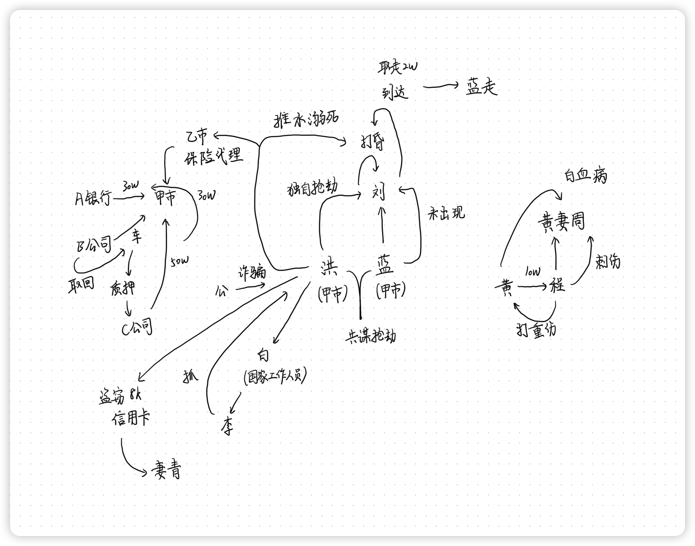
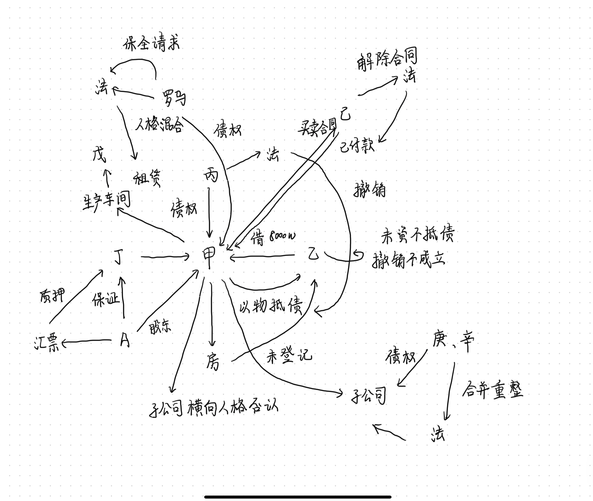
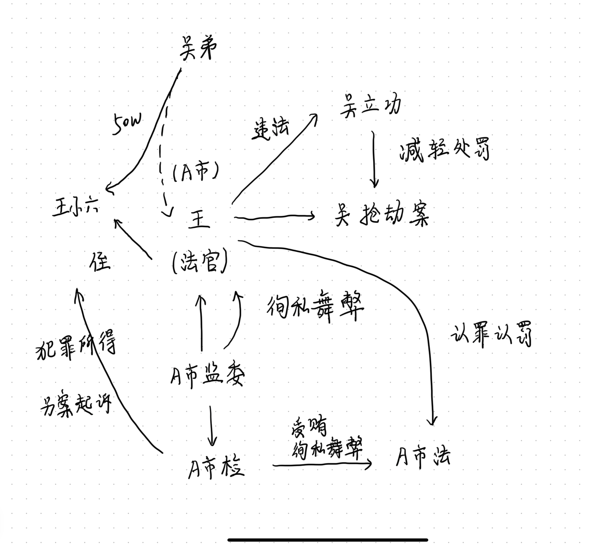
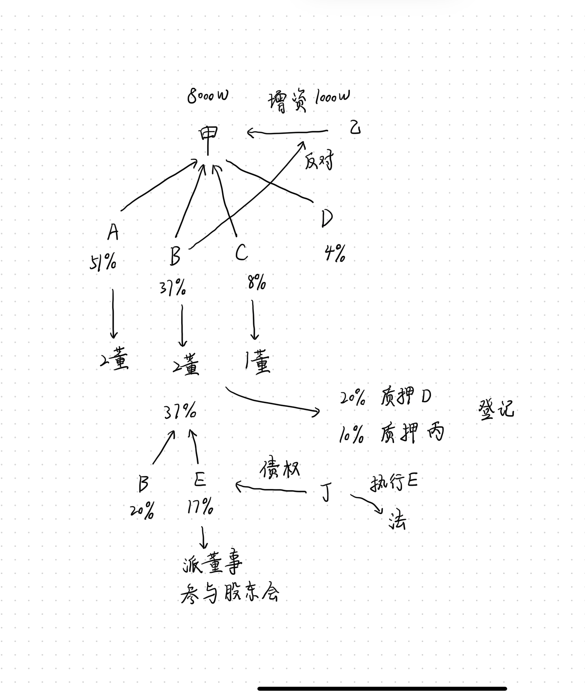

# 刑法学科主观真题（2019）

## 材料
- 1995年7月，在甲市生活的洪某与蓝某共谋抢劫，蓝某事前打探了被害人赵某的行踪后，二人决定在同年7月13日晚20：00拦路抢劫赵某。在事前两人进行了商议，做了详细规划。到了两人约定的那天后，洪某按时19：55到达了现场，但蓝某迟迟未出现。赵某出现后，洪某决定独自抢劫赵某。于是，洪某使用事先准备的凶器，击打赵某的后脑部，导致赵某昏倒在地不省人事。此时蓝某来到现场，与洪某共同取走了赵某身上价值2万余元的财物。随后，蓝某离开了现场，洪荞误以为赵某已经死亡，便将赵某扔到附近的水雄迟发导致赵某溺死（经鉴定赵某死前头部受重伤）。后洪某逃至乙市，化名在某保险公司做保险代理
- 2016年9月，洪某被保险公司辞退后回到甲市。由于没有经济来源，洪某打算从事个体经营。洪某使用虚假的产权证明作担保，从A银行贷款30万元用于经营，后因经营不善而难以偿还贷款。为了归还贷款，洪某想通过租车用于质押骗取他人借款。洪某从B汽车租赁公司的员工钱某那里得知，所有的汽车都装有GPS系统，如果他将汽车开出去质押，超过一段时间B公司还可以找到车子，将汽车开回。洪某心想，即使自己欺骗了B公司，租赁届满时B公司也可以将汽车追回，因而不会有财产损失。于是，洪某于2017年3月12日以真实身份与B公司签订了租车合同，租用了一辆奥迪车，约定租车一周，并在租车时交付了租金。租到车辆后，洪某伪造奥迪车的相关证明文件，找到C小贷公司负责人孙某，提出用自己的奥迪车贷款。孙某信以为真，将奥迪车留在公司（但没有办理质押手续），借给洪某50万元，要求洪某一星期后归还本息。一周后，B公司发现洪某没有归还所租用的汽车，便通过GPS发现车子的位置，并于深夜将车子开走。洪某从C公司借来的50万元归还了A银行的贷款30万元。孙某发现自己上当后报警
- 公安机关以洪某犯诈骗罪为由在网上通缉洪某，洪某通过公安部网上发布的通缉令知道，公安部并未掌握他1995年的犯罪事实，便找到甲市环保局副局长白某，给白某5万元，试图让他为自己说情。白某与公安局副局长李某联系，李某假意答应，但通过联系白某套取了洪某的住所，在第二天带领警察将洪某抓捕归案。在讯问中，洪某承认自己对C公司的诈骗罪，否认对B公司的合同诈骗，并未如实交代自己1995年的犯罪事实。但同时交代了自己的另一桩罪行，检举了黄某和程某的犯罪过程
- 洪某交代的另一桩犯罪事实发生于2016年10月，他进入政府部门办公室，发现办公桌上有一个信封，趁无人之际将其拿走。打开后发现里面有8000元现金和一张背后写有密码的银行卡。洪某拿取现金后将银行卡交给其妻青某：“这是我捡来的银行卡，你拿去商城买点衣服吧。”青某对于该卡来源并不知情，也未按照嘱咐去商场买衣服，而是去自动提款机上拿取了4万元，对此洪某并不知情
- 洪某称是他在和程某喝酒时，程某酒醉说出的。当时黄某要求程某去伤害自己的前妻周某。程某问到什么程度，黄某说伤她一条手臂，造成轻伤即可，事成之后我给你40万。黄某先行支付了10万，程某按约前往小巷堵住周某去路，大喊：“有人雇我来伤你，给我40万，不然我真的照做。”周某说：“我才不相信你。程某掏出水果刀去刺周菜，周某慌乱中用手臂抵挡导致自己身受轻伤。但周某身患白血病，因血流不止而身亡。程某对此并不知情，而黄某却一清二楚
- 事后程某向黄某讨要报酬，黄某说我只是让你伤她你却杀了她，没钱给你。程某气急败坏，将黄某打成重伤，然后离去
- 在公安机关的持续讯问下，洪某最终交代了自己于1995年所犯的罪行（公安机关知晓该案件，却没有锁定特定的犯罪嫌疑人人选）

## 问题
1. 按案情描述顺序分析各犯罪嫌疑人所犯罪行的性质、犯罪形态、罪数，并陈述理由；如就罪行性质、犯罪形态等，有争议的观点，请展示，并发表自己的看法

## 关系图

## 作答
1. 答
   1. 洪某、蓝某共谋抢劫赵某的犯罪事实，两人事前共谋抢劫有意思联络，洪某单独实施抢劫行为，但是蓝某并没有切断自己先行为的贡献，因此两人是共同犯罪，构成抢劫罪既遂，两人抢劫金额均是2万余元
   2. 洪某击晕赵某并最终导致赵某死亡的行为超出了抢劫的共同犯罪范围，因此蓝某不对赵某死亡的结果负责
   3. 洪某以为赵某已经死亡，结果导致赵某溺亡，属于法律上的事前故意，结果的推迟发生，如果认为前行为与后行为有紧密关联，应视为一个行为，则与洪某的行为为抢劫致人死亡，如果认为前行为与后行为应该分别评价，则洪某前行为为抢劫罪既遂，后行为为过失致人死亡罪，数罪并罚
   4. 洪某使用虚假的产权证明作担保，从A银行贷款30万元用于经营，其主观上一开始并没有不还贷款的想法，因此只构成骗取贷款罪，不构成贷款诈骗罪
   5. 洪某伪造奥迪车的相关证明文件，从C小贷公司贷款50万元，其主观上一开始就不想还贷款，因此构成贷款诈骗罪，洪某的行为没有造成B公司损失，不构成犯罪
   6. 洪某找到甲市环保局副局长白某，给白某5万元，属于行贿罪，白某属于受贿罪，李某假意答应不属于犯罪
   7. 洪某盗取8000元现金构成盗窃罪，洪某盗窃信用卡并交由其妻青某使用，构成盗窃罪，其妻青某使用明知来路不明的信用卡，构成信用卡诈骗罪，同时洪某的行为构成信用卡诈骗罪的教唆犯，一行为触犯数法益，择一重罪处理
   8. 洪某交代1995年所犯的罪行系交代自己的犯罪事实，属于坦白，交代黄某与程某的犯罪事实系交代公安机关尚未掌握的犯罪事实，属于立功
   9. 程某刺伤黄妻周某，周某身患白血病，因血流不止而身亡，介入因素是周某自身的特殊体质，不认为该介入因素切断了程某的犯罪行为与周某死亡结果之间的因果关系，因此程某的行为属于故意伤害罪致人死亡，程某气急败坏，将黄某打成重伤，行为构成故意伤害罪致人重伤，数行为侵害数法益，数罪并罚
   10. 黄某明知周某的特殊体质，仍然教唆程某刺伤周某，其行为属于故意杀人罪

## 参考答案
1. 1. 洪某、蓝某抢劫一案
      1. 洪某、蓝某成立共同犯罪。两人以上共同故意犯罪成立共同犯罪。
         1. 洪某、蓝某具有共同抢劫的故意
         2. 客观上两人有共谋行为，洪某有使用暴力的抢劫行为，蓝某有取财的抢劫行为，两人有共同犯罪的行为
         3. 因此两人成立共同犯罪
      2. 洪某、蓝某构成抢劫罪。以暴力、胁迫或其他手段截取他人财物的构成抢劫罪。洪某、蓝某有共同抢劫的故意，客观上有共同抢劫的行为，所以两人均构成抢劫罪
      3. 洪某构成加重形态的抢劫罪（致人死亡）或标准形态的抢劫罪与过失致人死亡罪的数罪并罚。洪某实施了两个行为。第一个行为是抢劫的暴力行为，第二个行为是抛“尸”行为。实际上洪某第二个行为导致赵某死亡，但是洪某以为第一个行为导致赵某死亡。洪某发生了具体事实认识错误，这种认识错误又叫“事前故意”。关于事前的故意主要有两种观点
         1. 洪某构成加重形态的抢劫罪（致人死亡）。若认为洪某两个行为实际上属于一个抢劫行为，洪某对此行为持有概括的抢劫故意，则洪某构成抢劫罪（致人死亡）
         2. 洪某构成标准形态的抢劫罪与过失致人死亡罪，应数罪并罚。若认为洪某分别实施了抢劫行为和抛“尸”行为，则洪某第一个行为构成标准形态的抢劫罪，第二个行为过失导致了赵某死亡，构成过失致人死亡罪。两个行为触犯两罪，应数罪并罚
      4. 蓝某构成抢劫罪（致人死亡）
         1. 共同犯罪人应对共同犯罪的犯罪行为及犯罪结果负责任。蓝某、洪某构成共同犯罪，其共同故意的内容包含对赵某死亡结果的罪过，因此蓝某应对赵某的死亡结果承担责任呢
   2. 洪某骗取贷款、租车抵押、诈骗一案
      1. 洪某对银行不构成贷款诈骗罪、不构成骗取贷款罪
         1. 洪某在骗取贷款时，仅为经营，并没有非法占有的目的，所以不构成贷款诈骗罪
         2. 洪某虽然主观上有骗取贷款的故意，客观上也有使用虚假产权证明做担保的骗取贷款的行为，但由于洪某及时归还贷款，所以不属于给金融机构造成严重损害结果或具有严重情节的行为。因此不构成骗取贷款罪
      2. 洪某对B公司不构成合同诈骗罪
         1. 合同诈骗罪要求被骗人具有财产损失。本案中，客观上，B公司并无财产损失。主观上，洪某明知B公司不可能有财产损失，洪某没有合同诈骗的故意。因此洪某对B公司不构成合同诈骗罪（或诈骗罪）
      3. 洪某对C公司构成贷款诈骗罪
         1. 洪某客观上有伪造车辆行驶证与购车发票，在C小贷公司办理抵押贷款的贷款诈骗行为，主观上不想归还贷款，有非法占有贷款的目的，有贷款诈骗的故意。因此洪某对C公司构成贷款诈骗罪
   3. 洪某行贿白某、李某一案
      1. 洪某构成行贿罪
         1. 客观上洪某具有为谋取不正当利益，给予国家工作人员白某5万元的行贿行为，主观上有行贿的故意。因此洪某构成行贿罪
      2. 白某构成受贿罪（斡旋受贿）
         1. 白某客观上有利用国家工作人员地位形成的便利，通过其他国家工作人员（李某）的职务行为，为请托人洪某谋取不正当利益而收取5万元的受贿行为，主观上有受贿故意，故白某构成受贿罪
      3. 李某不构成犯罪
         1. 李某假装答应受贿，实际是为抓获洪某，其客观上，行为不具有社会危害性，主观上不具有人身危险性，所以不构成犯罪
   4. 洪某、青某盗窃、信用卡诈骗一案
      1. 洪某、青某成立共同犯罪
         1. 洪某、青某具有共同犯罪的故意，客观上具有共同犯罪的行为，成立共同犯罪
      2. 青某成立信用卡诈骗罪
         1. 青某客观上有使用他人信用卡取钱的信用卡诈骗行为，主观上有非法占有他人信用卡内金额的目的，具有信用卡诈骗的故意，构成信用卡诈骗罪
      3. 洪某成立盗窃罪
         1. 洪某客观上有盗窃8000元及信用卡的盗窃行为，主观上有盗窃故意，构成盗窃罪
         2. 洪某客观上有盗窃信用卡并教唆青某使用的行为，主观上有盗窃信用卡并使用的故意，构成盗窃罪
   5. 黄某教唆程某伤害周某一案
      1. 黄某、程某成立共同犯罪
         1. 黄某、程某主观上具有共同犯罪的故意，客观上具有共同犯罪的行为，成立共同犯罪
      2. 程某构成故意伤害罪（致人死亡）
         1. 程某客观上实施了砍人至轻伤的行为，虽然介入了周某白血病的介入因素，但被害人特殊体质的介入因素不影响因果关系，所以程某客观上实施了伤害的行为，造成了周某死亡的结果
         2. 程某主观上具有伤害的故意，但对死亡结果只能持过失心态
         3. 程某构成故意伤害罪（致人死亡）
      3. 黄某构成故意杀人罪
         1. 共同犯罪人对共同犯罪行为及其造成的犯罪行为负责任。因此，客观上黄某应对周某死亡结果负责任
         2. 黄某主观上明知周某有白血病，依然教唆程某将周某砍至轻伤，这属于明知行为可能造成他人死亡结果，仍积极追求的主观心态，其主观存有杀人的故意
         3. 黄某构成故意杀人罪
      4. 程某单独成立敲诈勒索罪（未遂）
         1. 程某客观上实施了敲诈勒索周某40万元的行为，主观上具有敲诈勒索周某40万元的故意，构成敲诈勒索罪
         2. 犯罪由于意志以外的原因未得逞的，构成犯罪未遂。根据财产犯罪“控制既遂说”，本案中程某并未取得40万元财产，系属意志以外原因所致，故程某构成犯罪未遂
   6. 程某暴打黄某一案
      1. 程某构成故意伤害罪（致人重伤）
         1. 程某客观上有故意伤害致人重伤的行为，主观上有故意伤害致人重伤的故意，故程某构成故意伤害罪（致人重伤）
   7. 关乎洪某的量刑情节
      1. 洪某交代对C公司的诈骗（贷款诈骗）的事实，构成坦白，不构成自首。对其可以从轻处罚
         1. 一般自首要求犯罪人自动投案并如实供述自己所犯罪行。洪某是被动归案，不符合一般自首条件
         2. 特别自首要求犯罪人如实供述司法机关所不掌握的其他罪行，洪某交代的犯罪事实（诈骗）正是司法机关所掌握的罪行。因此洪某不构成特别自首
         3. 洪某如实供述所犯罪行，可以从轻处罚
      2. 洪某主动交代自己所犯盗窃罪的事实，构成特别自首
         1. 洪某虽已被采取刑事强制措施，但其如实供述了司法机关所不掌握的其他罪行（盗窃罪），构成自首，可以从轻、减轻处罚
      3. 洪某检举黄某、程某杀人案，构成重大立功
         1. 黄某涉嫌故意杀人罪，属于重大犯罪。洪某检举黄某与程某的一起犯罪事实，并经公安查证属实，构成重大立功，可以减轻或者免除处罚
   8. 关于追诉时效
      1. 洪某所犯抢劫罪已过追诉时效，不应追究其该罪的刑事责任。《刑法》第八十七条规定：“犯罪经过下列期限不再追诉：
         1. 法定最高刑为不满五年有期徒刑的，经过五年
         2. 法定最高刑为五年以上不满十年有期徒刑的，经过十年
         3. 法定最高刑为十年以上有期徒刑的，经过十五年
         4. 法定最高刑为无期徒刑、死刑的，经过二十年。如果二十年以后认为必须追诉的，须报请最高人民检察院核准”。洪某1995年所犯之罪，当时并未立案，不适用追诉时效的延长制度。2016年洪某交代所犯罪事实之时，已过最长追诉时效20年。因此如果不经最高人民检察院核准，不应追究洪某所犯之抢劫罪的刑事责任

# 民法民诉学科主观真题（2019）

## 材料
- 甲公司向乙公司借款8000万元，借款期限未到，双方签订以物抵债协议，约定将甲公司的办公楼过户给乙公司，以抵偿债务，但未办理过户登记
- 公甲甲公司的债权人丙认为，办公楼应当值1.2亿，该以物抵债协议价格过低，遂向法院提起诉讼，要求撤销该以物抵债协议。乙公司认为，甲公司还有大量财产可以偿还丙公司债务，丙公司主张撤销的理由并不成立
- 其后，甲公司又向丁公司借款，这时公司财产已经全部抵押或出质。无奈，甲公司股东A在未与妻子商量的情况下，向丁公司做了保证
- 丁公司认为，这种保证尚无法保障甲公司履行义务，甲公司于是又将一张以自己为收款人的汇票出质，背书“出质”字样后，交付给丁公司。但出票人在汇票上记载有“不得转让”的字样
- 为获得更多融资，甲公司又与戊公司签订生产车间租赁合同。在与戊公司签订租赁合同时，因某个车间尚有原材料、半成品没有清点，戊公司便使用了这些原材料和半成品
- 甲公司的债权人罗马轮胎公司认为，虽然甲公司不能偿还到期债务，但是因在与戊公司的租赁合同履行中，财产没有清点清楚，存在财产混同，遂在向法院要求偿还债务的同时，主张甲公司与戊公司“人格混同”，要求戊公司承担连带清偿责任
- 在案件审理过程中，法院根据罗马轮胎公司的请求对甲公司财产保全。另外，在甲公司与己公司的一份轮胎买卖合同中，已公司已经支付货款，但甲公司一直没有交付轮胎
- 胜诉判决生效后，己公司认为，甲公司交付的轮胎质量大不如前，于是又向法院提出解除合同，返还货款并赔偿损失的诉讼
- 此外，为了资金周转，甲公司利用其控股地位，向其全资子公司多次无偿调取资金，各个子公司之间如果资金短缺，甲公司就在其所有全资子公司之间统一调度资金使用，且关联公司之间账目不清
- 甲公司某全资子公司的债权人庚公司、辛公司，因到期债权不能获得清偿，向法院申请对甲公司及其所有全资子公司进行合并重整

## 题目
1. 甲公司与乙公司之间以物抵债的协议，“以物代偿”协议是否有效
2. 丙公司是甲公司的债权人，他发现这个以物抵债的协议，把一幢价值1.2亿的办公楼抵给了乙公司，但甲公司欠乙公司的钱只有8000万，所以他想行使债权人撤销权，撤销这个合同。债务人还有大量财产可以清偿时，会不会影响到撤销权的行使
3. 丙撤销以物抵债协议的诉讼当事人
4. 甲、戊公司行为是否构成人格混同
5. 甲公司又向丁公司借款，这时公司财产已经全部抵押或出质。无奈，甲公司股东A在未与妻子商量的情况下，向丁公司做了保证。A未经其妻同意对外作出保证担保，该债务是否属于夫妻共同债务
6. 甲公司为了偿还到期债务，将收票人为甲公司的汇票出质给债权人，该汇票背面写“不得转让”字样。请问该出质行为是否有效
7. 已公司已经支付价款，但甲公司未按约提供货物，于是起诉甲公司，请求甲公司履行供货协议，向己公司提供轮胎。后己公司认为甲公司提供的轮胎质量大不如以前，又起诉甲公司要求解除双方协议，并赔偿损失。两次起诉是否构成重复起诉
8. 甲公司下面的两子公司账务混乱，甲公司经常因资金不足从子公司调用资金，并且子公司之间的资金也相互调动，较为混乱。因某子公司未能偿还到期债务，某子公司的债权人申请甲公司和两子公司合并重整。子公司债权人有权申请甲公司和两子公司合并重整吗
9. 若法院受理合并重整，正在进行未完结的诉讼如何处理
10. 若法院受理合并重整，对其他债权人有何影响

## 关系图

## 作答
1. 答
   1. “以物代偿”协议无效
   2. 借款期限届满前签订的“以物代偿”协议系《民法典》规定的流押流质条款，违法无效
2. 答
   1. 债务人还有大量财产可以清偿时，会影响到撤销权的行使
   2. 只有当债务人资不抵债、买卖支付对价显著过低时，债权人才可以行使撤销权，若债务人还有大量财产可以清偿时，则该以物抵债协议并未侵害债权人利益，债权人便不能行使撤销权
3. 答
   1. 丙撤销以物抵债协议的诉讼的适格当事人
   2. 根据《民法典》规定，若债权人认为债务人以显著过低价格出售资产可能影响到债权人利益的，债权人可以提起撤销权诉讼，债权人做原告
4. 答
   1. 甲、戊公司行为不构成人格混同
   2. 甲、戊公司非关联关系，不具有构成人格混同的条件
5. 答
   1. 债务不属于夫妻共同债务
   2. 根据《民法典》规定，夫妻一方的行为，其目的是单纯为个人利益的，由行为方一方承担责任
6. 答
   1. 出质行为合法有效
   2. “不得转让”的效力仅限于出票人与甲公司之间，第三人不受影响获得质权
7. 答
   1. 两次起诉不构成重复起诉
   2. 根据《民法典》规定，重复起诉指前后两次诉讼的当事人、诉讼标的相同，诉讼请求相同或者后诉的诉讼请求否认前诉的诉讼请求，本题中，两次诉讼中的诉讼请求不同，且后诉诉讼请求并不否认前诉的诉讼请求，不构成重复起诉
8. 答
   1. 子公司债权人无权申请甲公司和两子公司合并重整
   2. 公司是否合并重整，由公司股东会决议，债权人无权申请
9. 答
   1. 正在进行未完结的诉讼应当裁定终止审理，并将案件材料移送至受理合并重组的法院
10. 答
    1. 其他债权人应及时向受理合并重整的法院申报债权

## 参考答案
1. 以物抵债协议，一般我们认为有效。我国法律没有规定代物清偿制度，而当事人对合同的成立又无特别约定的情况下，应当认为其系诺成合同，自双方意思表示一致时成立并生效。
   1. 但本案中，债权未到期，甲乙双方签署的以物抵债协议是否属于让与担保，还是流质契约，不确定。两者的区别在于是否有清算环节。一般认为，让与担保协议有效，流质契约无效。本题可能考的考点就是以物抵债协议，并没有考查让与担保或流质契约
2. 债务人甲公司有大量财产可以清偿会构成对撤销权行使的障碍。丙公司对甲公司享有到期债权，合法有效。甲公司将其价值1.2亿元的办公楼当作8000万元抵偿给乙公司，抵偿价格达不到市场价格的70%，根据《合同法解释（二）》第十九条的规定可知，属于价格明显不合理。但是甲公司还有大量财产可以清偿，抵债行为不影响甲公司偿债能力。故根据《民法典》第五百三十八条的规定可知，丙公司不得主张撤销权
3. 丙方为原告，甲方为被告，乙方为第三人。本案系撤销权诉讼，根据《最高人民法院关于适用〈中华人民共和国合同法〉若干问题的解释（一）》第二十四条规定：“债权人依照合同法第七十四条的规定提起撤销权诉讼时只以债务人为被告，未将受益人或受让人列为第三人的，人民法院可以追加该受益人或受让人为第三人”
4. 不构成人格混同。公司法层面上的人格混同是指公司股东滥用公司法人独立地位和股东有限责任，逃避债务，严重损害公司债权人利益的，应当对公司债务承担连带责任。人格混同一般表现为，公司与股东之间或者关联公司之间的主要人员，财产等方面的混同，没有区分。本案中承租人擅自使用出租人的财产，不构成人格混同
5. 不属于夫妻共同债务。根据《民法典》的规定及《最高人民法院关于审理涉及夫妻债务纠纷案件适用法律有关问题的解释》第三条规定：“夫妻一方在婚姻关系存续期间以个人名义超出家庭日常生活需要所负的债务，债权人以属于夫妻共同债务为由主张权利的，人民法院不予支持，但债权人能够证明该债务用于夫妻共同生活、共同生产经营或者基于夫妻双方共同意思表示的除外”。本案中A未经其妻同意以个人名义对外作出保证担保，不是用于家庭日常生活所需所负的债务，不属于夫妻共同债务
6. 无效。出票人在票据上记载“不得转让”，票据即已经丧失流通性，而依照担保物权的有关理论，作为质押标的的权利必须具有可转让性，所以出票人记载“不得转让”的票据不得设定质押
7. 不构成重复起诉。前面己公司起诉甲公司要求其提供轮胎，后面己公司因甲公司提供的轮胎质量大不如以前，起诉甲公司让其解除协议，赔偿损失。两次起诉的诉讼请求、诉讼标的不同，两个案子的案由不同。不构成重复起诉
8. 有权。《破产审判工作会议纪要》规定人民法院在审理企业破产案件时，应当尊重企业法人人格的独立性，以对关联企业成员的破产原因进行单独判断并适用单个破产程序为基本原则。当关联企业成员之间存在法人人格高度混同、区分各关联企业成员财产的成本过高、严重损害债权人公平清偿利益时，可例外适用关联企业实质合并破产方式进行审理
9. 其他未完结的诉讼中止审理。管理人代表参加诉讼，管理人接管财产后，恢复审理
10. 1. 影响债务人的担保权。根据《企业破产法》第七十五条的规定可知，在重整期间，对债务人的特定财产享有担保权暂停行使
    2. 有效财产权利人的财产取回权。根据《企业破产法》第七十六条规定：“债务人合法占有的他人财产，该财产的权利人在重整期间要求取回的，应当符合事先约定的条件”
    3. 根据《企业破产法》第八十二条的规定可知，债权人参加讨论重整计划草案的债权人会议并分组进行表决形成草案。根据《企业破产法》第八十四条的规定可知，债权人参加法院召开的债权人会议，对重整计划草案进行表决
    4. 《企业破产法》第九十二条第一款规定：“经人民法院裁定批准的重整计划，对债务人和全体债权人均有约束力”
    5. 《企业破产法》第九十三条第二款规定：“人民法院裁定中止重整计划执行的，债权人在重整计划中作出的债权调整的承诺失去效力。债权人因执行重整计划所受的清偿仍然有效，债权未受清偿的部分作为破产债权”

# 刑诉学科主观真题（2019）

## 材料
- 王某系A市人民法院刑事审判庭法官。2016年9月，王某在审理本市吴某抢劫案中，违反法律规定认为吴某有立功情节，对吴某减轻处罚判处有期徒刑10年，吴某的弟弟为此向王某行贿50万元。王某为规避法律，让其侄子王小六收钱并保管
- 2018年11月，A市监察委接到举报后对王某立案调查，调查中另查明王某在担任审判监督庭法官时犯有徇私舞弊减刑的犯罪事实，A市监察委对本案调查终结，移送检察机关审查起诉，检察机关以王某涉嫌受贿罪和徇私舞弊减刑罪向A市人民法院提起公诉，同时以王小六构成掩饰、隐瞒犯罪所得罪另案起诉
- 法院审理期间，王某改变了在检察委调查和检察机关审查起诉期间不认罪的态度，主动承认被指控的犯罪并自愿接受处罚，法院按照认罪认罚从宽的规定，对王某从轻作出了判决。一审判决后检察机关没有抗诉，王某未上诉，一审判决发生法律效力

## 题目
1. 本案在管辖上有无问题，请说明理由
2. 王小六涉嫌掩饰、隐瞒犯罪所得罪在未经立案调查或侦查的前提下，检察机关能否径行起诉，为什么
3. 如本案中王某的行为既涉及监察机关的犯罪又涉及公安机关、检察机关管辖的犯罪，关于管辖的处理的原则是什么
4. A市人民法院按照认罪认罚从宽的规定对王某从轻作出判决，是否符合法律规定？请说明理由

## 关系图

## 作答
1. 答
   1. 本案法院管辖上有问题
   2. 王某系A市人民法院刑事审判庭法官，因此关于王某的案件，A市人民法院的法官应当适用回避制度予以回避
   3. 因此该案应有A市人民法院以外的人民法院管辖
2. 答
   1. 检察机关能径行起诉
   2. 检察机关对犯罪嫌疑人、被告人审查起诉的罪名、犯罪事实不受公安机关的侦查范围所限，只有检察机关认为自己有确切证据能够证明犯罪嫌疑人、被告人有相关的犯罪事实，就可以进行相关罪名的审查起诉
   3. 因此本题中，虽然王小六涉嫌掩饰、隐瞒犯罪所得罪未经立案调查或侦查，但是检察机关可以径行起诉
3. 答
   1. 管辖的处理的原则是以监察机关为主，公安机关、检察机关为辅
   2. 本案中具体而言，王某作为国家机关工作人员，针对受贿罪，应当由监察机关负责受贿罪的相关调查工作，针对徇私舞弊罪，既可以由监察机关一并调查，也可以由检察机关负责侦查，具有由监察机关决定
4. 答
   1. A市人民法院按照认罪认罚从宽的规定对王某从轻作出判决，符合法律规定你
   2. 根据刑事诉讼法的相关规定，认罪认罚从宽原则适用于侦查、审查起诉、审判等各个阶段，因此虽然在检察委调查和检察机关审查起诉期间王某不认罪，但法院审理期间王某认罪认罚，这是会影响对于王某从宽处理的尺度，但仍然可以适用从宽处理的原则，因此对王某可以使用认罪认罚从宽处理的制度

## 参考答案
1. 本案在管辖上存在部分问题，具体分析如下
   1. 就立案管辖而言
      1. 王某涉嫌受贿罪和徇私舞弊减刑罪由监察委调查，符合法律规定
         1. 根据《监察法》第十一条第二项规定：“对涉嫌贪污贿赂、滥用职权、玩忽职守、权力寻租、利益输送、徇私舞弊以及浪费国家资财等职务违法和职务犯罪进行调查”。据此，监察委立案调查王某涉嫌受贿罪于法有据
         2. 依据《刑事诉讼法》第十九条规定：“刑事案件的侦查由公安机关进行，法律另有规定的除外。人民检察院在对诉讼活动实现法律监督中发现的司法工作人员利用职权实施的非法拘禁、刑讯逼供、非法搜查等侵犯公民权利、损害司法公正的犯罪，可以由人民检察院立案侦查”。本案中王法官虽然涉嫌徇私舞弊减刑罪，但是不属于检察院在对诉讼活动实行法律监督中发现的。王法官仍然属于职务犯罪行为，应当由监察机关进行调查
      2. 王小六涉嫌掩饰、隐瞒犯罪所得罪应当交由公安机关进行侦查
         1. 根据《监察法》第十一条与以及《刑事诉讼法》第十九条的规定，王小六涉嫌掩饰、隐瞒犯罪所得罪不属于检察院】监察委立案管辖，应当交由公安机关侦查
   2. 就审判管辖而言
      1. A市法院审判管辖违反法律规定
         1. 依据《刑事诉讼法解释》第十六条规定：“有管辖权的人民法院因案件涉及本院院长需要回避等原因，不宜使用管辖权的，可以请求移送上一级人民法院管辖，上一级人民法院可以管辖，也可以指定与提出请求的人民法院同级的其他人民法院管辖”。
         2. 王某属于A市人民法院法官，检察机关以王某涉嫌受贿罪和徇私舞弊减刑罪向A市人民法院提起公诉，需要考虑回避。因此，A市人民法院审判此案违反法律规定
2. 不能径行起诉，理由如下
   1. 《高检规则》第三百五十六条规定：“人民检察院在办理公安机关移送起诉的案件中，发现遗漏罪行或者有依法应当移送审查起诉的同案犯罪嫌疑人为移送起诉的，应当要求公安机关补充侦查或者补充移送起诉。对于犯罪事实清楚，证据确实、充分的，也可以直接提起公诉”。
   2. 根据《监察法》第十一条以及《刑事诉讼法》第十九条的规定可知，王小六涉嫌掩饰、隐瞒犯罪所得罪应当交由公安机关侦查。公安机关立案侦查并移送起诉后，检察院基于审查起诉的监督权，可以直接提起公诉。如果公安机关没立案，程序未启动，法律并没有赋予检察院直接起诉的权利
3. 一般应当以监察机关为主调查，其他机关予以协助的原则，理由如下
   1. 《监察法》第三十四条第二款规定：“被调查人既涉嫌严重职务违法或者职务犯罪，又涉嫌其他违法犯罪的，一般应当由监察机关为主调查，其他机关予以协助”。如果王某的行为既涉及监察机关的犯罪又涉及公检管辖的犯罪，应当按照上述法律规定处理
4. 此种做法符合法律规定，理由如下
   1. 刑事诉讼法基本原则是指反映刑事诉讼理念和目的的要求，贯穿于刑事诉讼全过程或者主要诉讼阶段，对刑事诉讼过程具有普遍或者重大指导意义和规范作用，为国家专门机关和诉讼参与人参与刑事诉讼必须遵循的基本行为准则
   2. 《刑事诉讼法》第十五条规定：“犯罪嫌疑人、被告人自愿如实供述自己的罪行，承认指控的犯罪事实，愿意接受处罚的，可以依法从宽处理”。认罪认罚从宽原则是刑事诉讼的基本原则之一，贯穿于侦查、审查起诉、审判阶段
   3. 综上，王某在审判阶段认罪认罚，A市人民法院按照认罪认罚从宽的规定对其从轻做出判决，此做法符合刑事诉讼法的规定

# 商经法学科主观真题（2019）

## 材料
- 甲公司注册资本8000万，由A、B、C、D作为股东，持股比例51%、37%、8%、4%，董事会5名，分别由A、B、C公司派员出任，比例为2:2:1。B持股37%，但是其中有E公司的17%，对于E公司，他有派人任董事，且每次的股东会会议都有参加，并且E公司偶尔会让不同的人来参加股东会会议。其他股东对此知情并且没有表示反对
- B公司将自己名下的20%出质给D，将10%出质给丙公司，均办理了抵押登记，丙公司不知道代持股的情况
- 甲公司决定增资1000万，有个外部投资人乙公司认缴全部增资，除了B不同意，其他股东都放弃认缴。B公司有两个主张，一是按照实缴比例优先认购，二对是其他股东放弃的优先认缴的部分也行使优先认缴权
- E公司的债权人丁公司申请执行E的财产，法院查明E公司是B公司所持股权的实际出资人，于是启动执行程序

## 题目
1. B公司的第一个主张能否成立
2. B公司的第二个主张能否成立
3. D是否取得股权质权
4. 丙公司是否取得股权质权
5. 根据D公司的申请，法院作出了实现担保物权的拍卖的裁定，请问E公司如何救济？若进入执行程序，E公司可以如何救济
6. 对于E公司的债权人丁公司提出的执行申请，B、E、D、丙公司能否提出执行异议

## 关系图

## 作答
1. 答
   1. B公司的第一个主张是“按照实缴比例优先认购”，该主张成立
   2. 根据《公司法》规定，除公司章程另有规定，公司股东按照实缴资本比例享有新股优先认购权，依次甲公司增资时，B公司主张按照实缴比例优先认购合法有效
2. 答
   1. B公司的第二个主张是“对其他股东放弃的优先认缴的部分也行使优先认缴权”，该主张不成立
   2. 根据《公司法》规定，公司增资时公司股东的B公司的新股优先认购权仅限于其按照实缴资本比例的部分，对于其他股东按照自己实缴比例享有的部分，B公司不享有优先认购权
3. 答
   1. D不能取得了股权质权
   2. D公司系甲公司股东，且E有在公司行使股东权利的行为，认定D公司对于B公司与E公司直接的代持股关系知情，不能认定D公司善意，因此D公司不能取得股权质权
4. 答
   1. 丙公司取得了股权质权
   2. B公司与E公司直接为代持股协议关系，公司章程、股东名册、登记机关登记信息等显示B公司持有37%的股份，未经登记不得对抗善意第三人，丙公司对于代持股不知情推定为善意，股权质权自登记时生效，因此丙公司自登记时取得股权质权
5. 答
   1. E公司可以采用购买拍卖的股权的方式进行救济
   2. E公司可以向法院提起第三人撤销之诉，请求撤销B公司与D公司直接的质押协议
   3. 若进入执行程序，E公司可以向执行法院申请案外人对执行标的的异议，也可以提供担保，从而中止执行程序
6. 答
   1. B、E、D公司可以提出执行异议，丙公司不能提出执行异议
   2. B、E、D公司均为甲公司的股东，丁申请执行E的财产即执行E在甲公司的股份，因此B、E、D公司可以提出执行异议
   3. 丙公司享有的仅是对B公司、E公司在甲公司股权的质权，不能提出执行异议，只能就执行后的价金主张优先受偿权