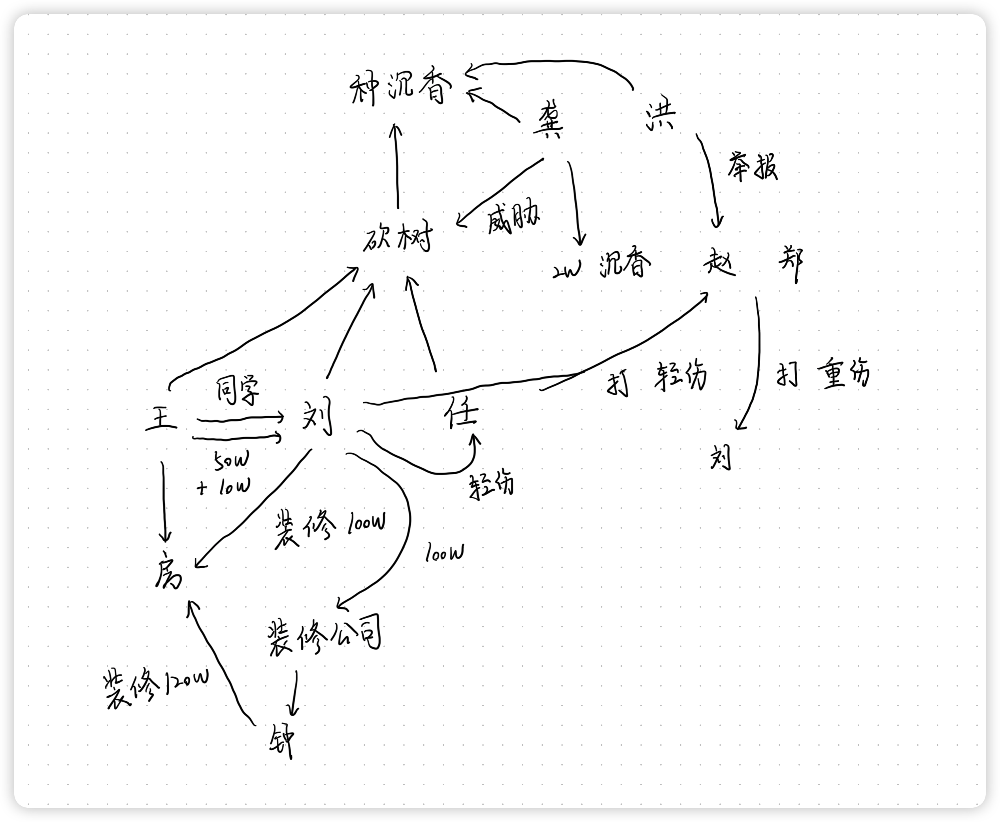
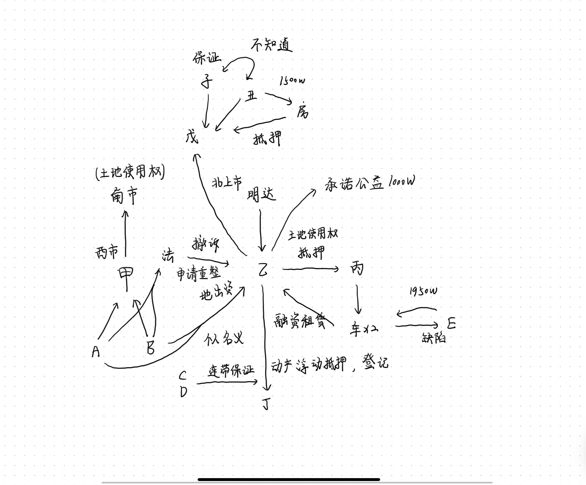
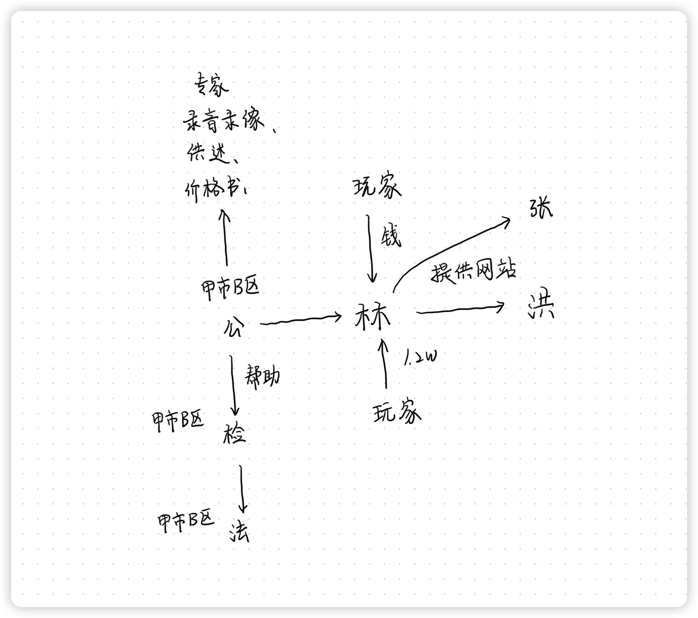
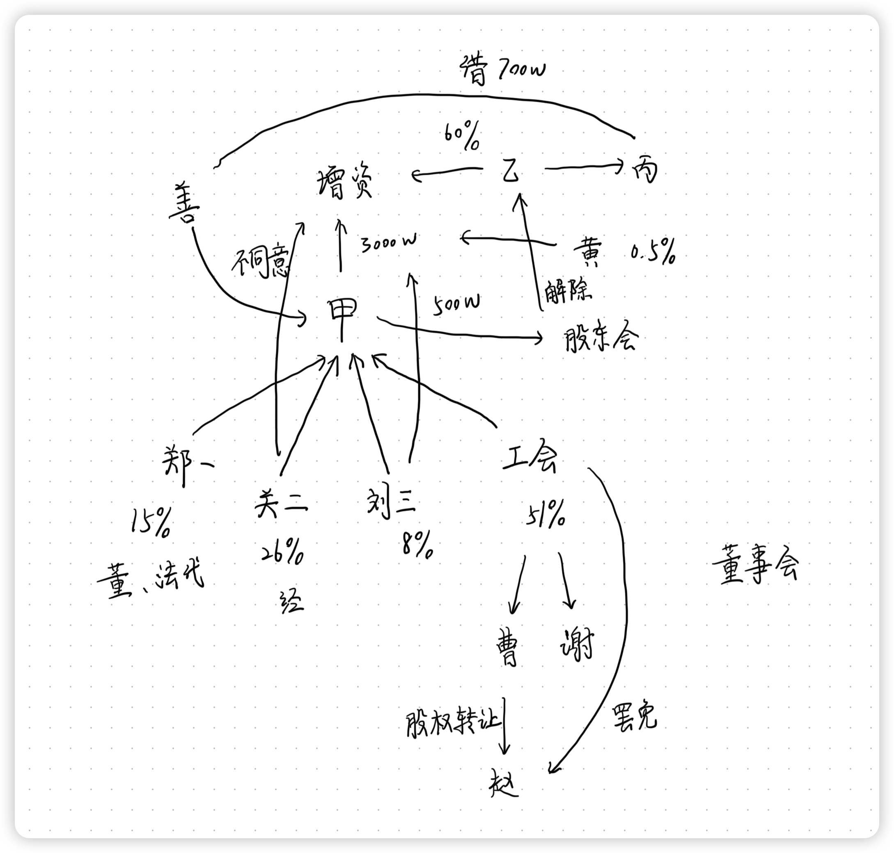

# 刑法学科主观真题（2020）

## 材料
- 2010年3月，刘某与任某为了种植沉香，擅自砍伐了国有森林中的一片树木（1200株），将砍伐的树木扔在一旁，然后种植沉香，一直没有被人发现。2016年2月，森林公安局的侦查人员王某发现林木被砍伐，但因其与刘某是中学同学，碍于情面便未作任何处理。导致刘某与任某继续种植沉香
- 2017年3月，王某购买一套房屋后，让刘某负责装修，并将50万元的装修费转交给刘某，同时对装修提出了需要花100万元才能完成的要求。刘某请甲装修公司装修完工后，装修公司应收120万元的费用，但刘某只给了装修公司100万元。装修公司负责人钟某执意要求刘某再付20万。刘某对钟某说：“房主是在黑社会混的，你再要20万元，小心他捣毁你的装修公司。”钟某听后就没有再要求刘某支付20万元。后来，刘某对王某说：“装修总共花费了120万元”。王某说：“太责了，我再出10万吧。”刘某收下该10万元
- 2018年7月，喜欢爬野山的龚某和洪某见到一片沉香树后心生盗念，龚某、洪某二人盗窃时被刘某和任某发现，洪某立即逃跑，龚某为了窝藏所盗沉香，对刘某和任某以不让拿走沉香就向林业主管部门告发相威胁，刘某、任某担心自己非法砍伐林木的行为被发现，就让龚某拿走了盗窃的价值2万元的沉香
- 2018年8月，洪某向林业主管部门举报了有人在国有森林中种植沉香的事实。林业主管部门工作人员赵某与郑某上山检查时，刘某与任某为了抗拒抓捕，对郑某与赵某实施暴力，赵某与郑某反击，形成互殴状态。赵某被打成轻伤，该轻伤由刘某、任某造成，但不能查明是刘某的行为所致，还是任某的行为所致。刘某被打成重伤，任某被打成轻伤，其中刘某的重伤由赵某与郑某共同造成，任某的轻伤则是由刘某的打击错误所造成的（刘某在攻击郑某时，郑某及时躲闪，导致刘某击中了同伙任某）

## 题目
1. 分析刘某、任某、王某、龚某、洪某、赵某和郑某的行为性质，说明理由。（如有不同处理意见，请分别说明）

## 关系图

## 作答
1. 答
   1. 针对刘某与任某擅自砍伐国有森林案
      1. 刘某、任某构成共同犯罪，两人事前通谋，共同实施盗窃砍伐国有森林答行为，构成盗伐林木罪的共同犯罪，犯罪数额均为1200株林木
      2. 森林公安局的侦查人员王某，因同学关系未处理，构成玩忽职守罪
   2. 针对刘某帮助王某装修房屋一案
      1. 王某请刘某帮助装修房屋，作为之前未处理盗伐林木的行为的交换，构成权钱交易，刘某构成行贿罪，王某构成受贿罪，行贿与受贿的金额均为60万元
      2. 刘某以“黑社会”名义恐吓、欺骗钟某，使钟某基于恐惧与欺骗放弃20万元的请求权，行为同时触犯敲诈勒索罪与诈骗罪，金额为20万元，一行为侵犯数法益，应当想象竞合从一重罪处理
   3. 针对龚某、洪某盗窃沉香一案
      1. 龚某、洪某构成共同犯罪，两人共同实施盗窃沉香的行为，且主观上均知晓彼此的行为并通谋，构成盗窃罪的共同犯罪，但是由于意志意外的缘故没有盗窃未成功，因此构成盗窃罪的未遂
      2. 龚某为了窝藏所盗沉香，威胁告发，单独构成敲诈勒索罪，因为窝藏行为属于不可罚之事后行为，不具有期待可能性
   4. 针对林业主管部门工作人员与刘某、任某伤害一案
      1. 赵某被打成轻伤，该轻伤由刘某、任某造成，但不能查明加害人，但是由于刘某、任某共同实施殴打行为，构成共同犯罪，一人行为全体责任的原则，则刘某、任某致赵某被打成轻伤，构成故意伤害罪的共同犯罪
      2. 刘某被打成重伤，由赵某与郑某共同造成，同理由于赵某与郑某共同实施殴打行为，构成共同犯罪，一人行为全体责任的原则，赵某与郑某致刘某被打成重伤，构成故意伤害罪致人重伤
      3. 任某被打成轻伤，是由刘某的打击错误所造成的，构成偶然防卫，对于偶然防卫，有防卫意识必要说与防卫意识不要说两种处理意见
         1. 防卫意识必要说认为，防卫人必须认识到自己在进行正当防卫行为，该行为方能构成正当防卫，因此偶然防卫不构成正当防卫，本案中刘某的打击错误至任某轻伤系过失所致，过失致人伤害需要达到重伤的程度才需要承担刑事责任，因此刘某过失致任某轻伤不负刑事责任
         2. 防卫意识不要说认为，防卫人不必认识到自己在进行正当防卫行为，只需要客观上实施了正当防卫行为即可认定是正当防卫，因此偶然防卫构成正当防卫，本案中刘某的打击错误至任某轻伤客观上制止了任某的不法行为，构成正当防卫，因此刘某不负刑事责任

## 参考答案
1. 1. 刘某的行为分析如下
      1. 刘某和任某擅自砍伐国家森林中林木的行为，构成故意毁坏财物罪，而且是共同犯罪
      2. 刘某替王某装修并垫付部分装修款的行为，构成行贿罪
      3. 刘某对钟某的行为构成敲诈勒索罪与诈骗罪的想象竞合犯，犯罪数额为20万元
      4. 刘某和任某将赵某打成轻伤的行为，构成妨害公务罪，而且是共同犯罪
      5. 刘某将同伙任某打成轻伤，这一行为该如何定性，存在如下争论
         1. 刘某的行为成立故意伤害罪（未遂）。该观点认为，刘某误打中同伙任某的行为，是偶然防卫，刘某对任某不构成犯罪，但由于该行为具有导致无辜的赵某和任某受伤的危险，故刘某的行为成立故意伤害罪（未遂）
         2. 刘某成立故意伤害罪既遂或者不构成犯罪。该观点认为，刘某的行为是打击错误。对此，又存在如下两种观点
            1. 根据法定符合说，刘某客观上具有伤害行为，主观上具有伤害故意，成立故意伤害罪既遂
            2. 根据具体符合说，由于客观事实与行为人主观上的认识并未具体一致，李某的行为属于过失致人轻伤，不构成犯罪
   2. 任某的行为分析如下
      1. 任某和刘某擅自砍伐国有森林中林木的行为，构成故意毁坏财物罪，而且是共同犯罪
      2. 任某和刘某将赵某打成轻伤的行为，构成妨害公务罪，而且是故意犯罪
   3. 王某的行为分析如下
      1. 王某作为森林公安局的侦查人员，明知树木被砍伐，只是因为自己与刘某是中学同学，便未作任何处理，该行为构成徇私枉法罪
      2. 王某接受刘某垫付的部分装修款的行为，成立受贿罪
      3. 对王某应以徇私枉法罪和受贿罪实施数罪并罚
   4. 龚某的行为分析如下
      1. 龚某成立敲诈勒索罪，犯罪数额为2万元
      2. 龚某对刘某和任某以不让拿走沉香就向林业主管部门告发相威胁的行为，构成敲诈勒索罪，而非抢劫罪（《刑法》第263条），更非转化的抢劫（《刑法》第269条）
      3. 龚某的盗窃罪（未遂）和敲诈勒索罪属于概括的一罪，无需数罪并罚，只成立敲诈勒索罪一罪即可
   5. 洪某的行为分析如下
      1. 洪某成立盗窃罪（未遂）。至于龚某之后的敲诈勒索行为，对洪某而言属于实行过限，洪某对此无须负责
   6. 赵某和郑某的行为分析如下
      1. 林业主管部门工作人员赵某和郑某二人的行为属于正当防卫，不构成犯罪

# 民法民诉学科主观真题（2020）

## 材料
- 西上市东河区的甲公司有股东自然人A和B，公司名下在南下市北山区有一地块的土地使用权，该地块正在准备拆迁
- 东下市西河区的乙公司是北上市南海区明达公司的全资子公司，主营房地产业务。A和B以个人的名义找到乙公司，与乙公司协商，A和B以该地块的使用权出资，设立承接该开发的项目公司，双方达成《协议》，约定：
   1. 以乙公司为项目运营的商事载体
   2. A、B不涉及乙公司管理事务，包括投资、以土地使用权设定质押等
   3. A、B可以分得40%（各20%）的房产
   4. A、B分得房产后，即应无偿转回乙公司名下
   5. 如因履行协议过程中发生争议，由被告所在地法院管辖
- 协议签订后，对股权进行了变更，并根据股权的调整进行了工商变更登记
- 乙公司将该土地使用权抵押给了丙公司，融资租赁2台铲车。为获得更多融资款，乙公司将公司动产向丁公司设定了动产浮动抵押，并办理了登记，为实现担保物权，丁公司要求乙公司提供担保，乙公司找来了自然人C和D为提供连带保证。后在经营过程中，乙公同将2台铲车卖给了自然人E，并获得1950万元货款。后因为铲车的质量问题和设计缺陷，E一直与乙公司交涉未果
- 乙公司为体现自己落实《民法典》中的营利法人社会责任，承诺向“青少年成长基金”捐款1000万元，并在媒体上宣传
- 为获取更多融资款又与戊信托商签订协议，由担保人子和抵押人丑（以其价值1500万元的房子抵押，已办理抵押登记）提供担保，但子和丑并不知道对方的存在
- 楼盘建成之后，乙公司陆续对外销售了大概15%的房屋。自然人F购买房屋后发现房屋的面积、容积率、配套设施均与宣传有很大差距
- A和B发现乙公司大规模融资，又迅速对外销售房产产生怀疑。向法院起诉乙公司违约，后在诉讼中撤回起诉。后乙公司经营不佳，A和B申请将乙公司进行重整，要求乙公司给予约定的40%的房款

## 题目
1. 甲公司的债权人能否直接要求A、B承担连带责任
2. A、B起诉乙公司要求其交付40%的房屋，由哪个（些）法院管辖
3. A、B可否要求撤销乙公司的卖房合同
4. 购房人F如何寻求救济？可否依据《消费者权益保护法》主张三倍的惩罚性赔偿
5. 乙公司的债权人能否主张撤销乙公司与基金会的捐赠合同？乙公司能否撤销
6. 自然人E能够向乙公司主张什么责任
7. 乙公司为丁设立的动产浮动抵押权能否对抗自然人E
8. 如果丑为了自己的房产不被执行，替乙公司归还了1500万元的债务，那么其能否向子主张责任
9. 丁公司如何主张自己的担保责任？以不同的人为被告，如何安排当事人
10. 鉴定的启动方式及鉴定机构如何确定？当事人对鉴定意见提出异议申请重新鉴定，法院应如何处理

## 关系图

## 作答
1. 答
   1. 甲公司的债权人可以直接要求A、B承担连带责任
   2. A和B以个人的名义处分公司财产的行为属于典型的公司与股东个人财产混同，构成人格混同，若公司不能清偿债权人的债务时，债权人有权请求认定甲公司与股东A、B人格混同，适用股东人格否认制度，请求A、B承担连带责任
2. 答
   1. A、B起诉乙公司要求其交付40%的房屋，系合同纠纷引发的诉讼，应当适用民事诉讼法关于合同纠纷中法院管辖权的规定
   2. 本案中，协议中房屋买卖约定并不适用关于不动产相关的专属管辖的规定，同时协议中约定了“由被告所在地法院管辖”，该约定内容合法有效，因此应当认定适用协议管辖的规定，由被告乙公司所在地法院管辖
3. 答
   1. A、B不可要求撤销乙公司的卖房合同
   2. 乙公司卖房合同不存在《民法典》规定的合同无效事由，同时乙公司卖房没有侵害A、B的合法权益，A、B无权撤销卖房合同
4. 答
   1. 房屋的面积、容积率、配套设施均与宣传有很大差距，属于根本违约与欺诈行为，购房人F可以提起诉讼请求撤销与与乙公司的房屋买卖合同，同时请求乙公司赔偿损失
   2. 欺诈行为可以主张三倍的惩罚性赔偿
5. 答
   1. 乙公司的债权人不能主张撤销乙公司与基金会的捐赠合同
   2. 因为根据《民法典》规定，债权人的撤销权不能撤销公益性质的合同
   3. 乙公司的不能主张撤销乙公司与基金会的捐赠合同
   4. 乙公司作为法人是完全民事行为能力人，同时没有无权代理事由发生，因此捐赠合同合法有效，不存在可撤销的事由
6. 答
   1. 自然人E能够向乙公司主张违约责任
   2. 铲车的质量问题和设计缺陷属于典型的合同产品质量问题，应该承担违约责任
7. 答
   1. 乙公司为丁设立的动产浮动抵押权能够对抗自然人E
   2. 乙公司的动产浮动抵押权办理了登记，同时乙公同销售2台铲车不属于日常经营事务，因此可以对抗第三人即铲车买受人E
8. 答
   1. 不能向子主张责任
   2. 因为子和丑并不知道对方的存在，因此保证人与担保人内部没有互相追偿权，因此丑不能向子主张承担责任
9. 答
   1. 丁公司应当先主张拍卖变卖乙公司的动产担保物，在融资款及利息、费用范围内优先受偿，若未能清偿全部的，应当请求C、D对未能清偿部分承担连带责任
   2. 以乙公司为被告人，由于C、D承担连带责任，因此丁公司可以选择C、D全部或任一被被告，也可以不选择C、D为被告
10. 答
    1. 本案中的鉴定应该由当事人申请启动
    2. 因为本案中的鉴定不涉及国家社会第三人利益、不属于程序性事项，因此不属于法院依职权鉴定事项，应当由第三人向法院申请鉴定
    3. 鉴定机构由法院询问当事人意见后指定
    4. 当事人对鉴定意见提出异议申请重新鉴定，法院应审查当事人异议是否成立，必要时应当请鉴定人出庭说明情况，异议成立的，法院应当裁定延期审理，并重新鉴定

## 参考答案
1. 不能。合同具有相对性，A、B不是合同的相对方，债权人不能直接要求其承担连带责任
2. 由被告人居所地东下市西河区法院管辖
3. 不能。本案中，乙公司卖房属于有权处分，而且没有法律规定的无效或者可撤销的事实，A、B当然不可要求撤销该合同
4. 1. 购房人F可以通过和解、调节、达成有效的仲裁协议仲裁或者提取诉讼的方式获得救济
   2. 关于可否依据《消费者权益保护法》主张三倍的惩罚性赔偿
      1. 可以。理由：根据相关规定，经营者提供商品或者服务由欺诈行为的，应当按照消费者的要求增加赔偿其受到的损失，增加赔偿的金额为消费者购买商品的价款或者接受服务费用的三倍。本案中，乙公司的宣传和实际交付的房屋明显不符，成立欺诈，F可以依据消法主张三倍的惩罚性赔偿
      2. 不可以。理由：根据《商品房买卖合同解释》相关规定，在商品房买卖合同中要求惩罚性赔偿仅限于特殊情形，而不包括本案中所说的与宣传不符的情况，所以无权根据《消费者权益保护法》主张三倍的惩罚性赔偿
5. 1. 不能。本案中，虽然乙公司设立基金会捐赠1000万元，但是其房屋还仅仅出售了15%左右，且债权人丁公司与戊公司的债权都有相应的担保，因此乙公司设立基金会捐赠1000万元的行为并不会影响到债权人债权的实现，其债权人无权行使撤销权撤销该捐赠行为
   2. 不能。本案中，乙公司将财产捐赠给基金会属于具有公益性质的赠与合同，那么此时债权人不能行使任意撤销权来撤销该赠与合同
6. 违约责任。本案中，因乙公司交付的设备出现质量问题构成违约行为，故E有权向乙公司主张违约责任
7. 能。本案中，乙公司为房地产开发企业，其正常的经营范围为房地产开发活动，出卖设备并不在正常经营范围之内。所以乙公司为丁设立的动产浮动抵押权可以对抗自然人E
8. 1. 不能。理由：根据《民法典》第三百九十九条规定：“提供担保的第三人承担担保责任后，有权向债务人追偿”。本案中，子丑不构成连带共同担保，丑替乙公司归还了1500万元债务之后，只能向债务人追偿，不可以向其他担保人追偿
   2. 可以。理由：根据民法通说理论，提供担保的第三人承担担保责任后，有权向债务人追偿，也可以要求其他担保人承担应当承担的份额，可以按照内部份额比例向丑追偿。本案中，丑替乙公司清偿债务后，既可以向债务人追偿，可以按照内部份额比例向子追偿
9. 1. 根据《民法典》第三百九十九条的规定可知，当债务人自己提供的物保与保证并存且当事人未约定如何实现债权时，债权人应当先就债务人提供的物保实现债权，再要求保证人承担保证责任。本案属于混合担保，但是债务人乙公司自己提供了物保，那么债权人丁公司行使权力有顺序限制，必须先就乙公司的抵押实现债权，未获清偿的部分才能再要求C和D承担保证责任
   2. 1. 根据《民法典》第六百八十六条第二款规定：“当事人在保证合同中对保证方式没有约定或者约定不明确的，按照一般保证承担保证责任”。C和D没有明确约定保证方式，那么C和D属于一般保证
      2. 根据《民间借贷案件规定》第二十四条第二款的规定可知，若丁公司仅起诉借款人乙公司，则法院可以不追加保证人C和D为共同被告；若丁公司仅起诉保证人C和D，则法院应当追加借款人乙公司为共同被告；若丁公司将借款人乙公司、保证人C和D当作共同被告一并起诉，则法院无需追加共同被告
10. 1. 鉴定的启动方式：可以依当事人申请启动鉴定，法院可以依职权启动鉴定
    2. 鉴定机构确定
       1. 当事人申请鉴定，法院应当组织当事人协商确定鉴定人，如果协商不成，由人民法院指定
       2. 法院依职权委托鉴定，询问当事人意见后，由法院指定
    3. 当事人对鉴定书的内容有异议的，应当在人民法院指定期间内以书面方式提出。对于当事人的异议，人民法院应当要求鉴定人作出解释、说明或者补充。人民法院认为有必要的，可以要求鉴定人对当事人未提出异议的内容进行解释、说明或者补充。当事人在收到鉴定人的书面答复后仍有异议的，人民法院应当通知有异议的当事人预交鉴定人出庭费用，并通知鉴定人出庭。有异议的当事人不预交鉴定人出庭费用的，视为放弃异议

# 刑诉学科主观真题（2020）

## 材料
- 林某明知洪某（已刑罚）实施犯罪，而为其提供网游网站，并将玩家充值到游戏里的1.2万元转走。林某明知张某（已刑罚）实施犯罪，而为其提供网游网站，并窃取玩家账号和密码，将账户内的资金转走
- 甲市B区公安局侦查后，认为林某明知他人利用信息网络实施犯罪，仍为其提供网站，构成帮助犯，并将案件移送甲市B区检察院审查起诉，甲市B区检察院向甲市B区法院提起公诉
- 本案证据有：物价局出具的价格认定书、供述、讯问录音录像、邀请有专门知识的人对鉴定意见发表了意见等

## 题目
1. 本案属于利用计算机实施犯罪，利用计算机实施犯罪如何确定管辖
2. 犯罪嫌疑人供述笔录与讯问录音录像存在本质性差异，法院应该以哪个为准？讯问录音录像能否作为认定案件的依据
3. 价格机构出具的价格认定书，属于何种证据类型，是否可以作为本案证据
4. 针对电子证据的收集，法院应审查哪些内容
5. 检察机关的举证质证的方式是什么
6. 专家辅助人对鉴定报告提出的意见，其性质属于什么？是否可以作为案件认定依据？法院应如何处理

## 关系图

## 作答
1. 答
   1. 根据刑法规定，利用计算机实施犯罪案件由犯罪行为地、犯罪结果地、受害人所在地、信息系统所在地的人民法院管辖
2. 答
   1. 犯罪嫌疑人供述笔录与讯问录音录像存在本质性差异，法院应该供述笔录为准，因为犯罪嫌疑人供述笔录是经犯罪嫌疑人、被告人签字确认过内容真实性的证据。讯问录音录像不能作为认定案件的依据，因此此时录音录像的真实存疑
3. 答
   1. 价格机构出具的价格认定书，属于书证，因为它是靠证据的内容对案件的事实进行说明的证据
   2. 若经过质证，可以确定其真实性、有效性时，可以作为本案证据使用
4. 答
   1. 法院应审查来源的合法性，即是否能够说明收集程序合法合规，证据制作过程未经恶意篡改
   2. 内容的真实性，即是否电子证据记录的内容与其他证据可以相互验证，真实正确地反映案件事实
5. 答
   1. 检察机关的举证质证的方式是一证一质
   2. 检察机关承担举证责任，负责对自己指控的犯罪事实提供证据证明，一次举证一种证据，先公诉人出示证据，后被害人一方进行质问质证，后被告人、辩护人一方质问质证
6. 答
   1. 专家辅助人对鉴定报告提出的意见，其性质属于专家意见
   2. 可以作为案件认定依据
   3. 专家意见是对证据的证明对象、证明力等问题的意见，是对证据的补充说明或反驳，可以影响证据是否应当被采纳、证据是否能够证明案件的全部或一部分事实的确认
   4. 法院应该根据自由心证原则，对专家意见进行听取

## 参考答案
1. 本案中，针对或者利用计算机网络实施的犯罪，犯罪地包括犯罪行为发生地的网站服务器所在地，网络接入地，网站建立者、管理者所在地，被侵害的计算机信息系统及其管理者所在地，被告人、被害人使用的计算机信息所在地，以及被害人财产遭受损失地
2. 1. 对于犯罪嫌疑人供述笔录与讯问时录音录像有本质性差异，法院应当结合控辩双方提供的所有证据以及被告人的全部供述和辩解进行综合判断。因其存在本质性差异，审判人员认为可能存在以非法方法收集证据情形的，应当对证据收集的合法性进行法庭调查
   2. 根据综合判断或证据收集合法性调查的结果确定录音录像是否可以作为定案依据。根据《刑事诉讼法解释》第八十条规定：“对被告人供述和辩解应当着重审查以下内容，被告人的供述和辩解与同案被告人的供述和辩解以及其他证据能否相互印证，有无矛盾。必要时，可以结合现场执法音视频记录、讯问录音录像、被告人进出看守所的健康检查记录、笔录等，对被告人的供述和辩解进行审查”
3. 价格认定书不属于“刑事诉讼法”规定的证据种类，其属于检验报告，可以作为定罪量刑的参考，是否可以作为定罪量刑的参考参照鉴定意见的审查规定处理
4. 根据《高法解释》第九十三条规定：“对电子邮件、电子数据交换、网上聊天记录、博客、微博客、手机短信、电子签名、域名等电子数据，应当着重审查以下内容
   1. 是否随原始存储介质移动；在原始存储介质无法封存、不便移动或者依法应当由有关部门保管、处理、返还时，提取、复制电子数据是否由两人以上进行，是否足以保证电子数据的完整性，有无提取、复制过程及原始存储介质存放地点的文字说明和签名
   2. 收集程序、方式是否符合法律及有关技术规范；经勘验、检查、搜查等侦查活动收集的电子数据，是否附有笔录、清单，并经侦查人员、电子数据持有人、见证人签名；没有持有人签名的，是否注明原因；远程调取境外或者异地的电子数据的，是否注明相关情况；对电子数据的规格、类别、文件格式等注明是否清楚
   3. 电子数据内容是否真实，有无删除、修改、增加等情形
   4. 电子数据与案件事实有无关联
   5. 与案件事实有关联的电子数据是否全面收集。并强调：对电子数据有疑问的，应当进行鉴定或者检验
   ”
5. 根据《刑事诉讼规则》第三百九十九条的规定：“在法庭审理中,公诉人应当客观、全面、公正地向法庭出示与定罪、量刑有关的证明被告人有罪、罪重或者罪轻的证据。按照审判长要求，或者经审判长同意，公诉人可以按照以下方式举证、质证
   1. 对于可能影响定罪量刑的关键证据和控辩双方存在争议的证据，一般应当单独举证、质证
   2. 对于不影响定罪量刑且控辩双方无异议的证据，可以仅就证据的名称及其证明的事项、内容作出说明
   3. 对于证明方向一致、证明内容相近或者证据种类相同，存在内在逻辑关系的证据，可以归纳、分组示证、质证
   公诉人出示证据时，可以借助多媒体设备等方式出示、播放或者演示证据内容。定罪证据与量刑证据需要分开的，应当分别出示
   ”
6. 专家辅助人对鉴定意见提出的意见是一种质证意见，主要作用是帮助司法人员审查判断鉴定意见是否可以作为案件定证据，其本身不可作为案件认定的证据

# 商经法学科主观真题（2020）

## 材料
- 甲有限公司，有股东5人，郑一、关二、刘三、工会持股比例分别为15%、26%、8%、51%。工会已登记为法人，代表甲公司全体职工持股。郑一担任董事长和法定代表人，关二任总经理。工会委派曹四、谢五任甲公司董事，与郑一、关二、刘三共同组成董事会
- 职工股东曹四将其股权对外转让给赵七，未告知工会。后工会知情后，召开全体职工会撤销曹四的董事职务
- 后甲公司有意增资3000万，拟定的增资方案为全部增资由乙公司认缴，出资款分三期实缴，第一期在合同签订后支付200万，第二期在办理股权变更登记后支付800万，剩余出资在公司上市后足额付清。增资后乙公司持有甲公司60%的股权
- 甲公司针对上述增资事宜召开股东会，全体职工股东参加：①关二不同意本次增资；②刘三主张优先认购500万增资；③持股0.5%的职工股东黄十一主张按其现有持有的股权优先认购增资；④其他股东同意上述增资方案。股东会最终决议通过该增资方案（同意人所占股权比例为73.5%）
- 后乙公司登记为甲公司股东，并依约实缴前两期出资。后乙公司委派到甲公司的董事善八，在乙公司的指示下与乙公司的全资子公司丙公司签订无息借款700万元的合同，借款期限为8年
- 后乙公司经营陷入困境，一年多以来，乙公司与甲公司原有股东因经营理念不合等原因，矛盾剧增。后甲公司原股东在未通知乙公司的情况下，召开股东会，通过解除乙公司股东资格的股东会决议

## 题目
1. 职工股东曹四将其股权对外转让给赵七的行为，效力如何
2. 工会召开全体职工会撤销曹四董事的委派，是否产生曹四董事资格丧失的效力
3. 甲公司针对增资的股东会决议，效力如何
4. 刘三、黄十一关于增资认缴的主张是否可以获得支持
5. 甲公司与丙公司签订的借款合同，效力如何
6. 解除乙公司股东资格的股东会决议，效力如何

## 关系图

## 作答
1. 答
   1. 职工股东曹四将其股权对外转让给赵七的行为，合法有效
   2. 职工股东曹四处分自己的股权，系有权处分，处分行为合法有效
2. 答
   1. 不产生曹四董事资格丧失的效力
   2. 根据《公司法》规定，有限责任公司股东会才有任免董事的权利，工会召开的全体职工会不是股东会，不能行使股东会才有的任免董事的权利
3. 答
   1. 甲公司针对增资的股东会决议，合法有效
   2. 增资事项需要公司召开股东会决议，甲公司召开了股东会并决议符合程序要求，增资事项通过需要股东会三分之二以上表决权股东同意，同意人所占股权比例为73.5%满足通过增资事项的表决权数量要求
4. 答
   1. 刘三关于增资认缴的主张可以获得部分支持，黄十一关于增资认缴的主张可以获得全部支持
   2. 根据《公司法》规定，如无章程特别约定，公司增资时，股东按照实缴的出资比例行使新股优先认购权，因此黄十一主张按其现有持有的股权优先认购增资可以得到支持，刘三持股8%，只能在240万元范围内行使优先认购权
5. 答
   1. 甲公司与丙公司签订的借款合同，合法有效
   2. 借款合同没有损害甲公司的利益
6. 答
   1. 解除乙公司股东资格的股东会决议，无效
   2. 甲公司原股东在未通知乙公司的情况下，召开股东会，股东会程序违法，因此股东会决议无效