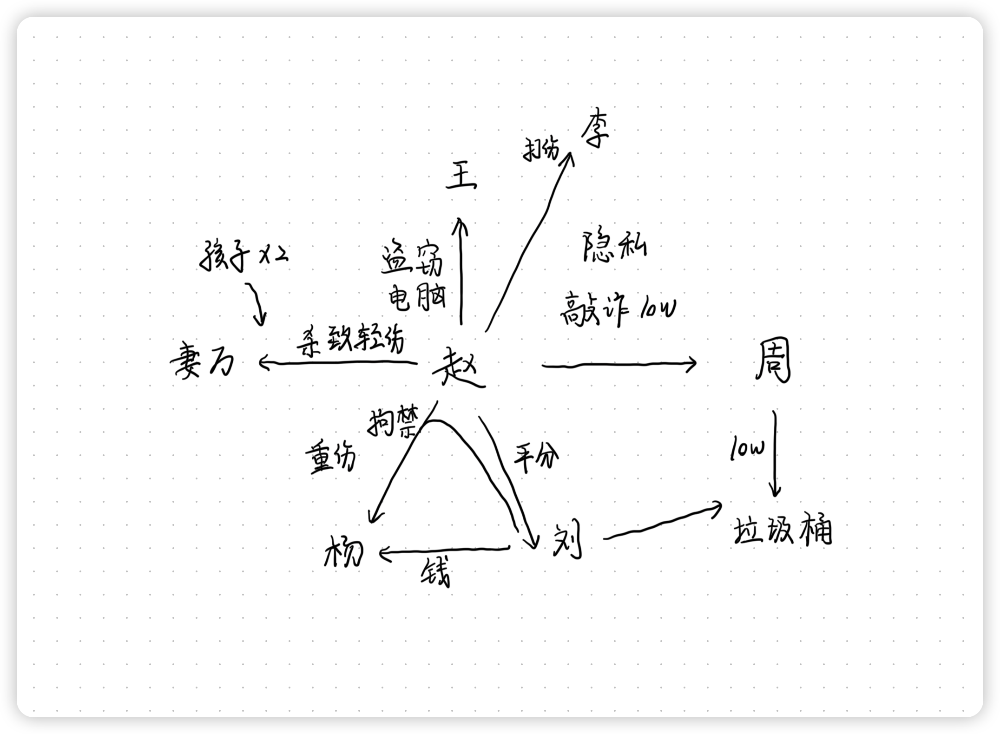
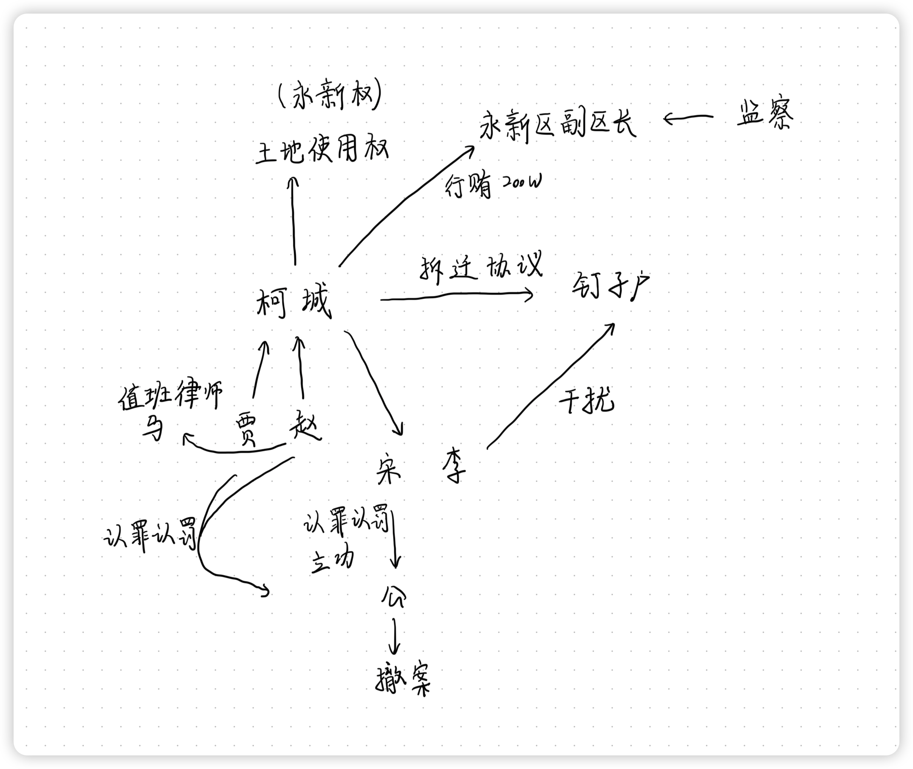

# 刑法学科主观真题（2021）

## 材料
- 2017年，赵某敲诈勒索周某10万元，否则将通过网络公布隐私。周某害怕，就按照赵某的指示，将10万元现金放到指定的垃圾桶旁边。赵某将该事情真相告诉了刘某，让刘某去垃圾桶旁边取钱，刘某取到后与赵某平分，每人得5万。（事实一）
- 2018年，赵某前往王某家盗窃，窃取一台笔记本电脑。下楼离开时，误以为李某是回家的王某。为了窝藏赃物，将李某打成轻伤。事实上，李某只是来楼里贴小广告的，对赵某盗窃的事实并不知情。（事实二）
- 2019年，杨某欠刘某债务到期没有偿还，刘某想要向杨某索取债务。赵某出主意说：“我们把他绑起来通他还钱”，刘某同意。二人将杨某拘禁后，杨某说：“你们把我绑起来我没办法还钱，就算你们把我放了我也没钱还”。两天后，赵某出主意说把杨某的大拇指砍下来，刘某同意，后来二人将杨某的大拇指砍下（重伤）。（事实三）
- 2020年，赵某的妻子万某发现赵某犯罪后劝其自首，赵某不从，恼羞成怒想要勒死妻子。正在拿皮带勒万某脖子的时候。万某叫喊，听到呼喊的两个孩子跑过来（一个3岁，一个5岁），赵某觉得不应该当着两个孩子的面杀死妻子，于是停止行凶，仅造成万某轻伤。（事实四）

## 题目
1. 对于事实一，有观点认为刘某成立敲诈勒索罪，请说明理由？有观点认为刘某成立侵占罪，请说明理由
2. 对于事实二，有观点认为赵某成立事后（转化型）抢劫，理由有哪些？有观点认定赵某成立盗窃罪和故意伤害罪，理由有哪些
3. 对于事实三，有观点认为刘某和赵某仅成立故意伤害罪，你反对还是赞同这个观点，说明理由
4. 对于事实四，赵某是故意杀人罪的犯罪中止还是犯罪未遂？请说明理由

## 关系图

## 作答
1. 答
   1. 刘某成立敲诈勒索罪，因为赵某将该事情真相告诉了刘某，刘某知悉赵某实施了敲诈勒索行为，属于承继的共同犯罪，刘某实施取钱行为视为着手，符合既遂的标准，因此刘某构成敲诈勒索罪
   2. 刘某成立侵占罪，周某将10万元现金放到指定的垃圾桶旁边时，赵某的敲诈勒索罪已经既遂，因此刘某不能与赵某构成敲诈勒索罪的共同犯罪，同时此时周某丧失对10万元现金的占有，刘某取钱的行为系对10万元现金的侵占行为，因此刘某构成侵占罪
2. 答
   1. 赵某误以为李某是回家的王某，将李某打成轻伤，系认识错误中的对象错误
   2. 赵某成立事后（转化型）抢劫，认为转化型抢劫中的实施暴力行为的对象不必须是被害人，也可以是第三人，因此赵某对第三人李某实施故意伤害行为致轻伤，应当认定为赵某构成事后（转化型）抢劫
   3. 赵某成立盗窃罪和故意伤害罪，认为转化型抢劫中的实施暴力行为的对象必须是被害人，因此赵某窃取一台笔记本电脑时盗窃罪既遂，之后的将李某打成轻伤与盗窃行为是独立的两个行为，应当分别评价，后行为系故意伤害李某致轻伤，构成故意伤害罪，数行为侵害数法益，应当数罪并罚，应当认定赵某成立盗窃罪和故意伤害罪
3. 答
   1. 反对，认为刘某和赵某的行为应当认定为犯非法拘禁罪与故意伤害罪致人重伤数罪并罚
   2. 二人将杨某拘禁，目的是向杨某索取自己的债务，因此构成共同犯罪，只犯非法拘禁罪，不触犯绑架罪，因为并非是带有非法占有第三人财物的目的实施的拘禁行为，同时二人将杨某的大拇指砍下的行为，并非是为了实施拘禁行为，而是单纯的泄愤行为，与拘禁行为本身是独立的两个行为，应当分别评价，因此后伤害行为构成共同犯罪，触犯故意伤害罪致人重伤，同时数行为侵害数法益，应当数罪并罚
4. 答
   1. 赵某是故意杀人罪的犯罪未遂
   2. 赵某停止故意伤人行为的原因是不应该当着两个孩子的面杀死妻子，一般认为近亲属的制止行为系属于非个人意志的因素，因此应当认为赵某的行为是故意杀人罪的犯罪未遂

## 参考答案
1. 刘某后续加入行为的定性的关键在于刘某加入之时，赵某的敲诈勒索行为是否实行终了。一般而言，在没既遂、中止事由的情况下，以犯罪既遂之时为实行行为终了之时。对于敲诈勒索罪而言，行为人排除被害人对财产的占有，将财产设定为自己或者第三人占有，就是本罪的既遂之时。因此，事实中，赵某的敲诈勒索行为是否实行终了（既遂），关键在于是否认定赵某实际占有刘某放置在指定的垃圾桶旁边的10万元现金。对此，刑法理论存在两种观点，分别为控制说（通说）和失控说
   1. 如果认为刘某构成敲诈勒索罪，则对赵某实际占有刘某放置在指定的垃圾桶旁边的10万元现金，采用控制说，“控制说”要求行为人实际控制财物。被害人周某将财物放在指定垃圾桶旁时，财物虽已经脱离周某占有，但仍未被赵某实际占有，赵某实施的敲诈勒索行为还未既遂，也即赵某的敲诈勒索行为尚未实时终了。则刘某中途加入，去垃圾桶旁边取钱的行为与赵某的敲诈勒索行为既遂之间有物理上的因果性，成立敲诈勒索罪的承继的共犯
   2. 如果认为刘某成立侵占罪，则对赵某实际占有刘某放置在指定的垃圾桶旁边的10万元现金采取失控说。“失控说”认为只要被害人失去对财物的控制，就认定行为人取得财物，那么当被害人周某将财物放在指定垃圾桶旁边时，周某已经失去对财物的控制，此时，就可认定赵某的敲诈勒索行为既遂（实行终了），刘某取走垃圾桶旁边10万元的行为与赵某的敲诈勒索行为无关。刘某取走垃圾桶旁边的财物属于侵占无人占有的财物，成立侵占罪
2. 本案的关键在于行为人在主观上为窝藏财物、抗拒抓捕、毁灭罪证，但客观上不存在防止行为人窝藏财物、毁灭罪证或是抓捕行为人的人，而对无关第三人实施暴力或以暴力相威胁的行为的是否成立事后抢劫。换言之，存在主观上的关联性，但无客观性上的关联性时，是否成立事后抢劫。对此，刑法理论上存在两种观点。分别是肯定说和否定说
   1. 如果赵某成立事后（转化型）抢劫，则采取肯定说。肯定说认为，此无关第三人实施暴力或以暴力相威胁行为的成立事后抢劫。刑法只是规定行为人必须处于窝藏赃物、抗拒抓波、毁灭罪证三种特定目的之一，没有将暴力的对象限定为别害人或抓捕者，也即不要求暴力行为与窝藏赃物的目的之间存在客观上的关联性。据此，本案中，赵某为了窝藏赃物，将来楼里贴小广告的李某打成轻伤的行为成立事后（转化型）抢劫
   2. 如果赵某成立盗窃罪和故意伤害罪，则采取否定说。否定说认为，对无关第三人实施暴力或以暴力相威胁的行为不成立事后抢劫。刑法将转化抢劫中暴力的对象限定为被害人或抓捕者，要求暴力行为与窝藏赃物的目的之间存在客观上的关联性。据此，本案尽管出于窝藏赃物的目的，但对来楼里贴小广告的李某（无关第三人）实施暴力，致其轻伤的行为不成立转化型抢劫，仅成立盗窃罪和故意伤害罪，数罪并罚
3. 1. 对于事实三，我赞同将刘某和赵某仅成立故意伤害罪一罪的观点
      1. 刘某和赵某为索取债务而非法拘禁他人，二人构成非法拘禁罪，不构成绑架罪
      2. 根据《刑法》第二百三十八条规定：“非法拘禁他人或者以其他方法非法剥夺他人人身自由的，处三年以下有期徒刑、拘役、管制或者剥夺政治权利。具有殴打、侮辱情节的，从重处罚。犯前款罪，致人重伤的，处三年以上十年以下有期徒刑；致人死亡的，处十年以上有期徒刑。使用暴力致人伤残、死亡的，依照本法第二百三十四条、第二百三十二条的规定定罪处罚。为索取债务非法扣押、拘禁他人的，依照前两款的规定处罚。国家机关工作人利用职权犯前三款罪的，依照前三款的规定从重处罚”。《刑法》第二百三十八条第二款后段的性质属于法律注意规定。即只有在行为人使用暴力时具有伤害、杀人故意，才能适用本条规定。本案中，刘某、赵某在已经实力控制杨某、还砍下杨某手指，显然具有伤害故意，因此直接适用第二百三十八条第二款后段的规定，成立故意伤害罪这一罪名
   2. 对于事实三，我反对刘某和赵某仅成立故意伤害罪一罪的观点
      1. 刘某和赵某为索取债务而非法拘禁他人，二人构成非法拘禁罪，不构成绑架罪。如果不赞同将刘某和赵某仅成立故意伤害罪一罪，则应当认为《刑法》第二百三十八条第二款后半段属于法律拟制规定
      2. 《刑法》第二百三十八条规定：“非法拘禁他人或者以其他方法非法剥夺他人人身自由的，处三年以下有期徒刑、拘役、管制或者剥夺政治权利。具有殴打、侮辱情节的，从重处罚。犯前款罪，致人重伤的，处三年以上十年以下有期徒刑；致人死亡的，处十年以上有期徒刑。使用暴力致人伤残、死亡的，依照本法第二百三十四条、第二百三十二条的规定定罪处罚。为索取债务非法扣押、拘禁他人的，依照前两款的规定处罚。国家机关工作人利用职权犯前三款罪的，依照前三款的规定从重处罚”。《刑法》第二百三十八条第二款后段的性质属于法律拟制。即只有当行为人没有伤害、杀害故意，但在非法拘禁过程中使用暴力致人重伤、死亡的，才需要适用第二百三十八条第二款后段的规定，以故意伤害罪或者故意杀人罪论处。而本案中，刘某、赵某在已经实力控制杨某后，还砍下杨某手指，显然具有伤害故意，对此，无需使用第二百三十八条第二款后段的规定，而应直接认定为非法拘禁罪和故意伤害罪，数罪并罚
4. 赵某构成故意杀人罪的犯罪中止。《刑法》第二十四条规定：“在犯罪过程中，自动放弃犯罪或者自动有效地防止犯罪结果发生的，是犯罪中止。对于中止犯，没有造成损害的，应当免除处罚；造成损害的，应当减轻处罚”。
   1. 赵某觉得不应该当着两个孩子的面杀死妻子，并不是因为外部障碍而不能继续行凶，不是犯罪未遂
   2. 根据主观说的观点，赵某能继续行凶而主动停止行凶，属于能达目的而不欲，是犯罪中止
   3. 根据《刑法》第二十四条规定，赵某的行为造成万某轻伤，应当减轻处罚

# 刑诉学科主观真题（2021）

## 材料
- 某县柯城公司以竞标方式获取永新区内某地的使用权，不久因土地开发经营需要，柯城公司开始组织进行该地块居民的拆迁补偿工作。期间，有两户“钉子户”拒不接受拆迁协议，并极力阻止柯城公司开展拆迁活动，为此，在柯城公司股东贾某、赵某的授意安排下，员工宋某、李某带领部分社会闲杂人员，多次以抛砖头、贴标语、播放噪音等方式，干扰两户钉子户居民的正常家庭生活，因不堪其扰，两户居民向公安机关报案。宋某在侦查阶段即认罪认罚，并且具有重大立功表现，公安机关经法定程序对其做撤案处理。审查起诉阶段，贾某，赵某均自愿认罪认罚，并签署了认罪认罚具结书。其中赵某因未委托辩护人而申请值班律师马某帮助后，贾某及赵某、李某被当地检察院起诉，本案引发了社会广泛关注，舆论反响强烈。另外，经查柯城公司在竞标上述地块时，曾以单位名义向永新区副区长行贿200万元，当地监察部门展开立案

## 题目
1. 如何理解认罪认罚中的“重大立功”？公安机关因此撤销案件应当经过何种法定程序
2. 值班律师马某在侦查阶段的地位和职责是什么？如果审判时被告人仍没有委托辩护人，值班律师能否出庭为其辩护
3. 一审法院在审理柯城公司涉嫌单位行贿一案中，如果贾某和赵某均被指控为直接责任人员，法院应如何确定诉讼代表人参加诉讼的？请说明理由
4. 本案一审法院应如何组成合议庭审理本案？该合议庭成员应如何分工？请说明理由
5. 寻衅滋事一案判决后，若当事人提出上诉，二审期间监察机关就公司单位行贿的线索调查终结移送检察院审查起诉，法院应如何处理
6. 本案二审经审理认为，贾某和赵某的犯罪事实清楚、证据确实充分，但李某犯罪事实不清、证据不足，对此二审法院应如何处理

## 关系图
