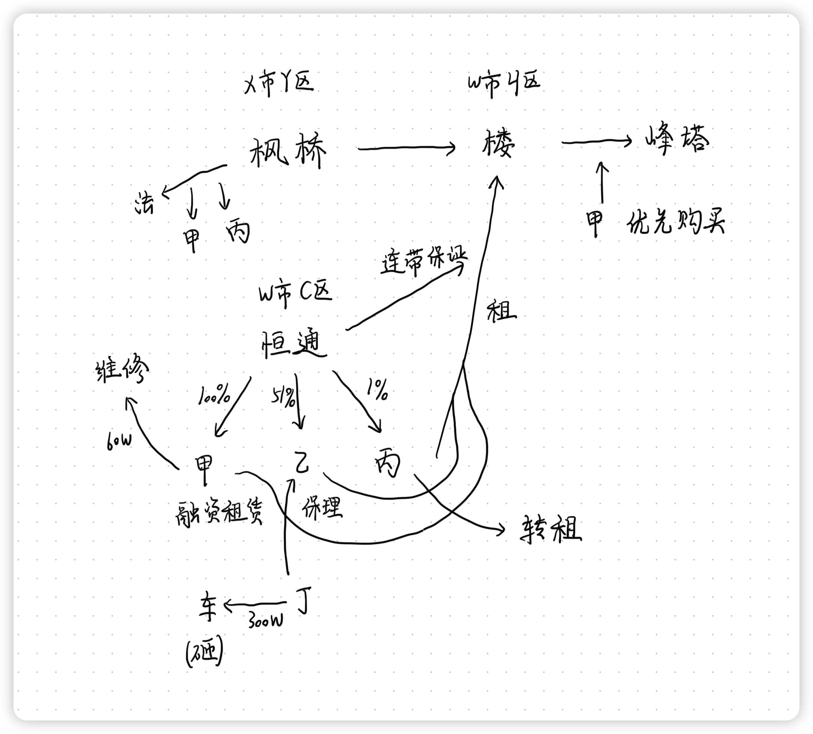

# 刑法学科主观真题（2021）

## 材料
- 2017年，赵某敲诈勒索周某10万元，否则将通过网络公布隐私。周某害怕，就按照赵某的指示，将10万元现金放到指定的垃圾桶旁边。赵某将该事情真相告诉了刘某，让刘某去垃圾桶旁边取钱，刘某取到后与赵某平分，每人得5万。（事实一）
- 2018年，赵某前往王某家盗窃，窃取一台笔记本电脑。下楼离开时，误以为李某是回家的王某。为了窝藏赃物，将李某打成轻伤。事实上，李某只是来楼里贴小广告的，对赵某盗窃的事实并不知情。（事实二）
- 2019年，杨某欠刘某债务到期没有偿还，刘某想要向杨某索取债务。赵某出主意说：“我们把他绑起来通他还钱”，刘某同意。二人将杨某拘禁后，杨某说：“你们把我绑起来我没办法还钱，就算你们把我放了我也没钱还”。两天后，赵某出主意说把杨某的大拇指砍下来，刘某同意，后来二人将杨某的大拇指砍下（重伤）。（事实三）
- 2020年，赵某的妻子万某发现赵某犯罪后劝其自首，赵某不从，恼羞成怒想要勒死妻子。正在拿皮带勒万某脖子的时候。万某叫喊，听到呼喊的两个孩子跑过来（一个3岁，一个5岁），赵某觉得不应该当着两个孩子的面杀死妻子，于是停止行凶，仅造成万某轻伤。（事实四）

## 题目
1. 对于事实一，有观点认为刘某成立敲诈勒索罪，请说明理由？有观点认为刘某成立侵占罪，请说明理由
2. 对于事实二，有观点认为赵某成立事后（转化型）抢劫，理由有哪些？有观点认定赵某成立盗窃罪和故意伤害罪，理由有哪些
3. 对于事实三，有观点认为刘某和赵某仅成立故意伤害罪，你反对还是赞同这个观点，说明理由
4. 对于事实四，赵某是故意杀人罪的犯罪中止还是犯罪未遂？请说明理由

## 关系图

## 作答
1. 答
   1. 刘某成立敲诈勒索罪，因为赵某将该事情真相告诉了刘某，刘某知悉赵某实施了敲诈勒索行为，属于承继的共同犯罪，刘某实施取钱行为视为着手，符合既遂的标准，因此刘某构成敲诈勒索罪
   2. 刘某成立侵占罪，周某将10万元现金放到指定的垃圾桶旁边时，赵某的敲诈勒索罪已经既遂，因此刘某不能与赵某构成敲诈勒索罪的共同犯罪，同时此时周某丧失对10万元现金的占有，刘某取钱的行为系对10万元现金的侵占行为，因此刘某构成侵占罪
2. 答
   1. 赵某误以为李某是回家的王某，将李某打成轻伤，系认识错误中的对象错误
   2. 赵某成立事后（转化型）抢劫，认为转化型抢劫中的实施暴力行为的对象不必须是被害人，也可以是第三人，因此赵某对第三人李某实施故意伤害行为致轻伤，应当认定为赵某构成事后（转化型）抢劫
   3. 赵某成立盗窃罪和故意伤害罪，认为转化型抢劫中的实施暴力行为的对象必须是被害人，因此赵某窃取一台笔记本电脑时盗窃罪既遂，之后的将李某打成轻伤与盗窃行为是独立的两个行为，应当分别评价，后行为系故意伤害李某致轻伤，构成故意伤害罪，数行为侵害数法益，应当数罪并罚，应当认定赵某成立盗窃罪和故意伤害罪
3. 答
   1. 反对，认为刘某和赵某的行为应当认定为犯非法拘禁罪与故意伤害罪致人重伤数罪并罚
   2. 二人将杨某拘禁，目的是向杨某索取自己的债务，因此构成共同犯罪，只犯非法拘禁罪，不触犯绑架罪，因为并非是带有非法占有第三人财物的目的实施的拘禁行为，同时二人将杨某的大拇指砍下的行为，并非是为了实施拘禁行为，而是单纯的泄愤行为，与拘禁行为本身是独立的两个行为，应当分别评价，因此后伤害行为构成共同犯罪，触犯故意伤害罪致人重伤，同时数行为侵害数法益，应当数罪并罚
4. 答
   1. 赵某是故意杀人罪的犯罪未遂
   2. 赵某停止故意伤人行为的原因是不应该当着两个孩子的面杀死妻子，一般认为近亲属的制止行为系属于非个人意志的因素，因此应当认为赵某的行为是故意杀人罪的犯罪未遂

## 参考答案
1. 刘某后续加入行为的定性的关键在于刘某加入之时，赵某的敲诈勒索行为是否实行终了。一般而言，在没既遂、中止事由的情况下，以犯罪既遂之时为实行行为终了之时。对于敲诈勒索罪而言，行为人排除被害人对财产的占有，将财产设定为自己或者第三人占有，就是本罪的既遂之时。因此，事实中，赵某的敲诈勒索行为是否实行终了（既遂），关键在于是否认定赵某实际占有刘某放置在指定的垃圾桶旁边的10万元现金。对此，刑法理论存在两种观点，分别为控制说（通说）和失控说
   1. 如果认为刘某构成敲诈勒索罪，则对赵某实际占有刘某放置在指定的垃圾桶旁边的10万元现金，采用控制说，“控制说”要求行为人实际控制财物。被害人周某将财物放在指定垃圾桶旁时，财物虽已经脱离周某占有，但仍未被赵某实际占有，赵某实施的敲诈勒索行为还未既遂，也即赵某的敲诈勒索行为尚未实时终了。则刘某中途加入，去垃圾桶旁边取钱的行为与赵某的敲诈勒索行为既遂之间有物理上的因果性，成立敲诈勒索罪的承继的共犯
   2. 如果认为刘某成立侵占罪，则对赵某实际占有刘某放置在指定的垃圾桶旁边的10万元现金采取失控说。“失控说”认为只要被害人失去对财物的控制，就认定行为人取得财物，那么当被害人周某将财物放在指定垃圾桶旁边时，周某已经失去对财物的控制，此时，就可认定赵某的敲诈勒索行为既遂（实行终了），刘某取走垃圾桶旁边10万元的行为与赵某的敲诈勒索行为无关。刘某取走垃圾桶旁边的财物属于侵占无人占有的财物，成立侵占罪
2. 本案的关键在于行为人在主观上为窝藏财物、抗拒抓捕、毁灭罪证，但客观上不存在防止行为人窝藏财物、毁灭罪证或是抓捕行为人的人，而对无关第三人实施暴力或以暴力相威胁的行为的是否成立事后抢劫。换言之，存在主观上的关联性，但无客观性上的关联性时，是否成立事后抢劫。对此，刑法理论上存在两种观点。分别是肯定说和否定说
   1. 如果赵某成立事后（转化型）抢劫，则采取肯定说。肯定说认为，此无关第三人实施暴力或以暴力相威胁行为的成立事后抢劫。刑法只是规定行为人必须处于窝藏赃物、抗拒抓波、毁灭罪证三种特定目的之一，没有将暴力的对象限定为别害人或抓捕者，也即不要求暴力行为与窝藏赃物的目的之间存在客观上的关联性。据此，本案中，赵某为了窝藏赃物，将来楼里贴小广告的李某打成轻伤的行为成立事后（转化型）抢劫
   2. 如果赵某成立盗窃罪和故意伤害罪，则采取否定说。否定说认为，对无关第三人实施暴力或以暴力相威胁的行为不成立事后抢劫。刑法将转化抢劫中暴力的对象限定为被害人或抓捕者，要求暴力行为与窝藏赃物的目的之间存在客观上的关联性。据此，本案尽管出于窝藏赃物的目的，但对来楼里贴小广告的李某（无关第三人）实施暴力，致其轻伤的行为不成立转化型抢劫，仅成立盗窃罪和故意伤害罪，数罪并罚
3. 1. 对于事实三，我赞同将刘某和赵某仅成立故意伤害罪一罪的观点
      1. 刘某和赵某为索取债务而非法拘禁他人，二人构成非法拘禁罪，不构成绑架罪
      2. 根据《刑法》第二百三十八条规定：“非法拘禁他人或者以其他方法非法剥夺他人人身自由的，处三年以下有期徒刑、拘役、管制或者剥夺政治权利。具有殴打、侮辱情节的，从重处罚。犯前款罪，致人重伤的，处三年以上十年以下有期徒刑；致人死亡的，处十年以上有期徒刑。使用暴力致人伤残、死亡的，依照本法第二百三十四条、第二百三十二条的规定定罪处罚。为索取债务非法扣押、拘禁他人的，依照前两款的规定处罚。国家机关工作人利用职权犯前三款罪的，依照前三款的规定从重处罚”。《刑法》第二百三十八条第二款后段的性质属于法律注意规定。即只有在行为人使用暴力时具有伤害、杀人故意，才能适用本条规定。本案中，刘某、赵某在已经实力控制杨某、还砍下杨某手指，显然具有伤害故意，因此直接适用第二百三十八条第二款后段的规定，成立故意伤害罪这一罪名
   2. 对于事实三，我反对刘某和赵某仅成立故意伤害罪一罪的观点
      1. 刘某和赵某为索取债务而非法拘禁他人，二人构成非法拘禁罪，不构成绑架罪。如果不赞同将刘某和赵某仅成立故意伤害罪一罪，则应当认为《刑法》第二百三十八条第二款后半段属于法律拟制规定
      2. 《刑法》第二百三十八条规定：“非法拘禁他人或者以其他方法非法剥夺他人人身自由的，处三年以下有期徒刑、拘役、管制或者剥夺政治权利。具有殴打、侮辱情节的，从重处罚。犯前款罪，致人重伤的，处三年以上十年以下有期徒刑；致人死亡的，处十年以上有期徒刑。使用暴力致人伤残、死亡的，依照本法第二百三十四条、第二百三十二条的规定定罪处罚。为索取债务非法扣押、拘禁他人的，依照前两款的规定处罚。国家机关工作人利用职权犯前三款罪的，依照前三款的规定从重处罚”。《刑法》第二百三十八条第二款后段的性质属于法律拟制。即只有当行为人没有伤害、杀害故意，但在非法拘禁过程中使用暴力致人重伤、死亡的，才需要适用第二百三十八条第二款后段的规定，以故意伤害罪或者故意杀人罪论处。而本案中，刘某、赵某在已经实力控制杨某后，还砍下杨某手指，显然具有伤害故意，对此，无需使用第二百三十八条第二款后段的规定，而应直接认定为非法拘禁罪和故意伤害罪，数罪并罚
4. 赵某构成故意杀人罪的犯罪中止。《刑法》第二十四条规定：“在犯罪过程中，自动放弃犯罪或者自动有效地防止犯罪结果发生的，是犯罪中止。对于中止犯，没有造成损害的，应当免除处罚；造成损害的，应当减轻处罚”。
   1. 赵某觉得不应该当着两个孩子的面杀死妻子，并不是因为外部障碍而不能继续行凶，不是犯罪未遂
   2. 根据主观说的观点，赵某能继续行凶而主动停止行凶，属于能达目的而不欲，是犯罪中止
   3. 根据《刑法》第二十四条规定，赵某的行为造成万某轻伤，应当减轻处罚

# 民法民诉学科主观真题（2021）

## 材料
- 枫桥公司位于X市Y区，通过抵顶债务的方式收回一幢20层的“枫叶”写字楼（价值10个亿）位于W市H区，恒通公司是一家有多个金融牌照的集团公司，位于W市C区
- 恒通公司为了拓展业务，设立了三家子公司。甲融资租赁公司（全资子公司）、乙保理公司（控股子公司）、丙公司（参股子公司）。三家子公司与枫桥公司约定，分别承租“枫叶”写字楼的16、17、18层，按季支付租金，租金为每月30万（每层1000平方米，每平方米300元）。约定试租1年，到期如没有其他约定，续租2年，起租日期为2020年1月15日，如果产生纠纷由X市Y区管辖，由恒通公司为三家子公司支付租金提供连带责任保证，并出具了《担保函》。三家公司于2020年1月14日搬入
- 甲公司承租的16层，设施设备损坏，多次联系枫桥公司处理，枫桥公司未处理，甲公司只好垫资自己维修，花费60万，并明确表示会从下一季度的租金中扣除，枫桥公司表示拒绝。2020年3月，甲公司向枫桥公司支付了30万元。枫桥公司诉至法院，要求甲公司支付第二季度租金90万元，恒通公司承担连带保证责任。甲公司向法院主张垫付的维修款60万元抵销租金，枫桥公司不认可，并且主张2020年3月甲公司明确表示打给自己的30万元是清偿另一项债务。法院判决甲公司向枫桥公司支付租金90万元，恒通公司承担连带偿还责任，如恒通公司清偿债务，可以向甲公司追偿
- 丁代表公司去跟乙公司签约，将车停放在“枫叶”写字楼的停车场车位上，停车场的一棵大树因被大风刮倒，砸在了丁的车上造成损失300万。事后查明，事发前几日已经有多名人员向写字楼的管理方表明有树即将折断，由于工作人员未登记，交接班的时候彻底忘记此事。此意外还导致丁与乙公司未签约，造成损失5000万
- 丙公司觉得写字楼内部的风格与自己的经营理念不符，与枫桥公司协商，想要重新装修，遭到拒绝。心灰意冷的丙公司递未经枫桥公司同意将第18层转租给了另外一个公司，并决定试租的1年到期后不再续租
- “枫叶”写字楼经营失败，屡遭投诉，纠纷越来越多，枫桥公司于2021年1月2日将“枫叶”写字楼整体转让给峰塔公司。甲公司要求就16层享受优先购买权，在此之前，枫桥公司已经将甲公司、丙公司诉至法院

## 题目
1. 枫桥公司起诉甲公司和恒通公司要求支付租金应当由哪个法院管辖？为什么
2. 恒通公司如果承担了保证责任，能不能依据判决书申请执行？为什么
3. 甲公司提出60万元的维修费抵消租金的主张，法院应当认为是抗辩还是反诉处理？为什么
4. 关于甲公司主张2020年3月份转账的30万是支付的租金，对于该事实，应由谁来承担证明责任？如果法院最终未得出心证，法院应当如何处理
5. 丁就遭到的损害，可以向谁主张？为什么
6. 乙公司就因此未能签订5000万元的合同所遭受的损失是否能够主张赔偿？为什么
7. 丙公司把18层转租给另一个公司的行为是否有效？为什么
8. 枫桥公司把“枫叶”写字楼整体转让给峰塔公司时，甲公司等的租赁合同是否当然解除？为什么
9. 甲公司能否就16层行使优先购买权
10. 若恒通公司未采取对外担保的决议程序便提供保证，其是否应该为甲公司和丙公司承担连带保证责任？为什么

## 关系图

## 作答
1. 答
   1. 应当由“枫叶”写字楼所在地法院即W市H区专属管辖
   2. 根据《民事诉讼法》规定，房屋租赁合同相关诉讼由不动产所在地法院专属管辖，因此“如果产生纠纷由X市Y区管辖”条款违反了专属管辖的规定，该条款无效
2. 答
   1. 可以依据判决书申请执行
   2. 担保人承担了相应的担保责任后，有权向债务人追偿，因此恒通公司如果承担了保证责任，可以根据判决书申请执行，向甲公司追偿
3. 答
   1. 法院应当认为是反诉处理
   2. 甲公司提出60万元的维修费抵消租金的主张是一个独立的诉讼请求，该诉讼请求的当事人与本诉相同，且与本诉的诉讼请求独立可以作为一个单独的诉讼提出
4. 答
   1. 应由甲公司来承担证明责任
   2. 根据《民事诉讼法》规定，该请求并不属于举证责任倒置的特殊情形，因此由主张人即甲公司承担证明责任
   3. 如果法院最终未得出心证，法院应当驳回该诉讼请求
5. 答
   1. 乙公司可以向写字楼的所有者与经营者主张侵权赔偿责任
   2. 写字楼的所有者、管理者负责管理建筑物相关设施的责任，不能证明自己没有过错的，应当对造成的损失承担赔偿责任
   3. 工作人员未登记遗忘行为，工作人员的行为系职务行为，在履行职务过程中给第三人造成损失的，由接受劳务方承担赔偿责任
6. 答
   1. 乙公司就因此未能签订5000万元的合同所遭受的损失不能够主张赔偿
   2. 根据《民事诉讼法》规定，赔偿损失的损失仅指确定的经济损失，不包含对于未来可能发生的经济损失
   3. 这里未能签订5000万元的合同，该5000万元的经济利益获取存在诸多不确定因素，不能认定为确定的经济损失，不能够主张赔偿
7. 答
   1. 丙公司把18层转租给另一个公司的行为合法有效
   2. 丙公司处分“枫叶”公司的楼房，属于无权处分行为，但是无权处分不影响行为及合同的效力，且该行为并不存在违反法律法规等使得行为无效的因素，因此该行为合法有效
8. 答
   1. 甲公司等的租赁合同继续履行
   2. 因为甲公司等的租赁合同签订在先，“枫叶”写字楼整体转让行为在后，根据买卖不破租赁的原则，买卖行为不影响之前租赁合同的效力，峰塔公司应当继续与甲公司等履行租赁合同
9. 答
   1. 甲公司能就16层在同等条件下行使优先购买权
   2. 因为甲公司之前与枫叶公司签订有关于“枫叶”写字楼的租赁合同，因此根据《民法典》规定，甲公司在租赁期间，若枫叶公司处分“枫叶”写字楼的，甲公司可以在自己租赁范围内在同等条件下，行使优先购买权
10. 答
    1. 若恒通公司未采取对外担保的决议程序便提供保证，其应该为甲公司承担连带保证责任，不应该为丙公司承担连带保证责任
    2. 因为甲公司是恒通公司的全资子公司，因此恒通公司在对甲公司的关联担保中决议豁免，即该关联担保有效不需要恒通公司出具担保协议，因此恒通公司应为甲公司承担连带保证责任
    3. 但是丙公司是恒通公司的参股子公司，因此恒通公司在对丙公司的关联担保中应当出具合法有效的股东会决议，因此恒通公司未采取对外担保的决议程序，没有出具相应的决议，不能证明担保物权人善意，关联担保行为无效，因此恒通公司不应为丙公司承担连带保证责任

# 刑诉学科主观真题（2021）

## 材料
- 某县柯城公司以竞标方式获取永新区内某地的使用权，不久因土地开发经营需要，柯城公司开始组织进行该地块居民的拆迁补偿工作。期间，有两户“钉子户”拒不接受拆迁协议，并极力阻止柯城公司开展拆迁活动，为此，在柯城公司股东贾某、赵某的授意安排下，员工宋某、李某带领部分社会闲杂人员，多次以抛砖头、贴标语、播放噪音等方式，干扰两户钉子户居民的正常家庭生活，因不堪其扰，两户居民向公安机关报案。宋某在侦查阶段即认罪认罚，并且具有重大立功表现，公安机关经法定程序对其做撤案处理。审查起诉阶段，贾某，赵某均自愿认罪认罚，并签署了认罪认罚具结书。其中赵某因未委托辩护人而申请值班律师马某帮助后，贾某及赵某、李某被当地检察院起诉，本案引发了社会广泛关注，舆论反响强烈。另外，经查柯城公司在竞标上述地块时，曾以单位名义向永新区副区长行贿200万元，当地监察部门展开立案

## 题目
1. 如何理解认罪认罚中的“重大立功”？公安机关因此撤销案件应当经过何种法定程序
2. 值班律师马某在侦查阶段的地位和职责是什么？如果审判时被告人仍没有委托辩护人，值班律师能否出庭为其辩护
3. 一审法院在审理柯城公司涉嫌单位行贿一案中，如果贾某和赵某均被指控为直接责任人员，法院应如何确定诉讼代表人参加诉讼的？请说明理由
4. 本案一审法院应如何组成合议庭审理本案？该合议庭成员应如何分工？请说明理由
5. 寻衅滋事一案判决后，若当事人提出上诉，二审期间监察机关就公司单位行贿的线索调查终结移送检察院审查起诉，法院应如何处理
6. 本案二审经审理认为，贾某和赵某的犯罪事实清楚、证据确实充分，但李某犯罪事实不清、证据不足，对此二审法院应如何处理

## 关系图

## 作答
1. 答
   1. 认罪认罚中的“重大立功”是指检举揭发他人的严重危害他人、社会、国家安全的犯罪行为
   2. 公安机关因此撤销案件应当经过核实犯罪嫌疑人提供的线索的真实性、关联性，报请公安局负责人审批，依法作出撤销案件的决定的程序
2. 答
   1. 值班律师马某在侦查阶段的地位是法律咨询帮助人
   2. 值班律师马某在侦查阶段的职责是见证赵某签署认罪认罚具结书的真实性、自愿性，为犯罪嫌疑人提供法律咨询帮助
   3. 根据《刑事诉讼法》规定，值班律师能不能作为辩护人出庭，只能在侦查阶段与审查起诉阶段提供法律援助
3. 答
   1. 法院在公司法定代表人、公司实际控制人是犯罪嫌疑人、被告人的情况下，根据《刑事诉讼法》规定，应当要求公司委托职工作为诉讼代表人参加诉讼，如果公司不能委托员工作为代表诉讼的，可以委托律师作为诉讼代表人参加诉讼
4. 答
   1. 本案一审法院是基层人民法院，应当组成由三名法官组成的合议庭，亦或是由一名法官与两名人民陪审员或是三名法官与四名人民陪审员组成的合议庭，均由法官担任合议庭对审判长进行审理
   2. 合议庭成员中，人民陪审员负责对案件事实部分进行审理，法官负责对案件事实部分、案件法律部分、审判程序部分负责进行审理
5. 答
   1. 二审期间监察机关就公司单位行贿的线索调查终结移送检察院审查起诉，应当认为为案件出现了新的证据事实，二审法院应当裁定案件事实不清、证据不足，发回一审法院重审
6. 答
   1. 贾某和赵某的犯罪事实清楚、证据确实充分，二审法院应当判决维持原判
   2. 李某犯罪事实不清、证据不足，二审法院可以裁定事实不清、证据不足，发回重审，也可以在查清事实的基础上，直接改判

## 参考答案
1. 在认罪认罚案件中，重大立功是指
   1. 犯罪分子有检举、揭发他人重大犯罪行为，经查证属实
   2. 提供侦破其他重大案件的重要线索，经查证属实
   3. 阻止他人重大犯罪活动
   4. 协助司法机关抓捕其他重大犯罪嫌疑人（包括同案犯）
   5. 对国家和社会有其他重大贡献等表现的，应当认定为有重大立功表现
   前面所称“重大犯罪”、“重大案件”、“重大犯罪嫌疑人”的标准，一般是指犯罪嫌疑人、被告人可能被判处无期徒刑以上刑罚或者案件在本省、自治区、直辖市或者全国范围内有较大影响等情形
   《公安机关办理刑事案件程序规定》第一百八十八条规定：“犯罪嫌疑人自愿如实供述涉嫌犯罪的事实，有重大立功或者案件涉及国家重大利益，需要撤销案件的，应当层报公安部，由公安部商请最高人民检察院核准后撤销案件。报请撤销案件的公安机关应当同时将相关情况通报同级人民检察院。公安机关根据前款规定撤销案件的，应当对查封、扣押、冻结的财物及其孳息作出处理”。根据相关规定，本案中，犯罪嫌疑人宋某具有重大立功表现，若需要撤销案件，某县公安机关应当层报公安部，再由公安部商情最高人民检察院，最高检核准的，某县公安机关可以对犯罪嫌疑人宋某撤销案件，某县公安机关应当同时将相关情况通报某县人民检察院
2. 地位：值班律师并非犯罪嫌疑人、被告人的辩护人。《法律援助值班律师工作办法》第二条规定：“本办法所称值班律师，是指法律援助机构在看守所、人民检察院、人民法院等场所设立法律援助工作站，通过派驻或安排的方式，为没有辩护人的犯罪嫌疑人、被告人提供法律帮助的律师”。根据相关规定，值班律师是为没有辩护人的犯罪嫌疑人、被告人提供法律帮助的律师
   职责：《法律援助值班律师工作办法》第六条规定：“值班律师依法提供以下法律帮助：(一)提供法律咨询；(二)提供程序选择建议；(三)帮助犯罪嫌疑人、被告人申请变更强制措施；(四)对案件处理提出意见；(五) 帮助犯罪嫌疑人、被告人及其近亲属申请法律援助；(六)法律法规规定的其他事项。值班律师在认罪认罚案件中，还应当提供以下法律帮助：(一)向犯罪嫌疑人、被告人释明认罪认罚的性质和法律规定；(二)对人民检察院指控罪名、量刑建议、诉讼程序适用等事项提出意见；(三)犯罪嫌疑人签署认罪认罚具结书时在场。值班律师办理案件时，可以应犯罪嫌疑人、被告人的约见进行会见，也可以经办案机关允许主动会见；自人民检察院对案件审查起诉之日起可以查阅案卷材料、了解案情”
   不能。根据相关规定，值班律师仅提供基本的法律帮助服务，不是真正的辩护人，值班律师没有出庭辩护的资格。因此如果审判时被告人没有委托辩护人，值班律师不能出庭为其辩护
3. 《刑事诉讼法解释》第三百三十六条规定：“被告单位的诉讼代表人，应当是法定代表人、实际控制人或者主要负责人；法定代表人、实际控制人或者主要负责人被指控为单位犯罪直接责任人员或者因客观原因无法出庭的，应当由被告单位委托其他负责人或者职工作为诉讼代表人。但是，有关人员被指控为单位犯罪直接责任人员或者知道案件情况、负有作证义务的除外；依据前款规定难以确定诉讼代表人的，可以由被告单位委托律师等单位以外的人员作为诉讼代表人。诉讼代表人不得同时担任被告单位或者被指控为单位犯罪直接责任人员的有关人员的辩护人”。第三百三十七条规定：“开庭审理单位犯罪案件，应当通知被告单位的诉讼代表人出庭；诉讼代表人不符合前条规定的，应当要求人民检察院另行确定。被告单位的诉讼代表人不出庭的，应当按照下列情形分别处理：（一）诉讼代表人系被告单位的法定代表人、实际控制人或者主要负责人，无正当理由拒不出庭的，可以拘传其到庭；因客观原因无法出庭，或者下落不明的，应当要求人民检察院另行确定诉讼代表人；（二）诉讼代表人系其他人员的，应当要求人民检察院另行确定诉讼代表人”。本案中对于单位犯罪，一审法院可以从以下方面确定诉讼代表人
   1. 被告单位的诉讼代表人，应当是柯城公司的法定代表人、实际控制人或者主要负责人
   2. 法定代表人、实际控制人活着主要负责人被指控为单位犯罪的直接责任人员或者因客观原因无法出庭的，应当由柯城公司委托其他负责人或者职工作为诉讼代表人。但是，有关人员被指控为单位犯罪直接责任人员或者知道案件情况、负有作证义务的除外
   3. 若仍难以确定诉讼代表人，可以由柯城公司委托律师等单位以外的人员作为诉讼代表人，但该律师不得同时担任柯城公司或者贾某、赵某的辩护人
   4. 若诉讼代表人不符合前述规定的，应当要求某县检察院另行确定诉讼代表人
4. 1. 《刑事诉讼法解释》第二百一十三条规定：“基层人民法院、中级人民法院、高级人民法院审判下列第一审刑事案件，由审判员和人民陪审员组成合议庭进行：（一）涉及群体利益、公共利益的；（二）人民群众广泛关注或者其他社会影响较大的；（三）案情复杂或者有其他情形，需要由人民陪审员参加审判的。基层人民法院、中级人民法院、高级人民法院审判下列第一审刑事案件，由审判员和人民陪审员组成七人合议庭进行：（一）可能判处十年以上有期徒刑、无期徒刑、死刑，且社会影响重大的；（二）涉及征地拆迁、生态环境保护、食品药品安全，且社会影响重大的；（三）其他社会影响重大的”。本案一审法院应当由三名法官、四名人民陪审员组成七人合议庭进行审理。根据法律规定，人民法院审判下列第一审案件，由人民陪审员和法官组成七人合议庭进行：①可能判处十年以上有期徒刑、无期徒刑、死刑，且社会影响重大的；②根据民事诉讼法、行政诉讼法提起的公益诉讼案件；③涉及征地拆迁、生态环境保护、食品药品安全，社会影响重大的案件；④其他社会影响重大的案件。因此，本案作为涉及拆迁的案件，鉴于其影响的重大性，问题的复杂性和舆论的关注性，某县法院应当由三名法官、四名人民陪审员组成七人合议庭进行审理
   2. 《刑事诉讼法解释》第二百一十五条规定：“人民陪审员参加三人合议庭审判案件，应当对事实认定、法律适用独立发表意见，行使表决权。 人民陪审员参加七人合议庭审判案件，应当对事实认定独立发表意见，并与审判员共同表决；对法律适用可以发表意见，但不参加表决”。本案中，某县法院在审理时，如果组成七人合议庭，三名法官负责审理事实和法律问题，并对事实和法律问题均有表决权；四名人民陪审员，可以审理和表决事实问题，但不参与表决法律问题
5. 《刑事诉讼法解释》第二十四条规定：“人民法院发现被告人还有其他犯罪被起诉的，可以并案审理；涉及同种犯罪的，一般应当并案审理。人民法院发现被告人还有其他犯罪被审查起诉、立案侦查、立案调查的，可以参照前款规定协商人民检察院、公安机关、监察机关并案处理，但可能造成审判过分迟延的除外。根据前两款规定并案处理的案件，由最初受理地的人民法院审判。必要时，可以由主要犯罪地的人民法院审判”。第二十五条规定：“第二审人民法院在审理过程中，发现被告人还有其他犯罪没有判决的，参照前条规定处理。第二审人民法院决定并案审理的，应当发回第一审人民法院，由第一审人民法院作出处理”。第二审法院发现柯城公司涉嫌单位犯罪被审查起诉的，可以协商检察院并案处理，但可能造成审判过分延迟的除外；若第二审法院决定并案审理，应当发回第一审法院，由第一审法院作出处理
6. 《刑事诉讼法解释》第四百零四条规定：“第二审人民法院认为第一审判决事实不清、证据不足的，可以在查清事实后改判，也可以裁定撤销原判，发回原审人民法院重新审判。有多名被告人的案件，部分被告人的犯罪事实不清、证据不足或者有新的犯罪事实需要追诉，且有关犯罪与其他同案被告人没有关联的，第二审人民法院根据案件情况，可以对该部分被告人分案处理，将该部分被告人发回原审人民法院重新审判。原审人民法院重新作出判决后，被告人上诉或者人民检察院抗诉，其他被告人的案件尚未作出第二审判决、裁定的，第二审人民法院可以并案审理”。第二审法院若认为李某与贾某、赵某的犯罪存在关联，第二审法院可以在查清事实后改判，也可全案裁定撤销原判，发回重审；若第二审法院认为李某与贾某、赵某的犯罪不存在关联，第二审法院可以对李某分案处理，将该李某发回原审法院重新审判。原审法院重新作出判决后，李某上诉或者检察院抗诉，贾某、赵某的案件尚未作出第二审判决、裁定的，第二审法院可以并案审理

