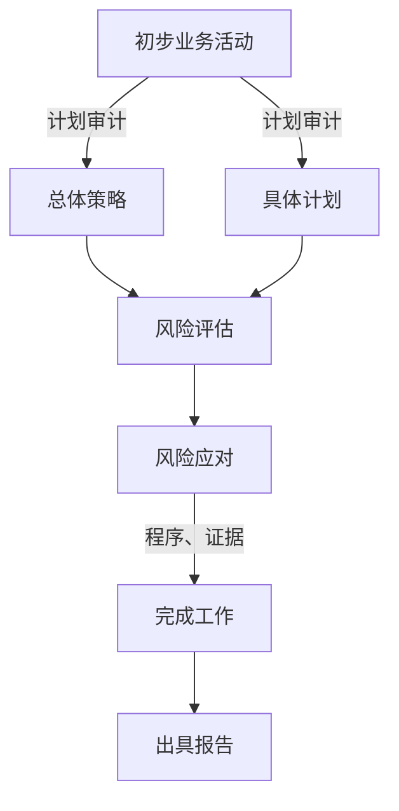

# 审计活动

## 审计概述

专有名词

1. 财物报表（四表一注）
   1. 资产负债表
   2. 利润表
   3. 现金流量表
   4. 所有者权益变动表
   5. 附注
2. 审计证据：会计记录所含有的信息
3. 审计程序：注册会计师收集审计证据的详细指令
4. 审计计划
   1. 初步业务活动
   2. 总体审计策略
   3. 具体审计计划
5. 审计重要性：可能影响财务报表使用者依据财务报表作出的经济决策
6. 审计涉及的组织和人员
7. 风险评估
   1. 被审计单位的内部控制：内部监管与内部监督
8. 风险应对
   1. 控制测试
   2. 实质性程序
9. 审计循环
   1. 交易和账户余额
   2. 业务循环
10. 完成审计报告和出具审计报告
    1. 审计准则
    2. 财物报告编制基础：《企业会计准则》