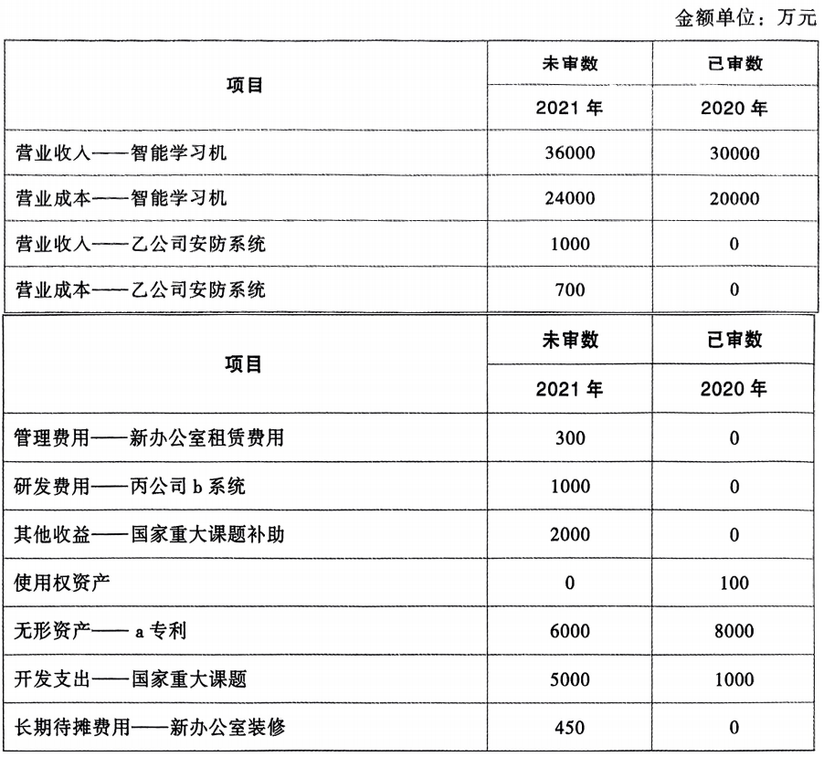
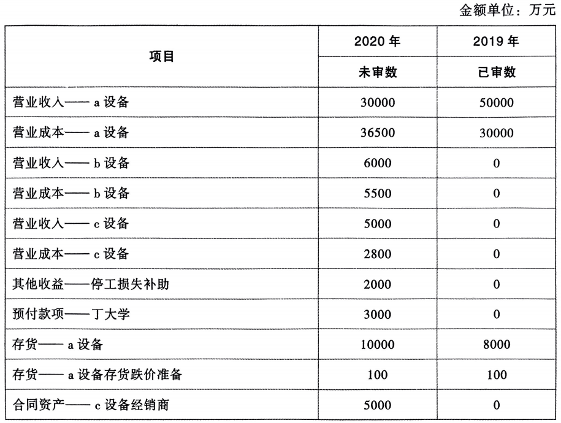

# 简答题一

## 题目

ABC会计师事务所的A注册会计师负责审计甲公司2021年度财务报表。与货币资金审计相关的部分事项如下：

1. A注册会计师评估认为甲公司存在隐瞒关联方资金占用的风险。在了解了甲公司与关联方资金占用相关的内部控制后，A注册会计师认为内部控制设计有效并得到执行，因此该风险不构成特别风险。

- 要求：针对上述第(4)项，指出A注册会计师的做法是否恰当。如不恰当，简要说明理由。(2022年)

## 作答

1. 否（不恰当）

    - 存在舞弊的特别风险，注册会计师评估特别风险时，不应考虑内部控制对特别风险的抵消效果。

## 订正答案

1. 回答正确

## 参考答案

1. 不恰当

    - 在判断特别风险时，不应考虑识别出的控制对相关风险的抵销效果。

# 综合题一

## 题目

上市公司甲公司是ABC会计师事务所的常年审计客户，主要从事电子元器件的生产和销售。A注册会计师负责审计甲公司2022年度财务报表，确定<strong style="color: green">财务报表整体的重要性</strong>为1000万元。

资料一：

A注册会计师在审计工作底稿中记录了所了解的甲公司及其环境等方面的情况，部分内容摘录如下：

1. 受竞争对手推出新产品的影响，2022年上半年，甲公司a产品销量仅为2021年销量的30%为夺回市场份额，2022年7月，甲公司对a产品的售价进行了自该产品上市以来的首次调整，由1元降至0.5元，同时加大了替代品的研发投入。

2. 2022年2月，甲公司生产b产品的车间因污水排放问题被责令停产改造，加装环保设备。为保持产品销量稳定，甲公司以与自产成本相当的价格委托代工厂生产b产品，至2022年12月车间改造完毕后恢复自产。

3. 2022年，甲公司新增向乙国销售产品的业务，为快速占领市场，甲公司与该国的经销商客户签订合同约定，按销售价格的5%付市场推广费。

4. 2022年，甲公司因研制多款新型产品，研发投入比上年增长50%，均费用化计入当期损益。研发过程中产出的试制品销售良好，毛利率达60%，销售额占研发费用的20%，一定程度上缓解了研发投入的资金压力。

5. 2022年1月，甲公司实施一项股票期权激励计划，激励对象为公司管理人员。因2022年度第一个行权期的行权条件已经满足，激励对象于2023年2月行权取得甲公司股票300万股，行权价格5元，行权时甲公司股价为15元。

资料二：

A注册会计师在审计工作底稿中记录了甲公司的财务数据，部分内容摘录如下：

- 要求：针对资料一第(1)至(5)项，结合资料二，假定不考虑其他条件，逐项指出资料一所列事项是否可能表明存在重大错报风险。如果认为可能表明存在重大错报风险，简要说明理由，并说明该风险主要与哪些财务报表项目的哪些认定相关(不考虑税务影响)。(2023年)

## 作答

1. 是

    - 市场环境变化，竞争对手推出新产品，经营风险增大。

    - 收入的发生、存在、准确性认定。

2. 是

    - 委托代工厂生产b产品，产品销量稳定的情况下，营业成本不增反降，存在舞弊风险迹象。

    - 收入的发生、存在认定，成本的完整性认定。

3. 是

    - 市场推广费约定为销售价格的5%，因此1600万元市场推广费，应对应32000万元营业收入，有2000万元差额，超过财务报表整体的重要性。

    - 营业收入的完整性认定。

4. 是

    - 产出试制品，说明不能全部认定为研究阶段，不应当全部费用化，计入当期损益；同时试制品的销售收入，不应当冲减研发支出，而应当计入当期损益。

    - 管理费用的存在、完整性认定、无形资产的完整性认定、研发支出的发生认定。

5. 是

    - 股权激励计划，行权后，应当相应调增资本公积科目。

    - 资本公积的完整性认定。

## 订正答案

1. <strong style="color: red">回答错误</strong>

    - 降价销售，关注存货跌价准备问题

2. <strong style="color: red">回答错误</strong>

    - 固定资产升级改造，可能涉及继续计提折旧问题

3. <strong style="color: red">回答错误</strong>

    - 营业成本可能存在不同名义支付的情况

4. <strong style="color: red">回答错误</strong>

    - 研发阶段试生产产品销售的会计处理问题

5. <strong style="color: red">回答错误</strong>

    - 股权激励计划的会计处理问题

## 参考答案

1. 是

    - a产品降价销售，导致成本高于售价/毛利率为负数，可能存在少计存货跌价准备的风险。

    - 资产减值损失(准确性)、存货(准确性、计价和分摊)。

2. 是

    - 车间停产继续计提的折旧应当计入营业成本，但2022年度b产品毛利率与上年持平，可能存在少计营业成本的风险。

    - 营业成本(分类/准确性)、管理费用(分类/准确性)。

3. 是

    - 支付给客户的市场推广费很可能是应付客户对价/应当冲减营业收入，可能存在多计收入和销售费用的风险。

    - 营业收入(分类/准确性)、销售费用(分类/准确性)。

4. 是

    - 研发过程产出的试制品的销售应当计入营业收入，并相应结转营业成本，可能存在少计营业收入、营业成本和研发费用的风险。

    - 营业收入(分类/完整性)、营业成本(分类/完整性)、研发费用(分类/准确性)。

5. 是

    - 甲公司应在2022年/等待期内确认相关的股份支付费用，但甲公司资本公积较2021年没有变化，可能存在少计管理费用和资本公积的风险。

    - 管理费用(完整性)、资本公积(完整性)。
    
# 综合题二

## 题目

上市公司甲公司是ABC会计师事务所的常年审计客户，主要从事电子元器件的生产和销售。A注册会计师负责审计甲公司2022年度财务报表，确定<strong style="color: green">财务报表整体的重要性</strong>为1000万元。

资料三：

A注册会计师在审计工作底稿中记录了审计计划，部分内容摘录如下：

1. A注册会计师在审计计划中确定了解甲公司及其环境的范围包括：①组织结构、所有权和治理结构；②行业形势、法律环境、监管环境和其他外部因素；③财务业绩的衡量标准。

2. 甲公司交易性金融资产年末余额900万元为2022年末购买的上市公司股票，A注册会计师经过了解后，未将交易性金融资产识别为存在重大错报风险的账户余额，不打算信赖控制，拟不进一步了解与之相关的业务流程层面的控制，直接实施实质性程序。

- 要求：针对资料三第(1)至(2)项，假定不考虑其他条件，逐项指出A注册会计师的做法是否恰当。如不恰当，简要说明理由。(2023年)

## 作答

1. 否（不恰当）

    - 还应当了解甲公司编制财务报表适用的财务报告编制基础及其会计政策、甲公司的内部控制体系。

2. 否（不恰当）

    - 即使拟不信赖甲公司的内部控制，也应当采取审计程序，了解甲公司的内部控制体系。

## 订正答案

1. <strong style="color: red">回答错误</strong>

    - 风险评估程序，应当了解组织结构、所有权结构、治理结构，以及业务模式

2. <strong style="color: red">回答错误</strong>

    - “不进一步了解”说明已经有初步了解了，所以不等同于没有了解内部控制

## 参考答案

1. 否

    - 还应当了解甲公司的业务模式。

2. 是

# 综合题三

上市公司甲公司是ABC会计师事务所的常年审计客户，主要从事信息技术服务和智能产品的研发、生产与销售。A注册会计师负责审计甲公司2021年度财务报表，确定集团<strong style="color: green">财务报表整体的重要性</strong>为800万元，<strong style="color: green">实际执行的重要性</strong>为600万元。

资料一：

A注册会计师在审计工作底稿中记录了所了解的甲公司情况及其环境，部分内容摘录如下：

1. 甲公司于2020年初以1亿元购入a专利技术，用于对智能学习机产品进行升级改造，于2021年初推出新版智能学习机，全面替代老版产品。因价格不变，产品销量增长了20%。

2. 2021年11月，甲公司承建乙公司安防系统集成业务，合同总价2000万元，工期3个月。合同约定客户按监理确认进度的70%付款，完工验收并试运行2个月后支付尾款，若客户违约，甲公司有权终止合同，已收取的款项不予返还。

3. 2021年，甲公司与丙公司签订合同为其开发定制化b智能业务管理系统。截至2021年底，该项目已发生支出1000万元，初步完成前期研发工作，系统方案通过丙公司评审，进入项目正式实施阶段。

4. 2020年，甲公司承担了一项国家重大课题研究项目，并于2021年6月收到科研经费2000万元。该课题研究成果归甲公司所有并将用于甲公司现有业务中，国家根据需要可以指定第三方使用。

5. 2020年12月，甲公司签订了一份办公室租赁合同，租赁开始日为2021年1月1日，年租金300万元，租期1年，且甲公司拥有4年的续租选择权。新办公室于2021年7月初完成装修后投入使用，装修支出共计500万元。

资料二：

A注册会计师在审计工作底稿中记录了甲公司的财务数据，部分内容摘录如下：

- 要求：针对资料一第(1)至(5)项，结合资料二，假定不考虑其他条件，逐项指出资料一所列事项是否可能表明存在重大错报风险。如果认为可能表明存在重大错报风险，简要说明理由，并说明该风险主要与哪些财务报表项目的哪些认定相关(不考虑税务影响)。(2022年)

## 作答

1. 是

    - 专利技术为无形资产，摊销额应冲减营业成本，新产品的毛利率保持不变，可能未考虑无形资产摊销。

    - 营业成本(分类/准确性)、制造费用(准确性)。

2. 是

    - 应根据合同约定确定收入，财务报表确定50%的收入，可能存在多计收入的风险。

    - 营业收入(准确性)、营业成本(准确性)。

3. 否

4. 是

    - 国家重大课题研究项目的科研经费，应计入政府补助科目。

    - 政府补助(分类/准确性)。

5. 是

    - 租赁费及装修费应计入使用权资产。

    - 使用权资产(分类/准确性)。

## 订正答案

1. 回答正确

    - 用于产品生产的无形资产摊销，应计入产品生产成本(制造费用或生产成本)，进而影响营业成本

2. <strong style="color: red">回答错误</strong>

    - 属于在某一时段内履行的履约义务，相关收入应当在该履约义务履行的期间内确认

3. <strong style="color: red">回答错误</strong>

    - 属于甲公司自己的研发，属于为丙公司提供研发服务

4. <strong style="color: red">回答错误</strong>

    - 是与资产相关的政府补助

5. <strong style="color: red">回答正确</strong>

    - 承租人有续租选择权且合理确定将行使该选择权的，租赁期还应当包含续租选择权涵盖的期间

## 参考答案

1. 是

    - 新版学习机价格不变的情况下，毛利率没有变化，产品成本中可能未包括外购专利的摊销，可能存在少计成本，多计费用的风险。

    - 营业成本(完整性/分类)、管理费用(发生/分类)。

2. 是

    - 该系统集成业务很可能不属于某一时段内履行的履约义务，可能存在多计收入和成本的风险。

    - 营业收入(发生)、合同资产/应收账款(存在)/合同负债(完整性)、营业成本(发生)、存货(完整性)。

3. 是

    - 前期研发工作可能是为客户提供的一项服务，而不是自身的研发支出，可能存在多计研发费用的风险。

    - 存货/营业成本(完整性)、研发费用(发生)。

4. 是

    - 课题研发支出资本化，科研经费可能是与资产相关的政府补助，可能存在多计其他收益，少计递延收益的风险。

    - 其他收益(发生)、递延收益(完整性)。

5. 是

    - 新办公室的租赁期很可能长于1年，可能不能作为短期租赁处理/可能需要确认使用权资产和租赁负债，存在少计使用权资产和租赁负债的风险。

    - 使用权资产(完整性)、租赁负债(完整性)。

# 综合题四

## 题目

上市公司甲公司是ABC会计师事务所的常年审计客户，主要从事医疗器械的生产和销售。A注册会计师负责审计甲公司2020年度财务报表，确定财务报表整体的重要性为1000万元。

资料一：

A注册会计师在审计工作底稿中记录了所了解的甲公司情况及其环境，部分内容摘录如下：

1. 为占领市场，甲公司2020年对a设备采取新的销售模式：将设备售价减半为每台50万元，设备销售合同约定客户必须向甲公司购买a设备使用的试剂，试剂采购合同根据需求另行签订。甲公司预期试剂销售的利润可以弥补设备降价的损失。2020年a设备销量增长20%。

2. 2020年6月，甲公司受乙公司委托为其生产1000台专用设备b,每台售价6万元。乙公司指定了b设备主要部件的供应商，并与该供应商确定了主要部件的规格和价格。

3. 甲公司采用经销模式销售2020年10月推出的新产品c设备，每台售价50万元。合同约定：经销商在实现终端销售后向甲公司支付设备款，在采购设备半年内未实现终端销售的可以退货。截至2020年末，甲公司累计销售c设备100台，与经销商对账显示这些设备均未实现终端销售。

4. 2020年5月，甲公司与丁大学合作研发一项新技术，预付研发经费3000万元。2020年末，该研发项目进入开发阶段。

5. 2020年7月，甲公司收到当地政府支付的新冠肺炎疫情停工损失补助2000万元。

资料二：

A注册会计师在审计工作底稿中记录了甲公司的财务数据，部分内容摘录如下：

- 要求：针对资料一第(1)至(5)项，结合资料二，假定不考虑其他条件，逐项指出资料一所列事项是否可能表明存在重大错报风险。如果认为可能表明存在重大错报风险，简要说明理由，并说明该风险主要与哪些财务报表项目的哪些认定相关(不考虑税务影响)。(2021年)