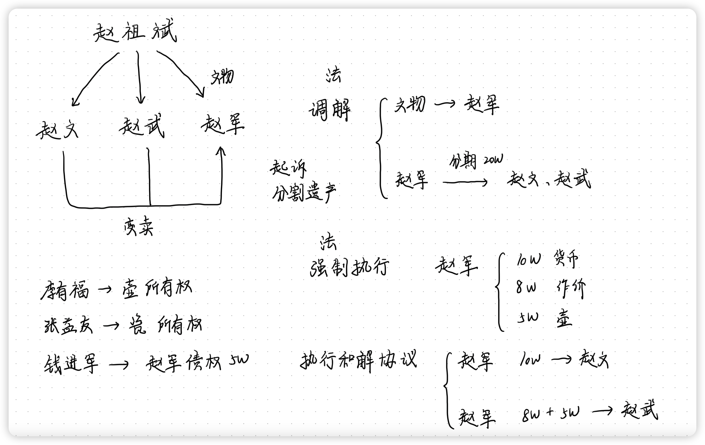
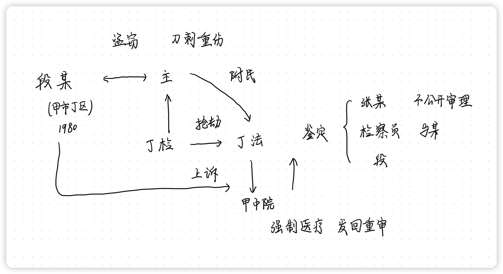
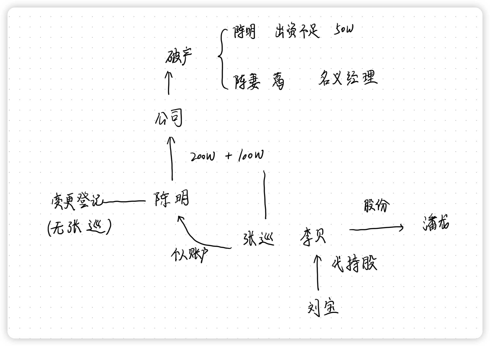

# 刑法学科主观真题（2014）

## 材料
- 国有化工厂车间主任甲与副厂长乙(均为国家工作人员)共谋，在车间的某贵重零件仍能使用时，利用职务之便，制造该零件报废、需向五金厂(非国有企业)购买的假象(该零件价格26万元)，以便非法占有货款。甲将实情告知五金厂负责人丙，嘱丙接到订单后，只向化工厂寄出供货单、发票而不需要实际供货，等五金厂收到化工厂的货款后，丙再将26万元货款汇至乙的个人账户。
- 丙为使五金厂能长期向化工厂供货，便提前将五金厂的26万元现金汇至乙的个人账户。乙随即让事后知情的妻子丁去银行取出26万元现金，并让丁将其中的13万元送给甲。3天后，化工厂会计准备按照乙的指示将26万元汇给五金厂时，因有人举报而未汇出。甲、乙见事情败露，主动向检察院投案，如实交待了上述罪行，并将26万元上交检察院。
- 此外，甲还向检察院揭发乙的其他犯罪事实：乙利用职务之便，长期以明显高于市场的价格向其远房亲戚戊经营的原料公司采购商品，使化工厂损失近300万元;戊为了使乙长期关照原料公司，让乙的妻子丁未出资却享有原料公司10%的股份(乙、丁均知情)，虽未进行股权转让登记，但已分给红利58万元，每次分红都是丁去原料公司领取现金。

## 题目
1. 请分析甲、乙、丙、丁、戊的刑事责任(包括犯罪性质、犯罪形态、共同犯罪、数罪并罚与法定量刑情节)，须答出相应理由。

## 关系图

## 作答
1. 答
   1. 甲
      1. 甲、乙共谋非法占有国有企业财产，行为已着手但因非自己原因未遂，构成共同犯罪、贪污罪未遂，金额为26万元，主动向检察院投案，如实交待了上述罪行，并将26万元上交构成自首
      2. 甲向检察院揭发乙的其他犯罪事实，该犯罪事实与甲、乙贪污无关，构成立功
   2. 乙
      1. 贪污同甲，构成共同犯罪，金额为26万元
      2. 乙利用职务之便，长期以明显高于市场的价格向其远房亲戚戊经营的原料公司采购商品，单独构成贪污罪，金额为300万元
   3. 丙
      1. 丙明知甲、乙贪污的意图，仍然帮助甲、乙，构成贪污罪的共同犯罪帮助犯
   4. 丁
      1. 丙明知甲、乙贪污的意图，仍然帮助甲、乙，构成贪污罪的共同犯罪帮助犯
      2. 丁享有原料公司10%的股份，获取分红，构成受贿罪
   5. 戊
      1. 戊为了使乙长期关照原料公司，构成行贿罪

## 参考答案
1. 甲、乙<strong style="color: red;">利用职务上便利实施了贪污行为</strong>，虽然<strong style="color: red;">客观上</strong>获得了26万元，构成贪污罪，但该26万元不是化工厂的财产，<strong style="color: red;">没有给化工厂造成实际损失</strong>；甲、乙也不可能贪污五金厂的财物，所以，对甲、乙的贪污行为只能认定为贪污未遂。<strong style="color: red;">甲乙犯贪污罪后自首</strong>，可以从轻或者减轻处罚。<strong style="color: red;">甲揭发了乙为亲友非法牟利罪与受贿罪的犯罪事实</strong>，构成立功，可以从轻或者减轻处罚。
2. 乙长期以明显高于市场的价格向其远房亲戚戊经营的原料公司采购商品，使化工厂损失近300万元的行为<strong style="color: red;">构成为亲友非法牟利罪</strong>。<strong style="color: red;">乙以妻子丁的名义</strong>在原料公司享有10%的股份分得红利58万元的行为，符合受贿罪的构成要件，成立<strong style="color: red;">受贿罪</strong>。对于为亲友非法牟利罪与受贿罪以及上述贪污罪，应当实行数罪并罚。
3. 丙将五金厂的26万元挪用出来汇给乙的个人账户。不是为了<strong style="color: red;">个人使用</strong>，也不是为了<strong style="color: red;">谋取个人利益</strong>，<strong style="color: red;">不能认定为挪用资金罪</strong>。但是，丙明知甲、乙两人实施贪污行为，客观上也帮助甲、乙实施了贪污行为，所以<strong style="color: red;">丙构成贪污罪的共犯</strong>（从犯）。
4. 丁将26万元取出的行为，<strong style="color: red;">不构成掩饰、隐瞒犯罪所得罪</strong>，因为该26万元不是<strong style="color: red;">贪污犯罪所得</strong>，也不是其他<strong style="color: red;">犯罪所得</strong>。丁也<strong style="color: red;">不成立贪污罪的共犯</strong>，因为丁取出26万元时该26万元不是<strong style="color: red;">贪污犯罪所得</strong>。丁将其中的13万元送给甲，既<strong style="color: red;">不是帮助分赃</strong>，也<strong style="color: red;">不是行贿</strong>，因为<strong style="color: red;">不成立犯罪</strong>。丁对自己名义对干股<strong style="color: red;">知情</strong>，并<strong style="color: red;">领取贿赂款</strong>，<strong style="color: red;">构成受贿罪的共犯</strong>（从犯）。
5. 戊作为回报让乙的妻子丁未出资却享有原料公司10%丁股份，虽未进行股权转让登记，但让丁分得红利58万元的行为，是为了<strong style="color: red;">谋取不正当利益</strong>，<strong style="color: red;">构成行贿罪</strong>。

# 民法学科主观真题（2014）

## 材料
- 2月5日，甲与乙订立一份房屋买卖合同，约定乙购买甲的房屋一套(以下称01号房)，价格80万元。并约定，合同签订后一周内乙先付20万元，交付房屋后付30万元，办理过户登记后付30万元。
- 2月8日，丙得知甲欲将该房屋出卖，表示愿意购买。甲告其已与乙签订合同的事实，丙说愿出90万元。于是，甲与丙签订了房屋买卖合同，约定合同签订后3日内丙付清全部房款，同时办理过户登记。2月11日，丙付清了全部房款，并办理了过户登记。
- 2月12日，当乙支付第一笔房款时，甲说：房屋已卖掉，但同小区还有一套房屋(以下称02号房)，可作价100万元出卖。乙看后当即表示同意，但提出只能首付20万元，其余80万元向银行申请贷款。甲、乙在原合同文本上将房屋相关信息、价款和付款方式作了修改，其余条款未修改。
- 乙支付首付20万元后，恰逢国家出台房地产贷款调控政策，乙不再具备贷款资格。故乙表示仍然要买01号房，要求甲按原合同履行。甲表示01号房无法交付，并表示第二份合同已经生效，如乙不履行将要承担违约责任。乙认为甲违约在先。3月中旬，乙诉请法院确认甲丙之间的房屋买卖合同无效，甲应履行2月5日双方签订的合同，交付01号房，并承担迟延交付的违约责任。甲则要求乙继续履行购买02号房的义务。
- 3月20日，丙聘请不具备装修资质的A公司装修01号房。装修期间，A公司装修工张某因操作失误将水管砸坏，漏水导致邻居丁的家具等物件损坏，损失约5000元。
- 5月20日，丙花3000元从商场购买B公司生产的热水器，B公司派员工李某上门安装。5月30日，李某从B公司离职，但经常到B公司派驻丙所住小区的维修处门前承揽维修业务。7月24日，丙因热水器故障到该维修处要求B公司维修，碰到李某。丙对李某说：热水器是你装的，出了问题你得去修。维修处负责人因人手不够，便对李某说：那你就去帮忙修一下吧。李某便随丙去维修。李某维修过程中操作失误致热水器毁损。

## 题目
1. 01号房屋的物权归属应当如何确定?为什么?
2. 甲、丙之间的房屋买卖合同效力如何?考察甲、丙之间合同效力时应当考虑本案中的哪些因素?
3. 2月12日，甲、乙之间对原合同修改的行为的效力应当如何认定?为什么?
4. 乙的诉讼请求是否应当得到支持?为什么?
5. 针对甲要求乙履行购买02号房的义务，乙可主张什么权利?为什么?
6. 邻居丁所遭受的损失应当由谁赔偿?为什么?
7. 丙热水器的毁损，应由谁承担赔偿责任?为什么?

## 关系图

## 作答
1. 答
   1. 01号房屋的物权归属为丙
   2. 不动产以登记作为物权变动，合同、付钱等行为均只产生债权效力，不发生物权变动
2. 答
   1. 甲、丙之间的房屋买卖合同合法有效
   2. 根据《民法典》143条关于合同效力的规定，甲、丙之间合同只要不违反法律法规的强制性规定，不违背公序良俗，当事人具有民事行为能力，意思表示真实，即可认定合同效力
   3. 因此本案中，只需审查甲、丙之间的合同内容合法，甲、丙均为完全民事行为能力人，房屋买卖意思表示真实即可
3. 答
   1. 甲、乙之间对原合同修改的行为的效力合法有效
   2. 根据《民法典》143条关于合同效力的规定
   3. 甲、乙之间对原合同修改的行为，是双方真实意思表示，达成合意，可以认定
4. 答
   1. 乙的诉讼请求不应当得到支持
   2. 甲、丙之间的房屋买卖合同合法有效
   3. 甲、乙重新签订合同的行为，应该认定为当事人对于合同内容的修改合意，01房屋不是甲、乙合同的买卖标的，没有发生违约
5. 答
   1. 乙可主张解除权
   2. 合同双方无过错当事人享有任意解除权
   3. 乙不能继续履行合同的原因是因为国家政策变动，属于解除权的免责事由，可以行使解除权
6. 答
   1. 邻居丁所遭受的损失应当由A公司承担赔偿责任
   2. A公司装修工张某因操作失误将水管砸坏，漏水导致邻居丁的家具等物件损坏，张某系A公司职工，提供劳务过程中因职务行为造成损失的，应当由雇佣单位A公司承担赔偿责任
7. 答
   1. 丙热水器的毁损，应由B公司承担赔偿责任
   2. 李某虽然从B公司离职，但B公司未尽到通知义务，因此李某行为构成表见代理
   3. 对于丙，李某是B公司的职工，李某维修过程中操作失误致热水器毁损系职务行为导致侵权，应当由B公司承担赔偿责任

## 参考答案
1. 甲、丙基于<strong style="color: red;">合法有效的买卖合同</strong>于2月11日<strong style="color: red;">办理了过户登记手续</strong>，即完成了<strong style="color: red;">不动产物权的公示行为</strong>。不动产物权发生变动，即由原所有权人甲变更为丙。
2. 甲、丙之间与2月8日形成的房屋买卖合同，该合同为<strong style="color: red;">有效合同</strong>。尽管甲已就该房与乙签订了合同，但甲丙的行为<strong style="color: red;">不属于违背公序良俗的行为</strong>，也<strong style="color: red;">不违反法律、行政法规的强制性规定</strong>，不存在无效的因素。丙的行为仅为<strong style="color: red;">单纯的知情</strong>，甲、丙之间的合同<strong style="color: red;">不属于恶意串通行为</strong>，因其<strong style="color: red;">不以损害乙的权利为目的</strong>。
3. 2月12日，甲、乙之间修改合同的行为，该<strong style="color: red;">行为有效</strong>，其性质属于<strong style="color: red;">双方变更合同</strong>。双方受变更后的合同的约束。
4. 乙与甲通过协商变更了合同，且<strong style="color: red;">甲、丙之间的合同有效且已经办理了物权变动的手续</strong>，故乙关于<strong style="color: red;">确认甲、丙之间合同无效、由甲交付01号房的请求不能得到支持</strong>。但是，乙<strong style="color: red;">可以请求甲承担违约责任</strong>，乙<strong style="color: red;">同意变更合同不等于放弃追索甲在01号房屋买卖合同项下的违约责任</strong>。
5. 乙可请求解除合同，甲应将收受的<strong style="color: red;">购房款本金及其利息</strong>返还给乙。因<strong style="color: red;">政策限购属于当事人无法预见的情形</strong>，且合同出现了<strong style="color: red;">履行不能</strong>的情形，乙有权解除合同，且无须承担责任。
6. 应当由<strong style="color: red;">丙和A公司</strong>承担。张某是受雇人，其执行<strong style="color: red;">职务的行为</strong>，由A公司承担侵权赔偿责任。丙聘请没有装修资质的A公司进屋装修，<strong style="color: red;">具有过错</strong>，也应对丁的损失承担赔偿责任。
7. 1. B公司承担。李某维修行为，构成<strong style="color: red;">表见代理</strong>，其行为后果由B公司承担（<strong style="color: red;">合同上的赔偿责任</strong>）。
   2. 李某虽然离职，但经维修处负责人指派，仍为<strong style="color: red;">执行工作任务</strong>，应由B公司承担（<strong style="color: red;">侵权责任</strong>）。

# 民诉学科主观真题（2014）

## 材料
- 赵文、赵武、赵军系亲兄弟，其父赵祖斌于2013年1月去世，除了留有一个元代青花瓷盘外，没有其他遗产。该青花瓷盘在赵军手中，赵文、赵武要求将该瓷盘变卖，变卖款由兄弟三人平均分配。赵军不同意。2013年3月，赵文、赵武到某省甲县法院(赵军居住地和该瓷盘所在地)起诉赵军，要求分割父亲赵祖斌的遗产。经甲县法院调解，赵文、赵武与赵军达成调解协议：赵祖斌留下的青花瓷盘归赵军所有，赵军分别向赵文、赵武支付人民币20万元。该款项分2期支付：2013年6月各支付5万元、2013年9月各支付15万元。
- 但至2013年10月，赵军未向赵文、赵武支付上述款项。赵文、赵武于2013年10月向甲县法院申请强制执行。经法院调查，赵军可供执行的款项有其在银行的存款10万元，可供执行的其他财产折价为8万元，另外赵军手中还有一把名家制作的紫砂壶，市场价值大约5万元。赵军声称其父亲留下的那个元代青花瓷盘被卖了，所得款项50万元做生意亏掉了。法院全力调查也未发现赵军还有其他的款项和财产。法院将赵军的上述款项冻结，扣押了赵军可供执行的财产和赵军手中的那把紫砂壶。
- 2013年11月，赵文、赵武与赵军拟达成执行和解协议：2013年12月30日之前，赵军将其在银行的存款10万元支付给赵文，将可供执行财产折价8万元与价值5万元的紫砂壶交付给赵武。赵军欠赵文、赵武的剩余债务予以免除。
- 此时，出现了以下情况：①赵军的朋友李有福向甲县法院报告，声称赵军手中的那把紫砂壶是自己借给赵军的，紫砂壶的所有权是自己的。②赵祖斌的朋友张益友向甲县法院声称，赵祖斌留下的那个元代青花瓷盘是他让赵祖斌保存的，所有权是自己的。自己是在一周之前(2013年11月1日)才知道赵祖斌已经去世以及赵文、赵武与赵军进行诉讼的事。③赵军的同事钱进军向甲县法院声称，赵军欠其5万元。同时，钱进军还向法院出示了公证机构制作的债权文书执行证书，该债权文书所记载的钱进军对赵军享有的债权是5万元，债权到期日是2013年9月30日。

## 题目
1. 在不考虑李有福、张益友、钱进军提出的问题的情况下，如果赵文、赵武与赵军达成了执行和解协议，将产生什么法律后果?(考生可以就和解协议履行的情况作出假设)
2. 根据案情，李有福如果要对案中所提到的紫砂壶主张权利，在民事诉讼制度的框架下，其可以采取什么方式?采取相关方式时，应当符合什么条件?(考生可以就李有福采取的方式可能出现的后果作出假设)
3. 根据案情，张益友如果要对那个元代青花瓷盘所涉及的权益主张权利，在民事诉讼制度的框架下，其可以采取什么方式?采取该方式时，应当符合什么条件?
4. 根据案情，钱进军如果要对赵军主张5万元债权，在民事诉讼制度的框架下，其可以采取什么方式?为什么?

## 关系图

## 作答
1. 答
   1. 执行和解协议在赵文、赵武与赵军产生债权关系
   2. 如果执行和解协议得到顺利执行，则赵文、赵武与赵军之间的债权关系归于消灭，若执行产生瑕疵，可另行提起诉讼
   3. 如果执行和解协议没有得到执行，则赵文、赵武选择依据执行和解协议向执行法院提起诉讼，或者选择向法院申请继续执行
2. 答
   1. 李有福主张对紫砂壶所有权的异议，不涉及法院的调解书的内容
   2. 因此李有福可以向执行法院申请案外人对执行标的的异议
   3. 如果法院认定案外人对执行标的的异议成立，中止执行，则赵文、赵武与赵军可以提起执行异议之诉
   4. 如果法院认定案外人对执行标的的异议不成立，则李有福可以提起第三人撤销之诉
3. 答
   1. 张益友主张对元代青花瓷盘所有权答异议，涉及法院的调解书的内容
   2. 因此张益友可以选择申请对甲县法院调解书的再审，也可以向甲县法院提起第三人撤销之诉
4. 答
   1. 钱进军可以请求法院撤销执行和解协议
   2. 因为债权到期前，债务人的行为有可能损害债权人利益的，债权人可以向法院提起诉讼，请求法院撤销
   3. 本题中执行和解协议，可以损害债权人钱进军的利益，因此债权人可以请求法院撤销执行和解协议

## 参考答案
1. 如果赵文、赵武与赵军达成了执行和解协议，将产生的法律后果是
   1. 和解协议达成后，<strong style="color: red;">执行程序中止</strong>
   2. 如果在执行和解履行期内赵军履行了和解协议，<strong style="color: red;">执行程序终结</strong>，<strong style="color: red;">调解书视为执行完毕</strong>
   3. 如果在执行期届满后，赵军没有履行执行和解协议，赵文、赵武可以<strong style="color: red;">申请恢复执行</strong>，执行将以调解书作为根据，执行和解协议失效。如果赵军履行了执行和解协议的一部分，执行时应当对该部分<strong style="color: red;">予以扣除</strong>
2. 李有福如果要对案中所提到的紫砂壶主张权利，在赵文、赵武与赵军的案件已经进入了执行阶段的情况下，在民事诉讼制度的框架下，其可以采取的方式是
   1. 提出<strong style="color: red;">对执行标的的异议</strong>。提出异议应当以书面的形式向甲县法院提出
   2. 如果法院裁定驳回了李有福的执行标的异议，李有福可以提出案外人异议之诉。提出案外人异议之诉应当符合的条件是
      1. 起诉的时间应当在收到执行法院对执行标的异议作出驳回裁定后15日内
      2. <strong style="color: red;">管辖法院为执行法院</strong>，即甲县法院
      3. 李有福作为原告，<strong style="color: red;">赵文、赵武作为被告</strong>，如果赵军反对李有福的主张，<strong style="color: red;">赵军也作为共同被告</strong>
3. 张益友如果要对那个元代青花瓷盘所涉及的权益主张权利，在赵文、赵武与赵军的案件已经进入了执行阶段的情况下，在民事诉讼制度的框架下，其可以提出<strong style="color: red;">第三人撤销之诉</strong>，张益友提出第三人撤销之诉应当符合的条件是
   1. 张益友作为原告，<strong style="color: red;">赵文、赵武、赵军作为被告</strong>
   2. <strong style="color: red;">向作出调解书的法院即甲县法院提出诉讼</strong>
   3. 应当在2013年11月1日之后的6个月内提出
4. 钱进军如果要对其对赵军所享有的那5万元债权主张权利，在赵文、赵武与赵军的案件已经进入了执行阶段的情况下，在民事诉讼制度的框架下，其可以<strong style="color: red;">申请参与分配</strong>。因为其条件符合申请参与分配的条件。按照《民事诉讼法》的规定，参与分配的条件包括
   1. 被执行人的财产<strong style="color: red;">无法清偿所有债权</strong>，本案中赵军的财产不足以清偿其所有的债务
   2. 被执行人为<strong style="color: red;">自然人或其他组织</strong>，而非法人，本案中赵军为自然人
   3. 由多个申请人对赵军享有债权
   4. 申请人必须<strong style="color: red;">取得生效的执行根据</strong>，本案中钱进军有经过公证的债权文书作为执行根据
   5. 参与分配的债权<strong style="color: red;">只限于金钱债权</strong>，本案中钱进军对赵军享有的就是金钱债权
   6. 参与分配必须发生在执行程序开始后，被执行人的财产清偿完毕之前，本案情形与此相符

# 刑诉学科主观真题（2014）

## 材料
- 犯罪嫌疑人段某，1980年出生，甲市丁区人，自幼患有间歇性精神分裂症而辍学在社会上流浪，由于生活无着落便经常偷拿东西。2014年3月，段某窜至丁区一小区内行窃时被事主发现，遂用随身携带的刀子将事主刺成重伤夺路逃走。此案丁区检察院以抢劫罪起诉到丁区法院，被害人的家属提起附带民事诉讼。丁区法院以抢劫罪判处段某有期徒刑10年，赔偿被害人家属3万元人民币。段某以定性不准、量刑过重为由提起上诉。甲市中级法院二审中发现段某符合强制医疗条件，决定发回丁区法院重新审理。
- 丁区法院对段某依法进行了精神病鉴定，结果清晰表明段某患有精神分裂症，便由审判员张某一人不公开审理，检察员马某和被告人段某出庭分别发表意见。庭审后，法庭作出对段某予以强制医疗的决定。

## 题目
1. 结合本案，简答强制医疗程序的适用条件。
2. 如中级法院直接对段某作出强制医疗决定，如何保障当事人的救济权?
3. 发回重审后，丁区法院的做法是否合法?为什么?
4. 发回重审后，丁区法院在作出强制医疗决定时应当如何处理被害人家属提出的附带民事诉讼?

## 关系图

## 作答
不同

## 参考答案
1. 1. 实施了危害公共安全或者严重危害公民人身安全的暴力行为
   2. 经法定程序鉴定属依法不负刑事责任的精神病人
   3. 有继续危害社会的可能
2. 《刑事诉讼法》规定了一审程序被强制医疗的人、被害人及其法定代理人、近亲属对强制医疗决定不服的，可以向上一级人民法院申请复议，没有明确二审程序是否可以申请复议。从理论上讲，二审是终审程序，当事人不能再上诉，只能通过审判监督程序予以纠正。但按照我国《刑事诉讼法》关于审判监督程序的规定，只有法院的判决、裁定才可以申诉，不包括决定。因此，如果中级人民法院的强制医疗决定不允许复议，必将剥夺当事人的救济权。故《刑事诉讼法》第287条规定的被决定强制医疗的人、被害人及其法定代理人、近亲属对强制医疗不服的，可以向上一级人民法院申请复议，应作广义理解，既包括一审也包括二审，使得当事人的救济权利得以保障。
3. 不合法。按照《刑事诉讼法》和有关司法解释的规定，丁区法院有下列违法行为
   1. 审理强制医疗案件应当组成合议庭进行
   2. 本案被告人系成年人，所犯抢劫罪不属于不公开审理的案件
   3. 审理强制医疗案件，应当通知段某的法定代理人到庭
   4. 段某没有委托诉讼代理人，法院应当通知法律援助机构指派律师担任其法定代理人，为其提供法律援助
4. 按照《刑事诉讼法解释》第160条关于法院认定公诉案件被告人的行为不构成犯罪，对已经提起的附带民事诉讼，经调解不能达成协议的，应当一并作出附带民事诉讼判决的精神，丁区法院应当就民事赔偿进行调解。调解不成，判决宣告被告人段某不负刑事责任，并在判决中就附带的民事诉讼一并处理，同时作出对被告人段某强制医疗的决定。

# 商经法学科主观真题（2014）

## 材料
- 2012年4月，陈明设立一家有限责任公司，从事绿色食品开发，注册资本为200万元。公司成立半年后，为增加产品开发力度，陈明拟新增资本100万元，并为此分别与张巡、李贝洽谈，该二人均有意愿认缴全部新增资本，加入陈明的公司。陈明遂先后与张巡、李贝二人就投资事项分别签订了书面协议。张巡在签约后第二天，即将款项转入陈明的个人账户，但陈明一直以各种理由拖延办理公司变更登记等手续。2012年11月5日，陈明最终完成公司章程、股东名册以及公司变更登记手续，公司注册资本变更为300万元，陈明任公司董事长，而股东仅为陈明与李贝，张巡的名字则未出现在公司登记的任何文件中。
- 李贝虽名为股东，但实际上是受刘宝之托，代其持股，李贝向公司缴纳的100万元出资，实际上来源于刘宝。2013年3月，在陈明同意的情况下，李贝将其名下股权转让给善意不知情的潘龙，并在公司登记中办理了相应的股东变更。
- 2014年6月，因产品开发屡次失败，公司陷入资不抵债且经营无望的困境，遂向法院申请破产。法院受理后，法院所指定的管理人查明：第一，陈明尚有50万元的出资未实际缴付;第二，陈明的妻子葛梅梅本是家庭妇女，但自2014年1月起，却一直以公司财务经理的名义，每月自公司领取奖金4万元。

## 题目
1. 在法院受理公司破产申请前，张巡是否可向公司以及陈明主张权利，主张何种权利?为什么?
2. 在法院受理公司破产申请后，张巡是否可向管理人主张权利，主张何种权利?为什么?
3. 李贝能否以自己并非真正股东为由，主张对潘龙的股权转让行为无效?为什么?
4. 刘宝可主张哪些法律救济?为什么?
5. 陈明能否以超过诉讼时效为由，拒绝50万元出资的缴付?为什么?
6. 就葛梅梅所领取的奖金，管理人应如何处理?为什么?

## 关系图

## 作答
1. 答
   1. 张巡可以向陈明主张基于不当得利返还货币
   2. 张巡不是公司股东，同时也不享有对公司的债权，因此张巡不可以向公司主张任何权利
   3. 因为张巡不是公司股东，因此张巡将款项转入陈明的个人账户，视为陈明不当得利，张巡可以主张返还
2. 答
   1. 张巡不可向管理人主张权利
   2. 张巡不是公司股东，同时也不享有对公司的债权，因此张巡不可以向公司主张任何权利
3. 答
   1. 李贝不能主张对潘龙的股权转让行为无效
   2. 李贝是公司股东名册上的公司股东
   3. 因此善意不知情的潘龙，参照善意取得，已经取得股权，股权转让行为合法有效
4. 答
   1. 刘宝可以基于代持股协议，向李贝主张返还100万元货币，同时承担违约责任
   2. 基于合同相对性原理，刘宝只能向李贝主张权利
5. 答
   1. 陈明不能以超过诉讼时效为由，拒绝50万元出资的缴付
   2. 公司申请破产，根据加速到期制度，出资人立刻丧失出资期限权益，公司债权人可以请求出资人在未出资范围内对公司债务承担连带责任
6. 答
   1. 管理人应当请求葛梅梅返回不当得利货币

## 参考答案
1. 根据案情交代，即陈明是以<strong style="color: red;">自己名义</strong>与张巡签订协议，款项也是转入陈明<strong style="color: red;">个人账户</strong>，且张巡并<strong style="color: red;">未登记为公司股东</strong>，故在张巡与公司之间不存在法律关系。因此张巡不能向公司主张任何权利。鉴于投资协议仅存在于张巡与陈明个人之间。张巡只能向陈明<strong style="color: red;">主张违约责任</strong>，<strong style="color: red;">请求返还所给付答投资以及相应的损害赔偿</strong>。
2. 根据问题1的结论，<strong style="color: red;">张巡与公司之间不存在法律关系</strong>，故而在公司进入破产程序后，张巡也不得将其对陈明的债权，视为对公司的债权，向管理人进行<strong style="color: red;">破产债权的申报</strong>。
3. 依《公司法解释（三）》第24节第3款，李贝虽为<strong style="color: red;">名义股东</strong>，但在对公司的关系上为真正的股东，其<strong style="color: red;">对股权的处分应为有权处分</strong>；退一步说，即使就李贝的股东身份在学理上存在争议，但在《公司法解释（三）》第25节第1款<strong style="color: red;">股权善意取得</strong>的规定下，李贝的处分行为也已成为有权处分行为，因此为保护善意相对人起见，李贝也不得主张该处分行为无效。
4. 鉴于刘宝仅与李贝之间存在法律关系，即<strong style="color: red;">委托持股关系</strong>。因此刘宝也就只能根据该合同关系，向李贝<strong style="color: red;">主张违约责任</strong>，对公司不享有任何权利主张。
5. 股东的出资义务，不适用诉讼时效《公司法解释（三）》第19条第1款，因此管理人在向陈明主张50万元出资义务的履行时，其不得以超过诉讼时效为由来予以抗辩。
6. 根据《企业破产法》第36条，债务人的董事、监事、高级管理人员利用职权从企业获取的<strong style="color: red;">非正常收入</strong>，<strong style="color: red;">管理人负有追回义务</strong>；再根据《企业破产法解释（二）》第24条第1款，董事、监事、高级管理人所获取的绩效奖金属于非正常收入范围，故而管理人应向葛梅梅请求返还所获取的收入，且可以通过起诉方式来予以追回。